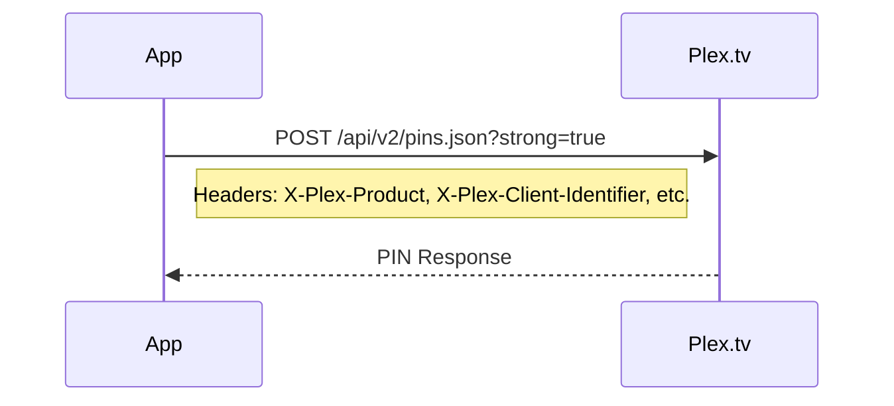
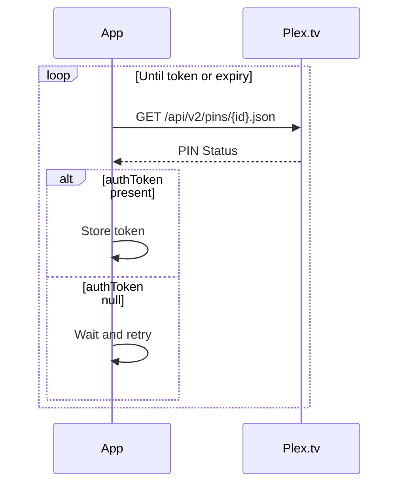
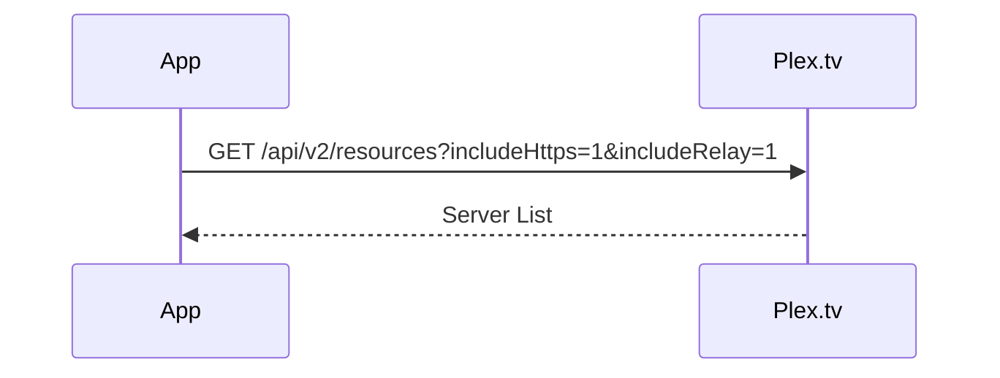
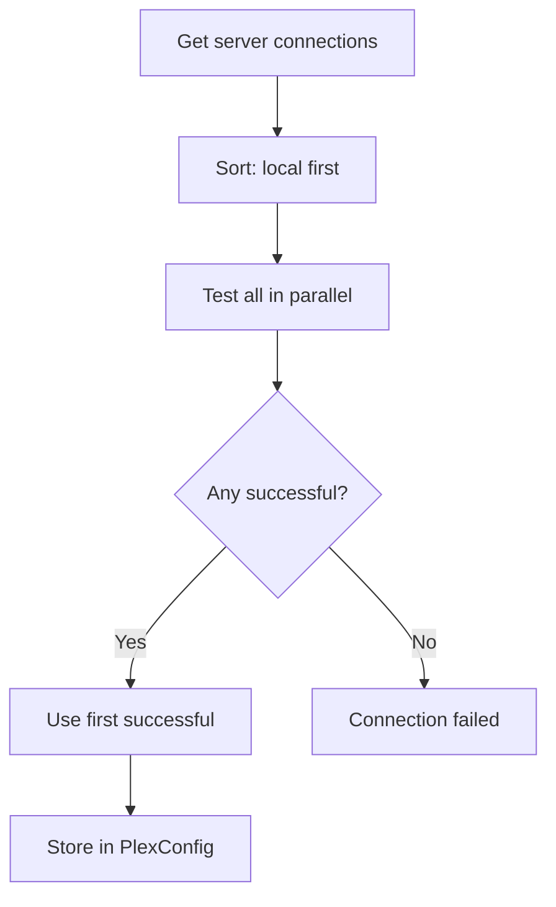
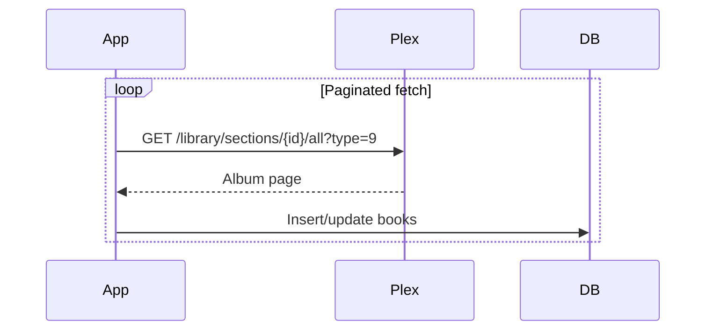
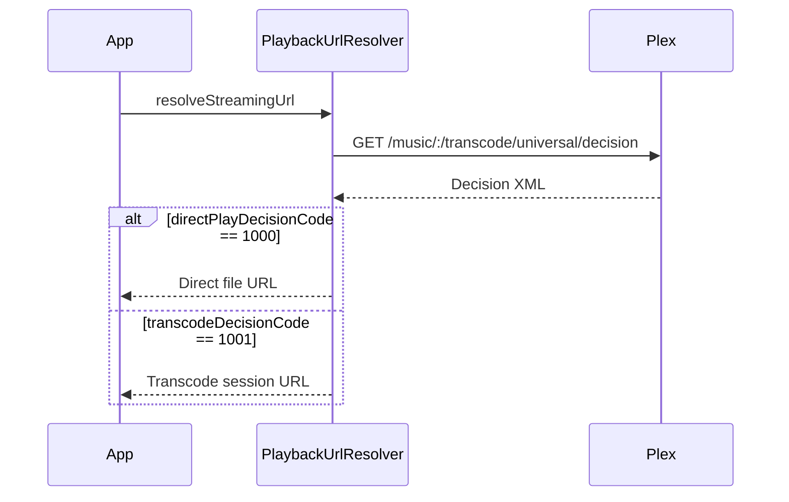
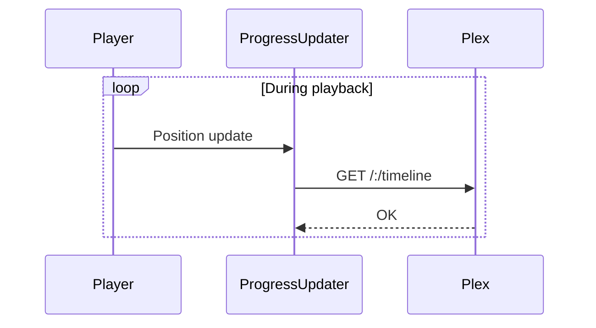

# Plex API Integration Flows

This document details all Plex API integration flows used in Chronicle.

## API Overview

Chronicle communicates with two Plex endpoints:

| Endpoint | Base URL | Purpose |
|----------|----------|---------|
| Plex.tv | `https://plex.tv` | Authentication, server discovery |
| Plex Media Server | Varies per server | Library, metadata, streaming |

## Authentication Headers

All requests include these headers via [`PlexInterceptor`](../app/src/main/java/local/oss/chronicle/data/sources/plex/PlexInterceptor.kt):

```http
X-Plex-Product: Chronicle
X-Plex-Platform: Android
X-Plex-Platform-Version: {Android SDK}
X-Plex-Client-Identifier: {UUID}
X-Plex-Device: {Device Model}
X-Plex-Device-Name: {Device Name}
X-Plex-Token: {Auth Token}
X-Plex-Client-Profile-Extra: {Audio capabilities}
Accept: application/json
```

## 1. OAuth Authentication Flow

### Step 1: Request PIN



**Request:**
```http
POST https://plex.tv/api/v2/pins.json?strong=true
X-Plex-Product: Chronicle
X-Plex-Client-Identifier: {unique-client-id}
```

**Response:**
```json
{
    "id": 123456789,
    "code": "ABCD1234",
    "trusted": false,
    "clientIdentifier": "unique-client-id",
    "expiresIn": 1799,
    "expiresAt": "2024-01-15T12:30:00.000Z",
    "authToken": null
}
```

### Step 2: Open Browser for User Auth

Construct OAuth URL and open in browser:

```
https://app.plex.tv/auth#?
  code={code}
  &context[device][product]=Chronicle
  &context[device][platform]=Android
  &context[device][device]=Chronicle
  &clientID={client-identifier}
```

### Step 3: Poll for Auth Token



**Request:**
```http
GET https://plex.tv/api/v2/pins/{pin-id}.json
X-Plex-Client-Identifier: {unique-client-id}
```

**Response (after user auth):**
```json
{
    "id": 123456789,
    "code": "ABCD1234",
    "authToken": "user-auth-token-here"
}
```

**Implementation:** [`PlexLoginRepo.postOAuthPin()`](../app/src/main/java/local/oss/chronicle/data/sources/plex/PlexLoginRepo.kt), [`PlexLoginRepo.checkForOAuthAccessToken()`](../app/src/main/java/local/oss/chronicle/data/sources/plex/PlexLoginRepo.kt)

## 2. Server Discovery

### Get User's Servers



**Request:**
```http
GET https://plex.tv/api/v2/resources?includeHttps=1&includeRelay=1
X-Plex-Token: {auth-token}
```

**Response:**
```json
[
    {
        "name": "My Plex Server",
        "clientIdentifier": "server-machine-id",
        "owned": true,
        "accessToken": "server-access-token",
        "connections": [
            {
                "protocol": "https",
                "address": "192.168.1.100",
                "port": 32400,
                "uri": "https://192.168.1.100:32400",
                "local": true
            },
            {
                "protocol": "https",
                "address": "external-ip.plex.direct",
                "port": 32400,
                "uri": "https://external-ip.plex.direct:32400",
                "local": false
            }
        ]
    }
]
```

**Implementation:** [`PlexLoginService.resources()`](../app/src/main/java/local/oss/chronicle/data/sources/plex/PlexService.kt)

### Connection Testing



**Test Request:**
```http
GET {server-url}/identity
X-Plex-Token: {server-token}
```

**Implementation:** [`PlexConfig.setPotentialConnections()`](../app/src/main/java/local/oss/chronicle/data/sources/plex/PlexConfig.kt)

## 3. User Selection (Managed Users)

### Get Account Users

```http
GET https://plex.tv/api/v2/home/users
X-Plex-Token: {account-auth-token}
```

**Response:**
```json
{
    "users": [
        {
            "id": 12345,
            "uuid": "user-uuid",
            "title": "Main User",
            "admin": true,
            "restricted": false,
            "hasPassword": true
        },
        {
            "id": 12346,
            "uuid": "child-uuid",
            "title": "Child",
            "admin": false,
            "restricted": true,
            "hasPassword": false
        }
    ]
}
```

### Switch User

```http
POST https://plex.tv/api/v2/home/users/{uuid}/switch
X-Plex-Token: {account-auth-token}
Content-Type: application/x-www-form-urlencoded

pin={optional-user-pin}
```

**Response:**
```json
{
    "id": 12345,
    "uuid": "user-uuid",
    "authToken": "user-specific-token"
}
```

**Implementation:** [`PlexLoginService.getUsersForAccount()`](../app/src/main/java/local/oss/chronicle/data/sources/plex/PlexService.kt), [`PlexLoginService.pickUser()`](../app/src/main/java/local/oss/chronicle/data/sources/plex/PlexService.kt)

## 4. Library Discovery

### Get Libraries

```http
GET {server}/library/sections
X-Plex-Token: {token}
```

**Response:**
```json
{
    "MediaContainer": {
        "Directory": [
            {
                "key": "1",
                "title": "Audiobooks",
                "type": "artist"
            },
            {
                "key": "2", 
                "title": "Music",
                "type": "artist"
            }
        ]
    }
}
```

**Implementation:** [`PlexMediaService.retrieveLibraries()`](../app/src/main/java/local/oss/chronicle/data/sources/plex/PlexService.kt)

## 5. Library Sync

### Fetch Audiobooks (Albums)



**Request:**
```http
GET {server}/library/sections/{libraryId}/all?type=9
    &X-Plex-Container-Start=0
    &X-Plex-Container-Size=100
X-Plex-Token: {token}
```

**Response:**
```json
{
    "MediaContainer": {
        "totalSize": 250,
        "offset": 0,
        "Metadata": [
            {
                "ratingKey": "119",
                "title": "The Hobbit",
                "titleSort": "Hobbit, The",
                "parentTitle": "J.R.R. Tolkien",
                "thumb": "/library/metadata/119/thumb/1234567890",
                "addedAt": 1704067200,
                "updatedAt": 1704153600,
                "viewCount": 2,
                "lastViewedAt": 1704240000
            }
        ]
    }
}
```

**Type Values:**
| Type | Meaning |
|------|---------|
| 8 | Artist |
| 9 | Album |
| 10 | Track |

**Implementation:** [`PlexMediaService.retrieveAlbumPage()`](../app/src/main/java/local/oss/chronicle/data/sources/plex/PlexService.kt), [`BookRepository.refreshDataPaginated()`](../app/src/main/java/local/oss/chronicle/data/local/BookRepository.kt)

### Fetch Tracks

```http
GET {server}/library/sections/{libraryId}/all?type=10
    &X-Plex-Container-Start=0
    &X-Plex-Container-Size=100
X-Plex-Token: {token}
```

**Response:**
```json
{
    "MediaContainer": {
        "Metadata": [
            {
                "ratingKey": "120",
                "parentRatingKey": "119",
                "title": "Chapter 1",
                "index": 1,
                "duration": 3600000,
                "viewOffset": 1200000,
                "Media": [
                    {
                        "Part": [
                            {
                                "key": "/library/parts/120/1234567890/file.m4b",
                                "file": "/audiobooks/The Hobbit/chapter1.m4b"
                            }
                        ]
                    }
                ]
            }
        ]
    }
}
```

**Implementation:** [`PlexMediaService.retrieveTracksPaginated()`](../app/src/main/java/local/oss/chronicle/data/sources/plex/PlexService.kt)

## 6. Audiobook/Track Metadata

### Get Single Book

```http
GET {server}/library/metadata/{albumId}?includeChapters=1
X-Plex-Token: {token}
```

### Get Tracks for Book

```http
GET {server}/library/metadata/{albumId}/children
X-Plex-Token: {token}
```

### Get Track with Chapters

```http
GET {server}/library/metadata/{trackId}?includeChapters=1
X-Plex-Token: {token}
```

**Response with chapters:**
```json
{
    "MediaContainer": {
        "Metadata": [
            {
                "ratingKey": "120",
                "title": "Part 1",
                "Chapter": [
                    {
                        "id": 1,
                        "index": 1,
                        "tag": "Chapter 1",
                        "startTimeOffset": 0,
                        "endTimeOffset": 900000
                    },
                    {
                        "id": 2,
                        "index": 2,
                        "tag": "Chapter 2",
                        "startTimeOffset": 900000,
                        "endTimeOffset": 1800000
                    }
                ]
            }
        ]
    }
}
```

**Implementation:** [`PlexMediaService.retrieveChapterInfo()`](../app/src/main/java/local/oss/chronicle/data/sources/plex/PlexService.kt)

## 7. Collections

### Fetch Collections

```http
GET {server}/library/sections/{libraryId}/collections?includeCollections=1
    &X-Plex-Container-Start=0
    &X-Plex-Container-Size=100
X-Plex-Token: {token}
```

### Get Books in Collection

```http
GET {server}/library/collections/{collectionId}/children
X-Plex-Token: {token}
```

**Implementation:** [`PlexMediaService.retrieveCollectionsPaginated()`](../app/src/main/java/local/oss/chronicle/data/sources/plex/PlexService.kt), [`PlexMediaService.fetchBooksInCollection()`](../app/src/main/java/local/oss/chronicle/data/sources/plex/PlexService.kt)

## 8. Playback URL Resolution

### Decision Endpoint

Chronicle uses the transcode/decision endpoint to negotiate playback:



**Request:**
```http
GET {server}/music/:/transcode/universal/decision
    ?path=/library/metadata/{trackId}
    &protocol=http
    &session={uuid}
    &hasMDE=1
    &directPlay=1
    &directStream=1
    &musicBitrate=320
    &maxAudioBitrate=320
X-Plex-Token: {token}
X-Plex-Client-Profile-Extra: add-direct-play-profile(type=musicProfile&container=mp4,m4a,m4b,mp3,flac,ogg,opus&audioCodec=aac,mp3,flac,vorbis,opus&videoCodec=*&subtitleCodec=*)
```

**Response (Direct Play):**
```xml
<MediaContainer
    generalDecisionCode="1000"
    generalDecisionText="Direct play OK"
    directPlayDecisionCode="1000"
    directPlayDecisionText="Direct play OK">
  <Track>
    <Media>
      <Part
        key="/library/parts/120/file.m4b"
        decision="directplay" />
    </Media>
  </Track>
</MediaContainer>
```

**Response (Transcode Required):**
```xml
<MediaContainer
    generalDecisionCode="2000"
    directPlayDecisionCode="3000"
    directPlayDecisionText="Not enough bandwidth"
    transcodeDecisionCode="1001"
    transcodeDecisionText="Conversion OK">
  <Track>
    <Media protocol="http">
      <Part
        key="/music/:/transcode/universal/start?session={id}"
        decision="transcode" />
    </Media>
  </Track>
</MediaContainer>
```

**Decision Codes:**

| Code | Type | Meaning |
|------|------|---------|
| 1000 | Direct Play | OK |
| 1001 | Transcode | OK |
| 2000 | General | OK |
| 3000 | Direct Play | Not available |
| 3001 | MDE | Bandwidth exceeded |
| 4005 | Transcode | No profile found |

**Implementation:** [`PlexMediaService.getPlaybackDecision()`](../app/src/main/java/local/oss/chronicle/data/sources/plex/PlexService.kt), [`PlaybackUrlResolver`](../app/src/main/java/local/oss/chronicle/data/sources/plex/PlaybackUrlResolver.kt)

## 9. Progress Tracking (Scrobbling)

### Start Media Session

```http
POST {server}/playQueues
    ?uri=server://{machineId}/com.plexapp.plugins.library/library/metadata/{bookId}
    &type=audio
    &repeat=false
    &own=true
    &includeChapters=true
X-Plex-Token: {token}
```

**Implementation:** [`PlexMediaService.startMediaSession()`](../app/src/main/java/local/oss/chronicle/data/sources/plex/PlexService.kt)

### Timeline Update



**Request:**
```http
GET {server}/:/timeline
    ?ratingKey={trackId}
    &key=/library/metadata/{trackId}
    &time={positionMs}
    &duration={durationMs}
    &state={playing|paused|stopped}
    &hasMDE=1
    &identifier=com.plexapp.plugins.library
X-Plex-Token: {token}
```

**State Values:**
| State | Meaning |
|-------|---------|
| playing | Currently playing |
| paused | Paused |
| stopped | Playback ended |

**Implementation:** [`PlexMediaService.progress()`](../app/src/main/java/local/oss/chronicle/data/sources/plex/PlexService.kt), [`ProgressUpdater`](../app/src/main/java/local/oss/chronicle/features/player/ProgressUpdater.kt)

### Mark as Watched/Unwatched

```http
# Mark watched
GET {server}/:/scrobble?key=/library/metadata/{id}&identifier=com.plexapp.plugins.library

# Mark unwatched
GET {server}/:/unscrobble?key=/library/metadata/{id}&identifier=com.plexapp.plugins.library
```

**Implementation:** [`PlexMediaService.watched()`](../app/src/main/java/local/oss/chronicle/data/sources/plex/PlexService.kt), [`PlexMediaService.unwatched()`](../app/src/main/java/local/oss/chronicle/data/sources/plex/PlexService.kt)

## 10. Media Streaming

### Direct File Access

```http
GET {server}/library/parts/{partId}/{timestamp}/file.{ext}
X-Plex-Token: {token}
```

### Transcoded Stream

```http
GET {server}/music/:/transcode/universal/start
    ?session={sessionId}
    &path=/library/metadata/{trackId}
    &protocol=http
    &[other params]
X-Plex-Token: {token}
```

## 11. Image/Artwork

### Thumbnail URL Construction

```kotlin
// PlexConfig.makeThumbUri()
Uri.parse("{serverUrl}{thumbPath}?X-Plex-Token={token}")

// Example
https://192.168.1.100:32400/library/metadata/119/thumb/1234567890?X-Plex-Token=xxxxx
```

## API Rate Limiting

Plex does not officially document rate limits. Chronicle implements:
- Paginated fetches (100 items per request)
- Request throttling during sync
- Caching of resolved streaming URLs

## Error Handling

Common error responses:

| HTTP Status | Meaning | Chronicle Handling |
|-------------|---------|-------------------|
| 401 | Unauthorized | Re-authenticate |
| 404 | Not found | Remove from local DB |
| 500 | Server error | Retry with backoff |
| Timeout | Connection issue | Try alternate connection |

## References

- [Plex API Documentation](https://developer.plex.tv/pms/)
- [Example API Responses](../example-query-responses/)
