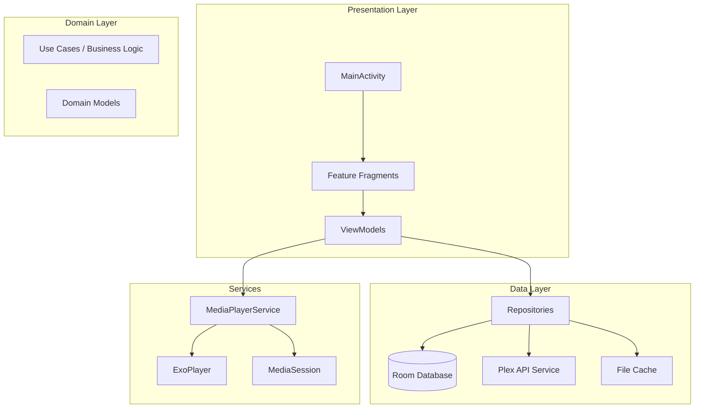
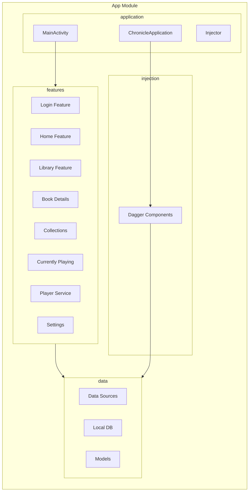
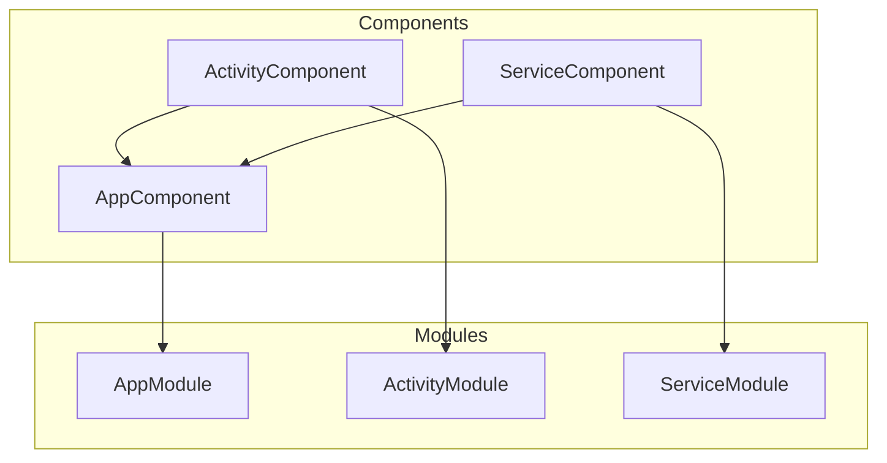
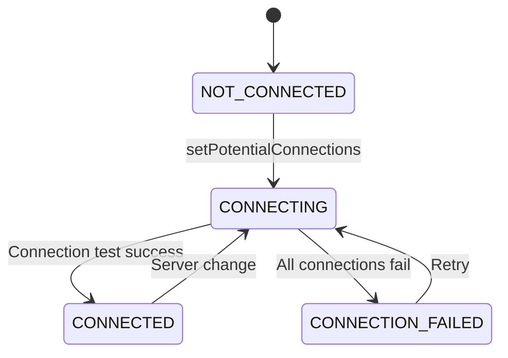
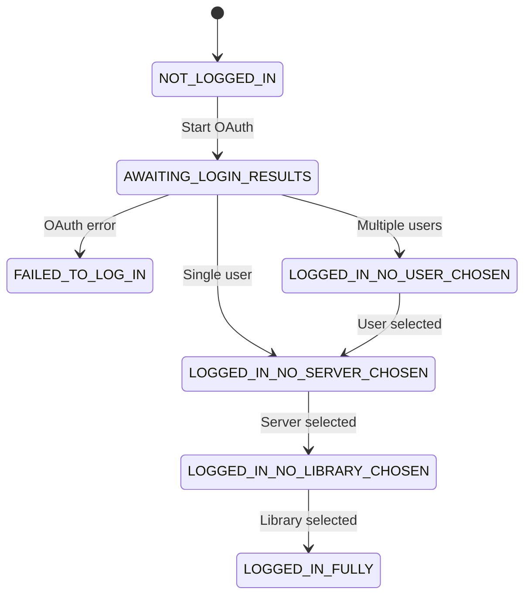
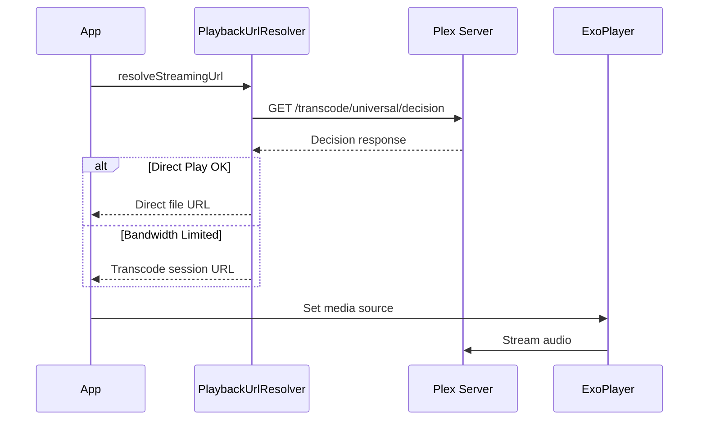

# Chronicle Architecture

## Overview

Chronicle is an Android audiobook player that integrates with Plex Media Server. The app follows a layered architecture with clear separation between Presentation, Domain/Business Logic, and Data layers.

## Architecture Diagram



## Component Diagram



## Layer Descriptions

### Presentation Layer

Located in [`features/`](../app/src/main/java/local/oss/chronicle/features/)

| Feature | Purpose |
|---------|---------|
| [`login/`](../app/src/main/java/local/oss/chronicle/features/login/) | OAuth flow, server/user/library selection |
| [`home/`](../app/src/main/java/local/oss/chronicle/features/home/) | Recently listened, recently added books |
| [`library/`](../app/src/main/java/local/oss/chronicle/features/library/) | Full audiobook library with search/filter |
| [`bookdetails/`](../app/src/main/java/local/oss/chronicle/features/bookdetails/) | Audiobook details, chapters, playback |
| [`collections/`](../app/src/main/java/local/oss/chronicle/features/collections/) | Plex collections browsing |
| [`currentlyplaying/`](../app/src/main/java/local/oss/chronicle/features/currentlyplaying/) | Full-screen player UI |
| [`player/`](../app/src/main/java/local/oss/chronicle/features/player/) | MediaPlayerService, ExoPlayer integration |
| [`settings/`](../app/src/main/java/local/oss/chronicle/features/settings/) | App preferences |

**Pattern**: Each feature contains:
- Fragment (UI)
- ViewModel (UI State & Logic)
- Adapters (RecyclerView)
- Binding Adapters (Data Binding)

### Domain Layer

Business logic is primarily in ViewModels and Repositories. Key models in [`data/model/`](../app/src/main/java/local/oss/chronicle/data/model/):

- [`Audiobook`](../app/src/main/java/local/oss/chronicle/data/model/Audiobook.kt) - Core audiobook entity
- [`MediaItemTrack`](../app/src/main/java/local/oss/chronicle/data/model/MediaItemTrack.kt) - Individual audio track/file
- [`Chapter`](../app/src/main/java/local/oss/chronicle/data/model/Chapter.kt) - Chapter marker within a track
- [`Collection`](../app/src/main/java/local/oss/chronicle/data/model/Collection.kt) - Plex collection

### Data Layer

Located in [`data/`](../app/src/main/java/local/oss/chronicle/data/)

**Local Storage** ([`data/local/`](../app/src/main/java/local/oss/chronicle/data/local/)):
- Room databases for Books, Tracks, Collections
- SharedPreferences for settings
- File system for cached audio files

**Remote** ([`data/sources/plex/`](../app/src/main/java/local/oss/chronicle/data/sources/plex/)):
- Retrofit services for Plex API
- Authentication and token management
- Connection handling (local/remote/relay)

## Dependency Injection (Dagger)

Located in [`injection/`](../app/src/main/java/local/oss/chronicle/injection/)



### Component Hierarchy

| Component | Scope | Purpose |
|-----------|-------|---------|
| [`AppComponent`](../app/src/main/java/local/oss/chronicle/injection/components/AppComponent.kt) | @Singleton | Application-wide dependencies |
| [`ActivityComponent`](../app/src/main/java/local/oss/chronicle/injection/components/ActivityComponent.kt) | @ActivityScope | Activity-scoped dependencies |
| [`ServiceComponent`](../app/src/main/java/local/oss/chronicle/injection/components/ServiceComponent.kt) | @ServiceScope | MediaPlayerService dependencies |

### Key Provided Dependencies

**AppComponent** provides:
- Room DAOs (BookDao, TrackDao, CollectionsDao)
- Repositories (BookRepository, TrackRepository, CollectionsRepository)
- Plex Services (PlexLoginService, PlexMediaService)
- PlexConfig, PlexPrefsRepo
- Moshi, WorkManager, Fetch (downloads)

**ServiceComponent** provides:
- ExoPlayer
- MediaSession
- MediaController
- NotificationBuilder
- SleepTimer
- PlaybackUrlResolver

## Key Architectural Patterns

### 1. Repository Pattern
Repositories abstract data sources, providing a single source of truth combining local (Room) and remote (Plex API) data.

```kotlin
class BookRepository(
    private val bookDao: BookDao,
    private val plexService: PlexMediaService,
    private val plexConfig: PlexConfig
) : IBookRepository {
    // Combines local cache with network data
}
```

### 2. MediaBrowserService Architecture
[`MediaPlayerService`](../app/src/main/java/local/oss/chronicle/features/player/MediaPlayerService.kt) extends `MediaBrowserServiceCompat` for:
- Background audio playback
- Android Auto/Automotive support
- Media button handling
- Lock screen controls

### 3. Dual HTTP Client Architecture
Two HTTP clients serve different purposes:

| Client | Purpose | Configuration |
|--------|---------|---------------|
| OkHttp + PlexInterceptor | API calls, metadata | Adds all Plex headers |
| ExoPlayer DefaultHttpDataSource | Audio streaming | Must also include Plex headers |

Both clients must include `X-Plex-Client-Profile-Extra` header for proper playback.

### 4. Connection State Machine



### 5. Login State Machine



## Plex Client Profile System

Chronicle declares its audio playback capabilities via the `X-Plex-Client-Profile-Extra` header:

```kotlin
"add-direct-play-profile(type=musicProfile&container=mp4,m4a,m4b,mp3,flac,ogg,opus&audioCodec=aac,mp3,flac,vorbis,opus&videoCodec=*&subtitleCodec=*)"
```

This enables Plex to make intelligent decisions about direct play vs. transcoding.

### Supported Audio Formats

| Format | Container | Direct Play |
|--------|-----------|-------------|
| AAC | mp4/m4a/m4b | ✅ |
| MP3 | mp3 | ✅ |
| FLAC | flac | ✅ |
| Vorbis | ogg | ✅ |
| Opus | opus/ogg | ✅ |

## Bandwidth-Aware Playback

Chronicle uses Plex's `/music/:/transcode/universal/decision` endpoint to negotiate playback:



This allows graceful degradation when bandwidth is limited instead of playback failure.

## File Structure

```
app/src/main/java/local/oss/chronicle/
├── application/          # Application class, MainActivity, Constants
├── data/
│   ├── local/           # Room databases, DAOs, repositories
│   ├── model/           # Domain models
│   └── sources/
│       ├── plex/        # Plex API integration
│       └── local/       # Local media source
├── features/            # Feature modules
│   ├── bookdetails/
│   ├── collections/
│   ├── currentlyplaying/
│   ├── download/
│   ├── home/
│   ├── library/
│   ├── login/
│   ├── player/
│   ├── search/
│   └── settings/
├── injection/           # Dagger DI setup
│   ├── components/
│   ├── modules/
│   └── scopes/
├── navigation/          # Navigation utilities
├── util/                # Extension functions, utilities
└── views/               # Custom views, binding adapters
```

## References

- [Plex API Documentation](https://developer.plex.tv/pms/)
- [ExoPlayer Documentation](https://exoplayer.dev/)
- [Android MediaSession Guide](https://developer.android.com/guide/topics/media-apps/working-with-a-media-session)
- [Dagger Documentation](https://dagger.dev/dev-guide/)
