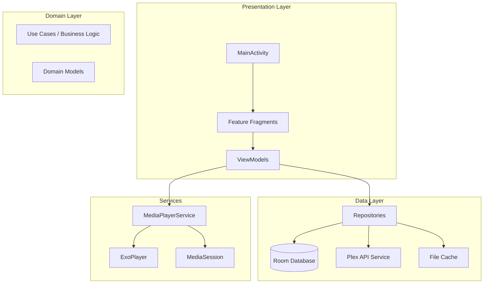
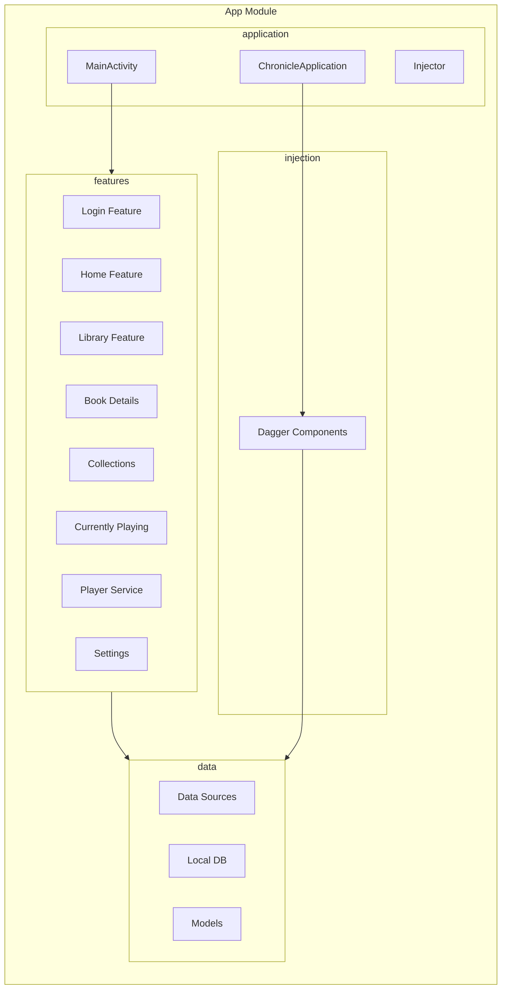

# Chronicle Architecture

## Overview

Chronicle is an Android audiobook player that integrates with Plex Media Server. The app follows a layered MVVM architecture with clear separation between Presentation, Domain/Business Logic, and Data layers.

This document provides a high-level overview of Chronicle's architecture. For detailed information on specific topics, see the documentation links below.

---

## Documentation Index

| Document | Description |
|----------|-------------|
| [Architecture Layers](architecture/layers.md) | Detailed description of Presentation, Domain, and Data layers |
| [Dependency Injection](architecture/dependency-injection.md) | Dagger 2 component hierarchy, modules, and scopes |
| [Architectural Patterns](architecture/patterns.md) | Key patterns: Repository, MVVM, MediaBrowserService, State Machines |
| [Plex Integration](architecture/plex-integration.md) | Plex API integration, client profiles, bandwidth-aware playback |

---

## Architecture Diagram



---

## Component Diagram



---

## Layer Summary

| Layer | Location | Responsibility |
|-------|----------|----------------|
| **Presentation** | [`features/`](../app/src/main/java/local/oss/chronicle/features/) | UI, ViewModels, user interaction |
| **Domain** | ViewModels, Repositories | Business logic, data transformation |
| **Data** | [`data/`](../app/src/main/java/local/oss/chronicle/data/) | Storage, API calls, caching |
| **Services** | [`features/player/`](../app/src/main/java/local/oss/chronicle/features/player/) | Background audio playback |

→ See [Architecture Layers](architecture/layers.md) for detailed layer descriptions.

---

## Dependency Injection Summary

Chronicle uses Dagger 2 with a three-component hierarchy:

| Component | Scope | Purpose |
|-----------|-------|---------|
| [`AppComponent`](../app/src/main/java/local/oss/chronicle/injection/components/AppComponent.kt) | @Singleton | Application-wide dependencies |
| [`ActivityComponent`](../app/src/main/java/local/oss/chronicle/injection/components/ActivityComponent.kt) | @ActivityScope | Activity-scoped dependencies |
| [`ServiceComponent`](../app/src/main/java/local/oss/chronicle/injection/components/ServiceComponent.kt) | @ServiceScope | MediaPlayerService dependencies |

→ See [Dependency Injection](architecture/dependency-injection.md) for component hierarchy and module details.

---

## Key Patterns Summary

| Pattern | Purpose |
|---------|---------|
| **Repository** | Single source of truth combining local and remote data |
| **MVVM** | Separation of UI, state management, and data access |
| **MediaBrowserService** | Background playback, Android Auto, media controls |
| **State Machines** | Connection and login state management |

→ See [Architectural Patterns](architecture/patterns.md) for detailed pattern implementations.

---

## Plex Integration Summary

Chronicle integrates with Plex Media Server for:
- OAuth authentication via plex.tv
- Library browsing and metadata
- Audio streaming with bandwidth-aware playback
- Playback position sync

→ See [Plex Integration](architecture/plex-integration.md) for API details and implementation.

---

## File Structure

```
app/src/main/java/local/oss/chronicle/
├── application/          # Application class, MainActivity, Constants
├── data/
│   ├── local/           # Room databases, DAOs, repositories
│   ├── model/           # Domain models
│   └── sources/
│       ├── plex/        # Plex API integration
│       └── local/       # Local media source
├── features/            # Feature modules
│   ├── bookdetails/
│   ├── collections/
│   ├── currentlyplaying/
│   ├── download/
│   ├── home/
│   ├── library/
│   ├── login/
│   ├── player/
│   ├── search/
│   └── settings/
├── injection/           # Dagger DI setup
│   ├── components/
│   ├── modules/
│   └── scopes/
├── navigation/          # Navigation utilities
├── util/                # Extension functions, utilities
└── views/               # Custom views, binding adapters
```

---

## Related Documentation

### Architecture Details
- [Architecture Layers](architecture/layers.md) - Presentation, Domain, Data layer details
- [Dependency Injection](architecture/dependency-injection.md) - Dagger setup and components
- [Architectural Patterns](architecture/patterns.md) - Key patterns and implementations
- [Plex Integration](architecture/plex-integration.md) - Plex API and streaming

### Feature Documentation
- [Features Guide](FEATURES.md) - Feature-specific documentation
- [API Flows](API_FLOWS.md) - Detailed API flow documentation
- [Data Layer](DATA_LAYER.md) - Database and repository patterns

### API Reference
- [Example Query Responses](example-query-responses/) - Real Plex API response examples

---

## External References

- [Plex API Documentation](https://developer.plex.tv/pms/)
- [ExoPlayer Documentation](https://exoplayer.dev/)
- [Android MediaSession Guide](https://developer.android.com/guide/topics/media-apps/working-with-a-media-session)
- [Dagger Documentation](https://dagger.dev/dev-guide/)
