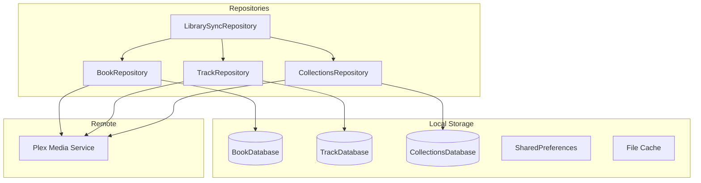
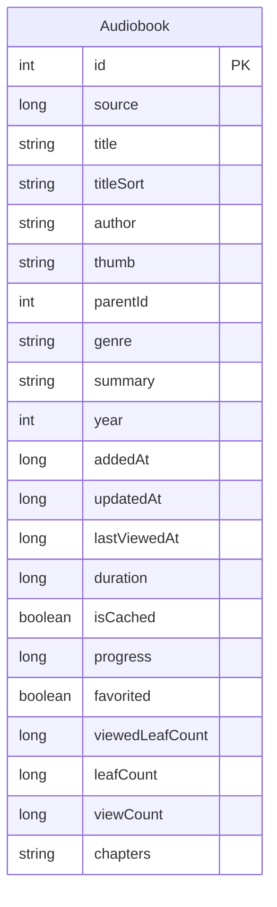
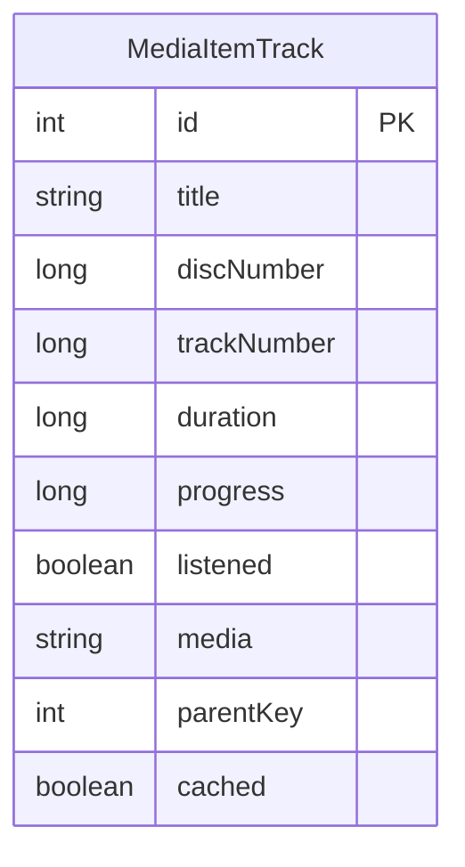
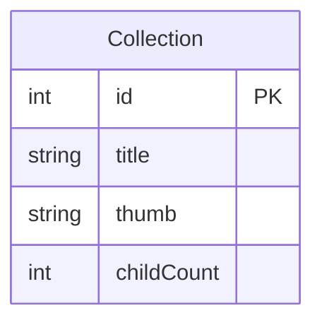
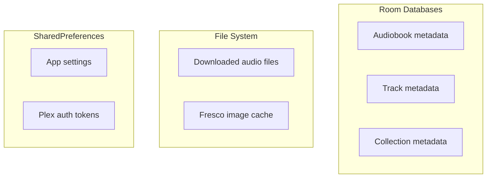
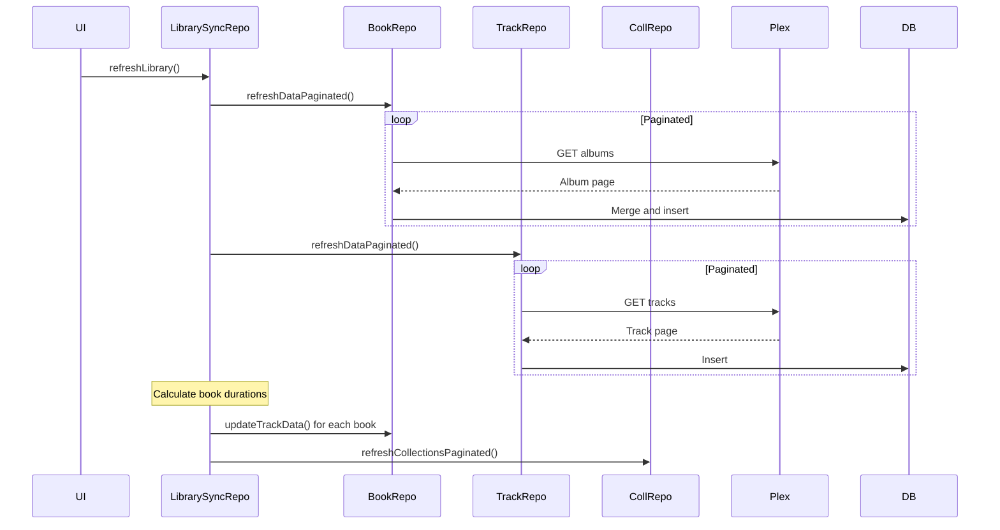
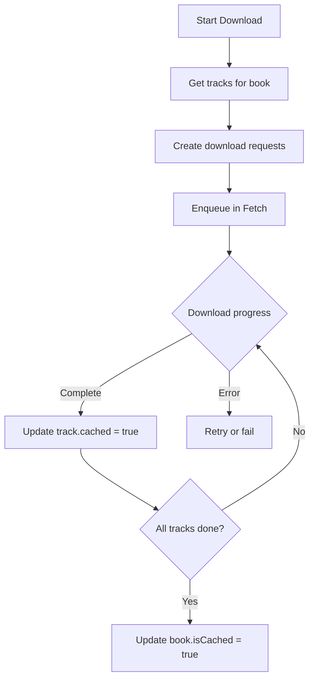
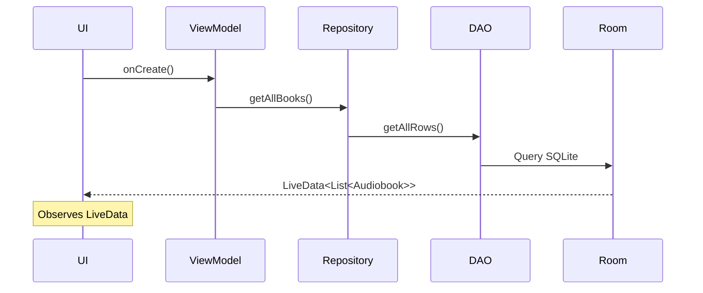
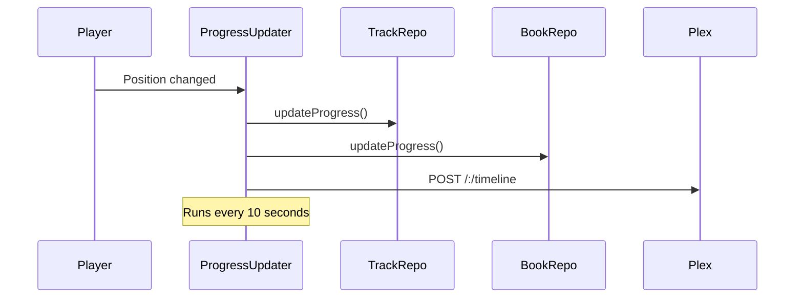

# Data Layer Documentation

This document details the local data storage, repository patterns, and sync mechanisms in Chronicle.

## Overview



## Room Databases

Chronicle uses three separate Room databases for data persistence.

### 1. BookDatabase

Stores audiobook metadata.

**Schema** ([`BookDatabase.kt`](../app/src/main/java/local/oss/chronicle/data/local/BookDatabase.kt)):



**Entity**: [`Audiobook`](../app/src/main/java/local/oss/chronicle/data/model/Audiobook.kt)

| Field | Type | Description |
|-------|------|-------------|
| `id` | Int | Plex ratingKey (PK) |
| `source` | Long | Media source identifier |
| `title` | String | Book title |
| `titleSort` | String | Sortable title |
| `author` | String | Author name |
| `thumb` | String | Thumbnail path |
| `genre` | String | Genre(s) |
| `summary` | String | Description |
| `year` | Int | Publication year |
| `addedAt` | Long | Unix timestamp added to library |
| `updatedAt` | Long | Last metadata update |
| `lastViewedAt` | Long | Last playback timestamp |
| `duration` | Long | Total duration (ms) |
| `isCached` | Boolean | Download status |
| `progress` | Long | Playback progress (ms) |
| `leafCount` | Long | Track count |
| `viewCount` | Long | Times completed |
| `chapters` | List | Embedded chapters (serialized) |

**Key Queries:**

```kotlin
// Get all books, respecting offline mode
@Query("SELECT * FROM Audiobook WHERE isCached >= :offlineModeActive ORDER BY titleSort")
fun getAllRows(offlineModeActive: Boolean): LiveData<List<Audiobook>>

// Recently listened (in progress)
@Query("""
    SELECT * FROM Audiobook 
    WHERE isCached >= :offlineModeActive 
      AND lastViewedAt != 0 
      AND progress > 10000 
      AND progress < duration - 120000 
    ORDER BY lastViewedAt DESC 
    LIMIT :bookCount
""")
fun getRecentlyListened(bookCount: Int, offlineModeActive: Boolean): LiveData<List<Audiobook>>

// Search
@Query("SELECT * FROM Audiobook WHERE (title LIKE :query OR author LIKE :query)")
fun search(query: String, offlineModeActive: Boolean): LiveData<List<Audiobook>>
```

**Migrations:**
- Version 1→2: Initial
- Version 2→3: Added chapters column
- Version 3→4: Added source column
- Version 4→5: Added progress column
- Version 5→6: Added titleSort column
- Version 6→7: Added viewCount column
- Version 7→8: Added year column

### 2. TrackDatabase

Stores individual audio track metadata.

**Schema** ([`TrackDatabase.kt`](../app/src/main/java/local/oss/chronicle/data/local/TrackDatabase.kt)):



**Entity**: [`MediaItemTrack`](../app/src/main/java/local/oss/chronicle/data/model/MediaItemTrack.kt)

| Field | Type | Description |
|-------|------|-------------|
| `id` | Int | Plex ratingKey (PK) |
| `title` | String | Track title |
| `discNumber` | Long | Disc number |
| `trackNumber` | Long | Track index |
| `duration` | Long | Track duration (ms) |
| `progress` | Long | Playback progress (ms) |
| `listened` | Boolean | Completed flag |
| `media` | String | File path on server |
| `parentKey` | Int | Parent audiobook ID |
| `cached` | Boolean | Local file exists |

**Key Queries:**

```kotlin
// Get tracks for a book, ordered
@Query("""
    SELECT * FROM MediaItemTrack 
    WHERE parentKey = :bookId 
    ORDER BY discNumber, trackNumber
""")
fun getTracksForAudiobook(bookId: Int): LiveData<List<MediaItemTrack>>

// Get cached tracks
@Query("SELECT * FROM MediaItemTrack WHERE cached = 1")
suspend fun getCachedTracks(): List<MediaItemTrack>
```

### 3. CollectionsDatabase

Stores Plex collection metadata.

**Schema** ([`CollectionsDatabase.kt`](../app/src/main/java/local/oss/chronicle/data/local/CollectionsDatabase.kt)):



**Entity**: [`Collection`](../app/src/main/java/local/oss/chronicle/data/model/Collection.kt)

| Field | Type | Description |
|-------|------|-------------|
| `id` | Int | Collection ratingKey (PK) |
| `title` | String | Collection name |
| `thumb` | String | Thumbnail path |
| `childCount` | Int | Number of books |

### 4. AccountDatabase

Stores account and library information for multi-account support.

| Entity | Purpose |
|--------|---------|
| `Account` | User account with provider type, credentials, display name |
| `Library` | Library within an account with server URL, section ID |

**Key relationships:**
- Account has many Libraries (foreign key cascade delete)
- Library is referenced by Audiobook and MediaItemTrack via `libraryId`

**Migrations:**
- BookDatabase v8→v9: Added `libraryId` column, converted `id` from Int to String
- TrackDatabase v6→v7: Added `libraryId` column, converted `id`/`parentKey` from Int to String

## Repository Pattern

Repositories provide a single source of truth combining local and remote data.

### IBookRepository

**Interface** ([`BookRepository.kt`](../app/src/main/java/local/oss/chronicle/data/local/BookRepository.kt)):

```kotlin
interface IBookRepository {
    fun getAllBooks(): LiveData<List<Audiobook>>
    fun getRecentlyAdded(bookCount: Int): LiveData<List<Audiobook>>
    fun getRecentlyListened(bookCount: Int): LiveData<List<Audiobook>>
    fun getBook(bookId: Int): LiveData<Audiobook?>
    fun search(query: String): LiveData<List<Audiobook>>
    
    suspend fun refreshDataPaginated()
    suspend fun getAudiobookAsync(bookId: Int): Audiobook?
    suspend fun updateCachedStatus(bookId: Int, cached: Boolean)
    suspend fun updateTrackData(bookId: Int, progress: Long, duration: Long, trackCount: Int)
}
```

**Implementation highlights:**

```kotlin
class BookRepository @Inject constructor(
    private val bookDao: BookDao,
    private val plexMediaService: PlexMediaService,
    private val plexConfig: PlexConfig,
    private val prefsRepo: PrefsRepo
) : IBookRepository {

    // Merge network data with local, preserving local-only fields
    override suspend fun refreshDataPaginated() {
        var offset = 0
        val pageSize = 100
        
        do {
            val response = plexMediaService.retrieveAlbumPage(
                libraryId = prefsRepo.libraryId,
                containerStart = offset,
                containerSize = pageSize
            )
            
            val networkBooks = response.container.directories.map { Audiobook.from(it) }
            val existingBooks = bookDao.getAudiobooks().associateBy { it.id }
            
            val mergedBooks = networkBooks.map { network ->
                existingBooks[network.id]?.let { local ->
                    Audiobook.merge(network, local)
                } ?: network
            }
            
            bookDao.insertAll(mergedBooks)
            offset += pageSize
        } while (response.container.totalSize > offset)
    }
}
```

### ITrackRepository

**Interface** ([`TrackRepository.kt`](../app/src/main/java/local/oss/chronicle/data/local/TrackRepository.kt)):

```kotlin
interface ITrackRepository {
    fun getTracksForAudiobook(bookId: Int): LiveData<List<MediaItemTrack>>
    
    suspend fun refreshDataPaginated()
    suspend fun getTracksForAudiobookAsync(bookId: Int): List<MediaItemTrack>
    suspend fun updateProgress(trackId: Int, position: Long)
    suspend fun updateCachedStatus(trackId: Int, cached: Boolean)
    suspend fun getBookIdForTrack(trackId: Int): Int
}
```

### CollectionsRepository

Handles Plex collection syncing ([`CollectionsRepository.kt`](../app/src/main/java/local/oss/chronicle/data/local/CollectionsRepository.kt)):

```kotlin
class CollectionsRepository @Inject constructor(
    private val collectionsDao: CollectionsDao,
    private val plexMediaService: PlexMediaService,
    private val prefsRepo: PrefsRepo
) {
    suspend fun refreshCollectionsPaginated() { ... }
    fun getAllCollections(): LiveData<List<Collection>>
    suspend fun getBooksInCollection(collectionId: Int): List<Audiobook>
}
```

## Data Models

### Audiobook

```kotlin
@Entity
data class Audiobook(
    @PrimaryKey val id: Int,
    val source: Long,
    val title: String = "",
    val titleSort: String = "",
    val author: String = "",
    val thumb: String = "",
    val parentId: Int = -1,
    val genre: String = "",
    val summary: String = "",
    val year: Int = 0,
    val addedAt: Long = 0L,
    val updatedAt: Long = 0L,
    val lastViewedAt: Long = 0L,
    val duration: Long = 0L,
    val isCached: Boolean = false,
    val progress: Long = 0L,
    val favorited: Boolean = false,
    val viewedLeafCount: Long = 0L,
    val leafCount: Long = 0L,
    val viewCount: Long = 0L,
    @TypeConverters(ChapterListConverter::class)
    val chapters: List<Chapter> = emptyList()
)
```

**Merge Logic** - When syncing, some fields come from network, others are local-only:

| Source | Fields |
|--------|--------|
| Network | title, author, thumb, genre, summary, year, addedAt, updatedAt |
| Local | duration, progress, isCached, favorited, chapters, source |
| Conditional | lastViewedAt (newer wins) |

### MediaItemTrack

```kotlin
@Entity
data class MediaItemTrack(
    @PrimaryKey val id: Int,
    val title: String,
    val discNumber: Long,
    val trackNumber: Long,
    val duration: Long,
    val progress: Long,
    val listened: Boolean = false,
    val media: String,
    val parentKey: Int,
    val cached: Boolean = false
) {
    companion object {
        // Static cache for pre-resolved streaming URLs
        val streamingUrlCache = mutableMapOf<Int, String>()
        
        // Regex pattern for cached file names
        val cachedFilePattern = Regex("track_(\\d+)_[a-f0-9]+\\.\\w+")
    }
    
    fun getTrackSource(): String {
        // Check streaming URL cache first
        streamingUrlCache[id]?.let { return it }
        
        // Return cached file path or remote URL
        return if (cached) {
            File(cachedMediaDir, getCachedFileName()).absolutePath
        } else {
            plexConfig.toServerString(media)
        }
    }
    
    fun getCachedFileName(): String {
        // Format: track_{id}_{partHash}.{ext}
        val partHash = media.hashCode().toString(16)
        val extension = media.substringAfterLast(".")
        return "track_${id}_$partHash.$extension"
    }
}
```

### Chapter

```kotlin
data class Chapter(
    val id: Long,
    val index: Long,
    val title: String,
    val startTimeOffset: Long,
    val endTimeOffset: Long,
    val downloaded: Boolean = false
)
```

## SharedPreferences

Two preference repositories manage settings:

### PrefsRepo

App settings ([`SharedPreferencesPrefsRepo.kt`](../app/src/main/java/local/oss/chronicle/data/local/SharedPreferencesPrefsRepo.kt)):

| Key | Type | Default | Description |
|-----|------|---------|-------------|
| `playback_speed` | Float | 1.0 | Playback speed multiplier |
| `skip_silence` | Boolean | false | Skip silent sections |
| `jump_forward_seconds` | Int | 30 | Forward skip duration |
| `jump_backward_seconds` | Int | 15 | Backward skip duration |
| `pause_on_focus_lost` | Boolean | true | Pause on audio focus loss |
| `shake_to_snooze` | Boolean | true | Extend sleep timer by shaking |
| `offline_mode` | Boolean | false | Show only cached content |
| `allow_auto` | Boolean | true | Enable Android Auto |
| `cached_media_dir` | File | - | Download storage location |

### PlexPrefsRepo

Plex authentication state ([`SharedPreferencesPlexPrefsRepo.kt`](../app/src/main/java/local/oss/chronicle/data/sources/plex/SharedPreferencesPlexPrefsRepo.kt)):

| Key | Type | Description |
|-----|------|-------------|
| `account_auth_token` | String | Plex.tv account token |
| `user` | PlexUser | Current user (JSON) |
| `server` | ServerModel | Selected server (JSON) |
| `library` | PlexLibrary | Selected library (JSON) |
| `oauth_temp_id` | Long | Temporary OAuth PIN ID |

## Caching Strategy

### Memory Cache

- **Streaming URLs**: `MediaItemTrack.streamingUrlCache` - Pre-resolved playback URLs
- **LiveData**: Room returns LiveData for reactive UI updates

### Disk Cache



### Audio File Cache

Downloaded tracks stored in app's external files directory:

```
/storage/emulated/0/Android/data/local.oss.chronicle/files/
├── track_120_a1b2c3d4.m4b
├── track_121_e5f6g7h8.m4b
└── track_122_i9j0k1l2.mp3
```

**File naming**: `track_{trackId}_{partHash}.{extension}`

**Management**: [`CachedFileManager`](../app/src/main/java/local/oss/chronicle/data/sources/plex/CachedFileManager.kt)

## Sync Mechanisms

### Library Sync



**Implementation**: [`LibrarySyncRepository`](../app/src/main/java/local/oss/chronicle/data/local/LibrarySyncRepository.kt)

### Progress Sync

Progress syncs bidirectionally:

**Local → Remote**: [`ProgressUpdater`](../app/src/main/java/local/oss/chronicle/features/player/ProgressUpdater.kt) sends timeline updates

**Remote → Local**: During library sync, `lastViewedAt` and `viewOffset` are merged

**Conflict Resolution**: More recent `lastViewedAt` wins

### Download Sync



**Refresh on App Start**: [`CachedFileManager.refreshTrackDownloadedStatus()`](../app/src/main/java/local/oss/chronicle/data/sources/plex/CachedFileManager.kt) reconciles DB with file system

## Offline Mode

When `PrefsRepo.offlineMode = true`:

1. **BookDao queries** use `isCached >= :offlineModeActive` filter
2. **UI** only shows downloaded books
3. **Playback** uses local files exclusively

Query pattern:
```kotlin
// offlineModeActive = true: WHERE isCached >= true (only cached)
// offlineModeActive = false: WHERE isCached >= false (all books)
@Query("SELECT * FROM Audiobook WHERE isCached >= :offlineModeActive")
fun getAllRows(offlineModeActive: Boolean): LiveData<List<Audiobook>>
```

## Data Flow Diagrams

### Read Flow (Library Screen)



### Write Flow (Progress Update)



## Type Converters

Room type converters for complex types:

```kotlin
class ChapterListConverter {
    private val moshi = Moshi.Builder().build()
    
    @TypeConverter
    fun fromChapterList(chapters: List<Chapter>): String {
        return moshi.adapter<List<Chapter>>().toJson(chapters)
    }
    
    @TypeConverter
    fun toChapterList(json: String): List<Chapter> {
        return moshi.adapter<List<Chapter>>().fromJson(json) ?: emptyList()
    }
}
```

## Error Handling

| Scenario | Handling |
|----------|----------|
| Network failure during sync | Show toast, retain cached data |
| Database migration failure | Clear and rebuild (destructive) |
| File system full | Cancel downloads, notify user |
| Corrupted cached file | Delete and re-download |
| Stale Plex token | Re-authenticate |
