# Chronicle Features

This document details all major features of the Chronicle audiobook player.

## Feature Overview

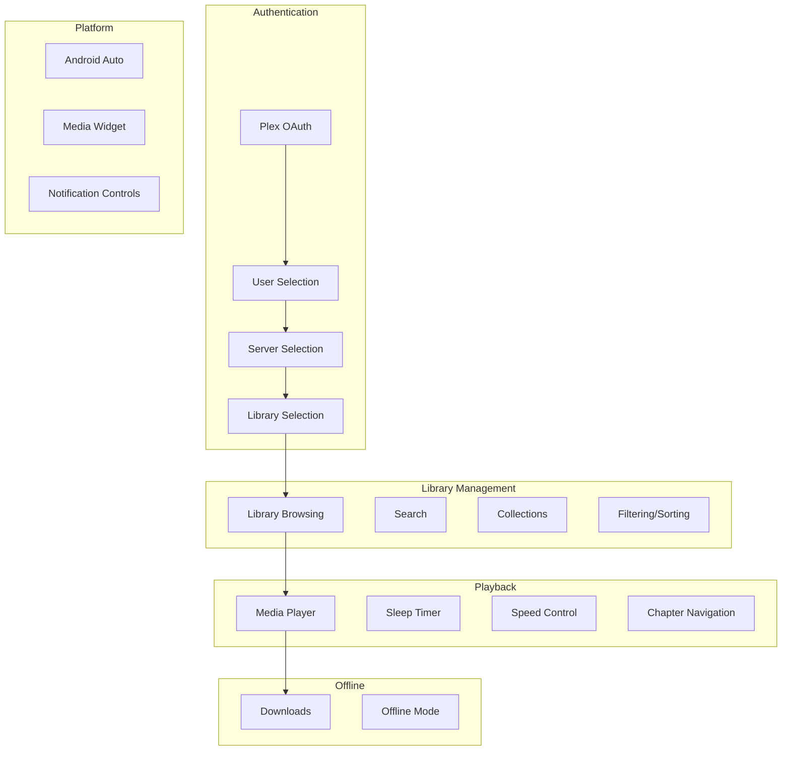

## 1. Plex Authentication

### OAuth Flow

Chronicle uses Plex's OAuth 2.0 PIN-based authentication flow.

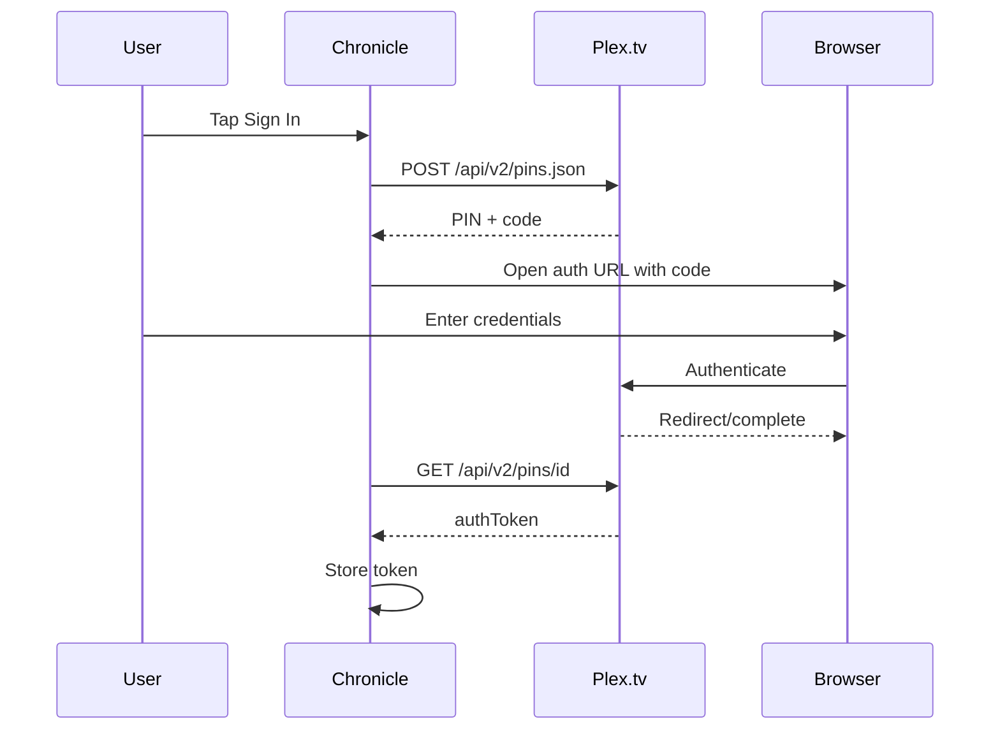

**Implementation**: [`PlexLoginRepo`](../app/src/main/java/local/oss/chronicle/data/sources/plex/PlexLoginRepo.kt)

### Key Files
- [`LoginFragment`](../app/src/main/java/local/oss/chronicle/features/login/LoginFragment.kt) - Login UI
- [`LoginViewModel`](../app/src/main/java/local/oss/chronicle/features/login/LoginViewModel.kt) - OAuth state management
- [`PlexLoginService`](../app/src/main/java/local/oss/chronicle/data/sources/plex/PlexService.kt) - API endpoints

## 2. Server/User Selection

### Multi-User Support

Plex accounts can have multiple users (managed users). Chronicle supports user switching:

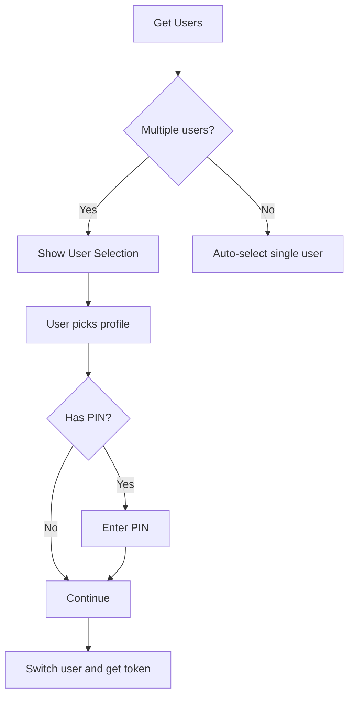

**Implementation**: 
- [`ChooseUserFragment`](../app/src/main/java/local/oss/chronicle/features/login/ChooseUserFragment.kt)
- [`ChooseUserViewModel`](../app/src/main/java/local/oss/chronicle/features/login/ChooseUserViewModel.kt)

### Server Selection

Users can have multiple Plex servers. Chronicle tests connectivity and selects the best connection:

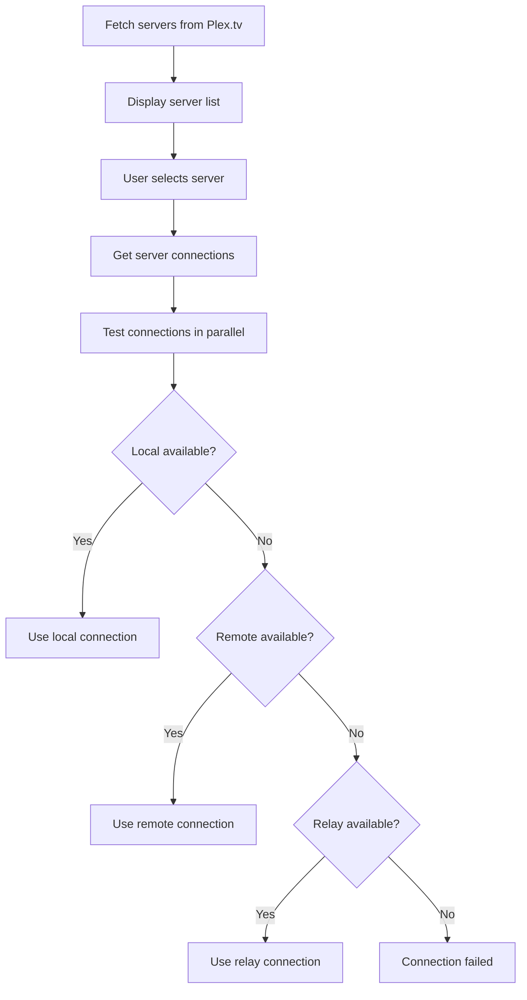

**Implementation**: 
- [`ChooseServerFragment`](../app/src/main/java/local/oss/chronicle/features/login/ChooseServerFragment.kt)
- [`PlexConfig.setPotentialConnections()`](../app/src/main/java/local/oss/chronicle/data/sources/plex/PlexConfig.kt)

### Library Selection

Lists Music libraries from the selected server (audiobooks are stored as music in Plex):

**Implementation**: 
- [`ChooseLibraryFragment`](../app/src/main/java/local/oss/chronicle/features/login/ChooseLibraryFragment.kt)
- [`ChooseLibraryViewModel`](../app/src/main/java/local/oss/chronicle/features/login/ChooseLibraryViewModel.kt)

## 3. Library Browsing

### Home Screen

Displays categorized audiobook lists:
- **Recently Listened** - Books with in-progress playback
- **Recently Added** - Newest additions to library

**Implementation**: [`HomeFragment`](../app/src/main/java/local/oss/chronicle/features/home/HomeFragment.kt), [`HomeViewModel`](../app/src/main/java/local/oss/chronicle/features/home/HomeViewModel.kt)

### Library View

Full library with sorting and filtering options:

| Sort Option | Description |
|-------------|-------------|
| Title | Alphabetical by title |
| Author | Alphabetical by author |
| Date Added | Newest first |
| Date Played | Most recently listened |
| Duration | Longest/shortest |
| Year | Publication year |

**Implementation**: [`LibraryFragment`](../app/src/main/java/local/oss/chronicle/features/library/LibraryFragment.kt), [`LibraryViewModel`](../app/src/main/java/local/oss/chronicle/features/library/LibraryViewModel.kt)

### Search

Real-time search across audiobook titles and authors:

**Implementation**: [`AudiobookSearchAdapter`](../app/src/main/java/local/oss/chronicle/features/library/AudiobookSearchAdapter.kt)

## 4. Collections

Plex collections allow grouping audiobooks (e.g., by series):

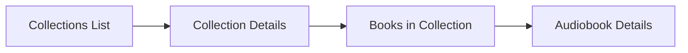

**Key Files**:
- [`CollectionsFragment`](../app/src/main/java/local/oss/chronicle/features/collections/CollectionsFragment.kt) - Collection list
- [`CollectionDetailsFragment`](../app/src/main/java/local/oss/chronicle/features/collections/CollectionDetailsFragment.kt) - Books in collection
- [`CollectionsRepository`](../app/src/main/java/local/oss/chronicle/data/local/CollectionsRepository.kt) - Data management

## 5. Audiobook Details

Displays comprehensive audiobook information:

- Cover art
- Title, author, year
- Summary/description  
- Genre
- Duration and progress
- Chapter list (for M4B files with embedded chapters)
- Download status

**Implementation**: 
- [`AudiobookDetailsFragment`](../app/src/main/java/local/oss/chronicle/features/bookdetails/AudiobookDetailsFragment.kt)
- [`AudiobookDetailsViewModel`](../app/src/main/java/local/oss/chronicle/features/bookdetails/AudiobookDetailsViewModel.kt)

### Chapter Navigation

For M4B files with embedded chapters:

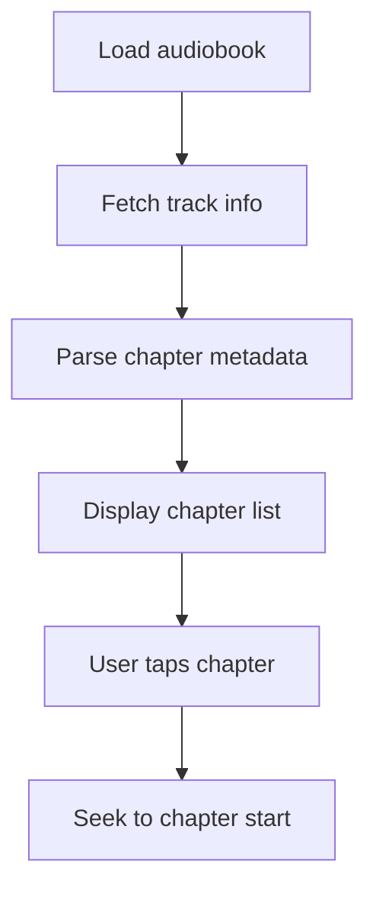

**Implementation**: [`ChapterListAdapter`](../app/src/main/java/local/oss/chronicle/features/bookdetails/ChapterListAdapter.kt)

## 6. Media Playback

### Architecture

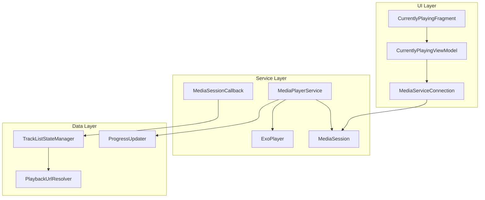

### Key Components

| Component | Purpose |
|-----------|---------|
| [`MediaPlayerService`](../app/src/main/java/local/oss/chronicle/features/player/MediaPlayerService.kt) | Background service, MediaBrowserService |
| [`AudiobookMediaSessionCallback`](../app/src/main/java/local/oss/chronicle/features/player/AudiobookMediaSessionCallback.kt) | Handles play/pause/seek commands |
| [`TrackListStateManager`](../app/src/main/java/local/oss/chronicle/features/player/TrackListStateManager.kt) | Manages playlist state |
| [`PlaybackUrlResolver`](../app/src/main/java/local/oss/chronicle/data/sources/plex/PlaybackUrlResolver.kt) | Resolves streaming URLs via decision endpoint |
| [`ProgressUpdater`](../app/src/main/java/local/oss/chronicle/features/player/ProgressUpdater.kt) | Syncs progress to Plex server |

### Playback Flow

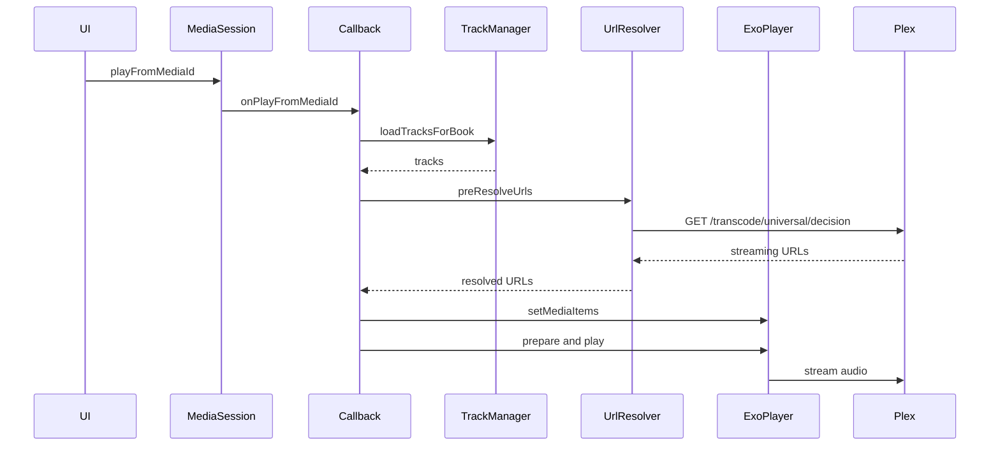

## 7. Offline Downloads

Chronicle supports downloading audiobooks for offline playback.

### Download Flow

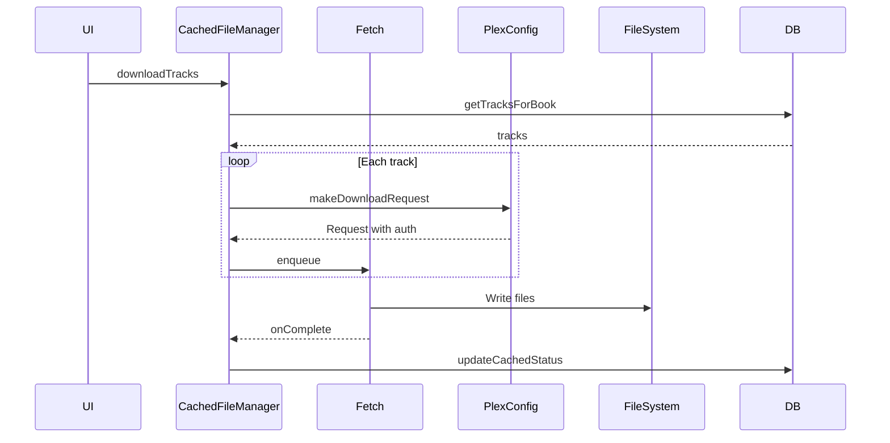

**Key Files**:
- [`CachedFileManager`](../app/src/main/java/local/oss/chronicle/data/sources/plex/CachedFileManager.kt) - Download orchestration
- [`DownloadNotificationWorker`](../app/src/main/java/local/oss/chronicle/features/download/DownloadNotificationWorker.kt) - Progress notifications

### Storage

Downloaded files are stored in app-specific external storage:
- File naming: `{trackId}_{partHash}.{extension}`
- Location: App's external files directory

### Offline Mode

When offline mode is enabled, only downloaded content is shown in the library.

## 8. Sleep Timer

Pauses playback after a specified duration.

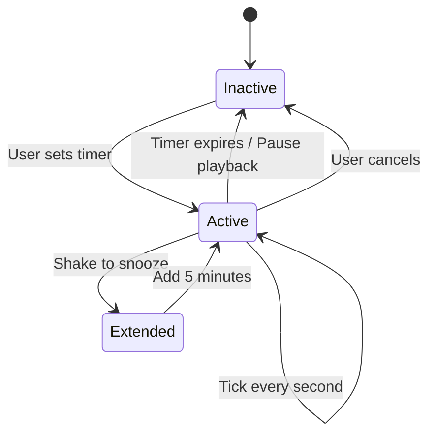

### Features
- Configurable duration
- Shake-to-snooze (extends timer by 5 minutes)
- Only counts down during active playback

**Implementation**: [`SleepTimer`](../app/src/main/java/local/oss/chronicle/features/player/SleepTimer.kt)

## 9. Playback Speed Control

Supports playback speed adjustment from 0.5x to 3.0x:

| Speed | Description |
|-------|-------------|
| 0.5x | Half speed |
| 0.7x | Slower |
| 1.0x | Normal |
| 1.2x | Slightly faster |
| 1.5x | Fast |
| 1.7x | Faster |
| 2.0x | Double speed |
| 3.0x | Triple speed |

**Additional option**: Skip silence - Automatically skips silent parts of audio

**Implementation**: 
- [`ModalBottomSheetSpeedChooser`](../app/src/main/java/local/oss/chronicle/views/ModalBottomSheetSpeedChooser.kt)
- [`PrefsRepo.playbackSpeed`](../app/src/main/java/local/oss/chronicle/data/local/SharedPreferencesPrefsRepo.kt)

## 10. Settings

Configurable preferences:

| Setting | Description |
|---------|-------------|
| Playback Speed | Default playback speed |
| Skip Silence | Auto-skip quiet parts |
| Skip Forward/Back Duration | Jump duration (10-90 seconds) |
| Pause on Focus Lost | Pause when other audio plays |
| Shake to Snooze | Extend sleep timer by shaking |
| Offline Mode | Show only downloaded content |
| Allow Android Auto | Enable Android Auto support |
| Download Location | Choose storage location |

**Implementation**: 
- [`SettingsFragment`](../app/src/main/java/local/oss/chronicle/features/settings/SettingsFragment.kt)
- [`SettingsViewModel`](../app/src/main/java/local/oss/chronicle/features/settings/SettingsViewModel.kt)
- [`PrefsRepo`](../app/src/main/java/local/oss/chronicle/data/local/SharedPreferencesPrefsRepo.kt)

## 11. Android Auto Support

Chronicle supports Android Auto for in-car playback.

### Media Browser Structure

```
Root
├── Recently Listened
├── Offline (Downloaded)
├── Recently Added
└── Library (All Books)
```

### Features
- Voice search support
- Playback controls
- Book artwork display
- Progress indicators

**Implementation**: 
- [`MediaPlayerService.onGetRoot()`](../app/src/main/java/local/oss/chronicle/features/player/MediaPlayerService.kt)
- [`MediaPlayerService.onLoadChildren()`](../app/src/main/java/local/oss/chronicle/features/player/MediaPlayerService.kt)
- [`MediaPlayerService.onSearch()`](../app/src/main/java/local/oss/chronicle/features/player/MediaPlayerService.kt)
- [`PackageValidator`](../app/src/main/java/local/oss/chronicle/util/PackageValidator.kt) - Validates Auto client

### Configuration
- [`auto_allowed_callers.xml`](../app/src/main/res/xml/auto_allowed_callers.xml) - Allowed Auto clients
- [`automotive_app_desc.xml`](../app/src/main/res/xml/automotive_app_desc.xml) - Auto capabilities

## 12. Progress Scrobbling

Chronicle syncs playback progress to Plex server for:
- Cross-device progress sync
- Continue listening features
- Watch history

### Timeline Updates

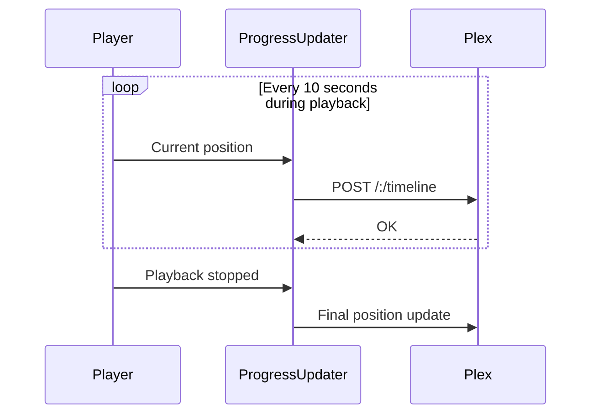

**Implementation**: [`ProgressUpdater`](../app/src/main/java/local/oss/chronicle/features/player/ProgressUpdater.kt)

## 13. Notification Controls

Media notification with:
- Play/pause
- Skip forward/back (configurable duration)
- Seek bar (Android 10+)
- Album art
- Title and author

**Implementation**: [`NotificationBuilder`](../app/src/main/java/local/oss/chronicle/features/player/NotificationBuilder.kt)

## Feature Dependencies

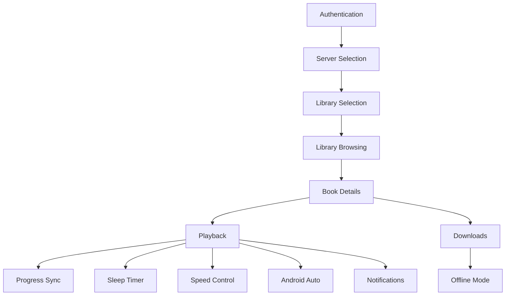
