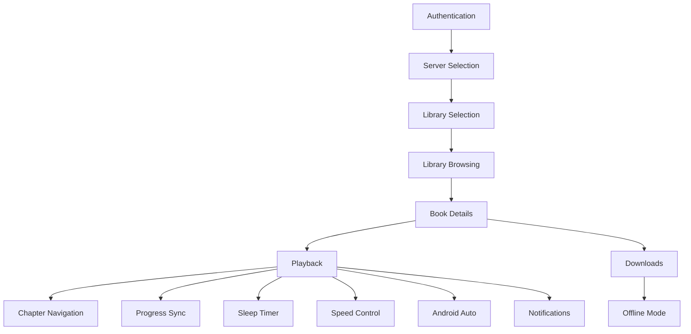

# Chronicle Features

## Overview

Chronicle is a feature-rich Android audiobook player that integrates with Plex Media Server. This document provides a high-level overview of Chronicle's features. For detailed information on specific topics, see the documentation links below.

---

## Documentation Index

| Document | Description |
|----------|-------------|
| [Login & Authentication](features/login.md) | OAuth flow, user selection, server selection, library selection |
| [Account Management](features/account-ui-design.md) | Multi-account and library switching UI |
| [Library & Browsing](features/library.md) | Home screen, library view, search, collections, audiobook details |
| [Media Playback](features/playback.md) | Player architecture, sleep timer, speed control, progress sync, notifications |
| [Chapter System](features/chapters.md) | Chapter data flow, detection algorithm, track-to-chapter mapping, navigation |
| [Offline Downloads](features/downloads.md) | Download management, storage, offline mode |
| [Android Auto](features/android-auto.md) | In-car playback, media browser, voice search |
| [Settings](features/settings.md) | Configurable preferences and app settings |

---

## Feature Overview

---

## Feature Summaries

### Authentication
Chronicle uses Plex's OAuth 2.0 PIN-based authentication flow. Users can select from multiple managed users, servers, and libraries.

→ See [Login & Authentication](features/login.md) for OAuth flow details and implementation.

---

### Account Management
Chronicle supports multiple Plex accounts and libraries with a **Unified Library View** that displays content from ALL connected accounts and libraries in a single interface.

#### Unified Library View
Chronicle aggregates audiobooks from all connected accounts and libraries:
- **Library Screen** - Shows all audiobooks from all libraries, sorted alphabetically
- **Home Screen** - "Recently Listened" and "Recently Added" aggregate across all libraries
- **Collections Screen** - Shows all collections from all libraries
- **Search** - Finds audiobooks across all connected libraries

#### Multi-Account Support
- Add multiple Plex accounts via **Settings → Manage Accounts**
- Each account can have multiple libraries, and all content is shown together
- All libraries sync automatically when refreshing
- Playback progress syncs to the correct server for each audiobook
- Remove accounts individually via Manage Accounts

→ See [Account Management](features/account-ui-design.md) for multi-account UI details.

---

### Library & Browsing
The app provides multiple ways to browse audiobooks from **all your connected libraries**:
- **Home Screen** - Recently listened and recently added from all libraries
- **Library View** - Full library with sorting/filtering across all libraries
- **Collections** - All Plex collections from all libraries
- **Search** - Real-time search across titles and authors from all libraries

→ See [Library & Browsing](features/library.md) for browsing features and audiobook details.

---

### Media Playback
Chronicle uses Media3 (ExoPlayer) for background audio playback with:
- Background playback support
- Sleep timer with shake-to-snooze
- Playback speed control (0.5x - 3.0x)
- Chapter navigation for M4B files
- Progress sync to Plex server
- Media notification controls

→ See [Media Playback](features/playback.md) for player architecture and controls.

---

### Chapter System
Chronicle supports chapter navigation for M4B audiobooks and multi-file audiobooks:
- Chapters sourced from Plex API or synthesized from track files
- Chapter-scoped seekbar and progress display
- Skip to next/previous chapter navigation
- Chapter list with active chapter highlighting

→ See [Chapter System](features/chapters.md) for detection algorithm and implementation details.

---

### Offline Downloads
Download audiobooks for offline playback:
- Background download with progress notifications
- Configurable storage location
- Offline mode for downloaded-only browsing

→ See [Offline Downloads](features/downloads.md) for download management.

---

### Android Auto
In-car audiobook playback with:
- Browsable media hierarchy
- Voice search support
- Playback controls

→ See [Android Auto](features/android-auto.md) for Auto integration details.

---

### Settings
Configurable preferences including:
- Playback speed and skip durations
- Offline mode
- Android Auto support
- Download location

→ See [Settings](features/settings.md) for available settings.

---

## Feature Dependencies

---

## Related Documentation

### Feature Details
- [Login & Authentication](features/login.md) - OAuth and server selection
- [Account Management](features/account-ui-design.md) - Multi-account and library switching
- [Library & Browsing](features/library.md) - Library and collections
- [Media Playback](features/playback.md) - Player and controls
- [Chapter System](features/chapters.md) - Chapter detection and navigation
- [Offline Downloads](features/downloads.md) - Download management
- [Android Auto](features/android-auto.md) - In-car support
- [Settings](features/settings.md) - App preferences

### Architecture
- [Architecture Overview](ARCHITECTURE.md) - System architecture
- [Architecture Layers](architecture/layers.md) - Presentation, Domain, Data layers
- [Architectural Patterns](architecture/patterns.md) - Key patterns

### API & Data
- [API Flows](API_FLOWS.md) - Detailed API documentation
- [Data Layer](DATA_LAYER.md) - Database and repository patterns
- [Example API Responses](example-query-responses/) - Real Plex API examples
