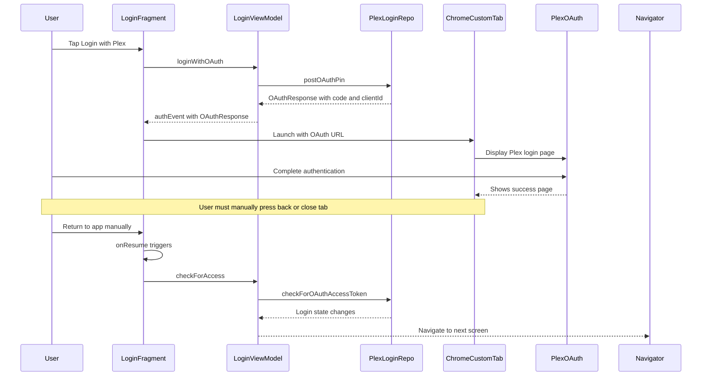
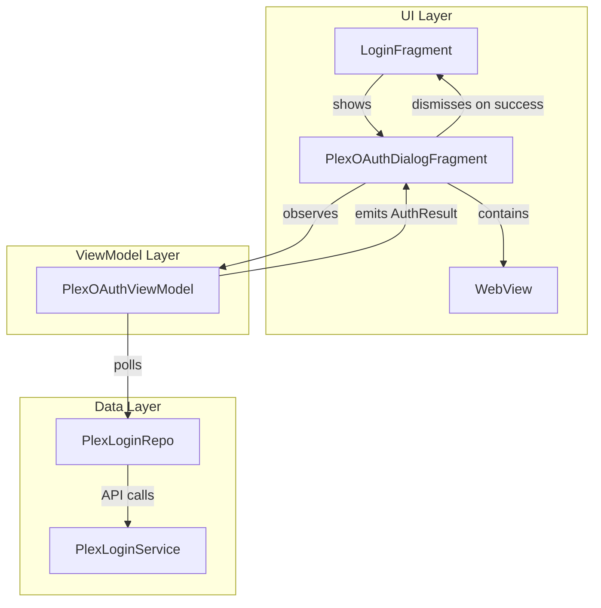
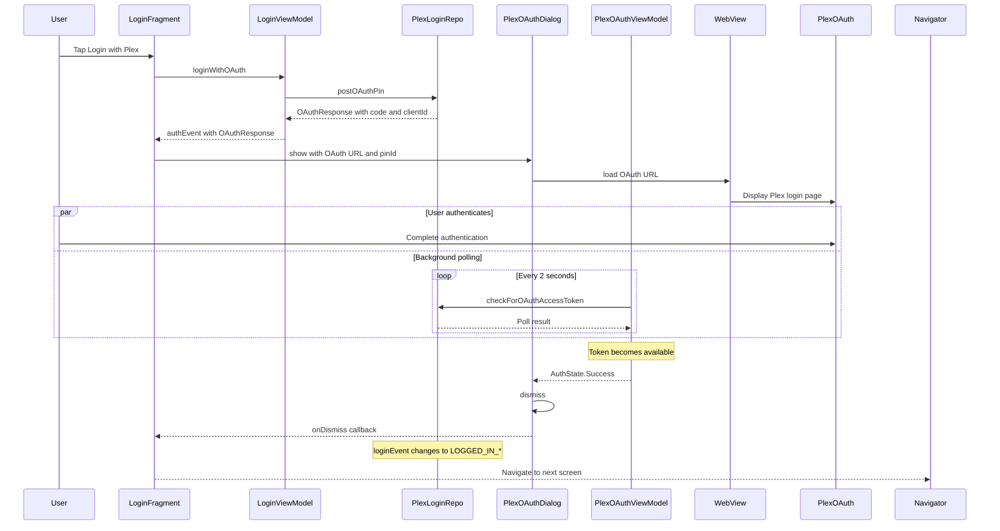

# Plex OAuth Login Auto-Close Design Document

## Overview

This document describes the design for automatically closing the Plex OAuth login interface and returning to the Chronicle app after successful authentication.

## Background

### Why Not Deep Links?

The initial design proposed using Plex's `forwardUrl` parameter with Chrome Custom Tabs. However, **Plex's OAuth API does not support `forwardUrl` for mobile apps**. When a mobile app provides a `forwardUrl`, Plex ignores it and instead shows a "return to app" message. This is a deliberate design choice by Plex to handle mobile OAuth differently from web OAuth.

### Current Implementation

The existing implementation in [`LoginFragment`](../app/src/main/java/local/oss/chronicle/features/login/LoginFragment.kt) uses Chrome Custom Tabs:



### Current Pain Points

1. **Manual User Action Required**: User must manually close the Chrome Custom Tab or press back after successful authentication
2. **No Feedback**: User doesn't know when authentication is complete without switching back to the app
3. **Potential Confusion**: Users may wait on the Plex success page, unsure if they should close it

---

## Chosen Solution: In-App WebView with Background Polling

### Justification

| Approach | Pros | Cons |
|----------|------|------|
| Deep Link Callback | Standard Android pattern, automatic close | **Not supported by Plex mobile OAuth** |
| Background Polling with Chrome Tab | No deep link needed | Complex foreground bring-back logic, poor UX |
| **In-App WebView** | Full control, can auto-close, integrated polling | Requires JavaScript enabled, needs proper User-Agent |

The **In-App WebView approach** is the only viable solution because:
1. We have full control over the WebView lifecycle
2. We can poll for token completion while the WebView is displayed
3. When the token is available, we can programmatically dismiss the WebView
4. The user gets a seamless experience without manual intervention

---

## Architecture Overview

### Component Diagram



### Key Components

1. **PlexOAuthDialogFragment**: A full-screen `DialogFragment` containing the WebView
2. **PlexOAuthViewModel**: Manages polling logic and authentication state
3. **PlexLoginRepo**: Existing repository, used for polling
4. **WebView**: Displays Plex OAuth page with JavaScript enabled

---

## Detailed Design

### New Files to Create

| File | Purpose |
|------|---------|
| `PlexOAuthDialogFragment.kt` | DialogFragment hosting the WebView |
| `PlexOAuthViewModel.kt` | ViewModel for polling and state management |
| `fragment_plex_oauth.xml` | Layout with WebView and loading indicator |
| `styles_dialog.xml` | Full-screen dialog theme |

### Existing Files to Modify

| File | Changes |
|------|---------|
| `LoginFragment.kt` | Launch DialogFragment instead of Chrome Custom Tab |
| `AppComponent.kt` | Add inject method for new DialogFragment |
| `strings.xml` | Add new string resources |

---

### Sequence Diagram: WebView Flow



---

## Code Structure

### 1. PlexOAuthDialogFragment

**Location:** `app/src/main/java/local/oss/chronicle/features/login/PlexOAuthDialogFragment.kt`

```kotlin
package local.oss.chronicle.features.login

import android.annotation.SuppressLint
import android.content.Context
import android.graphics.Bitmap
import android.os.Bundle
import android.view.LayoutInflater
import android.view.View
import android.view.ViewGroup
import android.webkit.WebChromeClient
import android.webkit.WebView
import android.webkit.WebViewClient
import androidx.fragment.app.DialogFragment
import androidx.fragment.app.viewModels
import androidx.lifecycle.Lifecycle
import androidx.lifecycle.lifecycleScope
import androidx.lifecycle.repeatOnLifecycle
import kotlinx.coroutines.launch
import local.oss.chronicle.R
import local.oss.chronicle.application.ChronicleApplication
import local.oss.chronicle.databinding.FragmentPlexOauthBinding
import timber.log.Timber
import javax.inject.Inject

class PlexOAuthDialogFragment : DialogFragment() {

    companion object {
        private const val ARG_OAUTH_URL = "oauth_url"
        private const val ARG_PIN_ID = "pin_id"
        const val TAG = "PlexOAuthDialogFragment"

        fun newInstance(oauthUrl: String, pinId: Long): PlexOAuthDialogFragment {
            return PlexOAuthDialogFragment().apply {
                arguments = Bundle().apply {
                    putString(ARG_OAUTH_URL, oauthUrl)
                    putLong(ARG_PIN_ID, pinId)
                }
            }
        }
    }

    @Inject
    lateinit var viewModelFactory: PlexOAuthViewModel.Factory

    private val viewModel: PlexOAuthViewModel by viewModels { viewModelFactory }
    
    private var _binding: FragmentPlexOauthBinding? = null
    private val binding get() = _binding!!

    private var onAuthSuccessListener: (() -> Unit)? = null
    private var onAuthCancelledListener: (() -> Unit)? = null

    override fun onAttach(context: Context) {
        (requireActivity().application as ChronicleApplication)
            .appComponent
            .inject(this)
        super.onAttach(context)
    }

    override fun onCreate(savedInstanceState: Bundle?) {
        super.onCreate(savedInstanceState)
        setStyle(STYLE_NORMAL, R.style.Theme_Chronicle_FullScreenDialog)
    }

    override fun onCreateView(
        inflater: LayoutInflater,
        container: ViewGroup?,
        savedInstanceState: Bundle?
    ): View {
        _binding = FragmentPlexOauthBinding.inflate(inflater, container, false)
        return binding.root
    }

    @SuppressLint("SetJavaScriptEnabled")
    override fun onViewCreated(view: View, savedInstanceState: Bundle?) {
        super.onViewCreated(view, savedInstanceState)

        setupToolbar()
        setupWebView()
        observeAuthState()

        val oauthUrl = requireArguments().getString(ARG_OAUTH_URL)
            ?: throw IllegalStateException("OAuth URL is required")
        val pinId = requireArguments().getLong(ARG_PIN_ID, -1L)
        
        if (pinId == -1L) {
            throw IllegalStateException("PIN ID is required")
        }

        binding.webview.loadUrl(oauthUrl)
        viewModel.startPolling(pinId)
    }

    private fun setupToolbar() {
        binding.toolbar.setNavigationOnClickListener {
            onAuthCancelledListener?.invoke()
            dismiss()
        }
        binding.toolbar.title = getString(R.string.plex_login_title)
    }

    @SuppressLint("SetJavaScriptEnabled")
    private fun setupWebView() {
        binding.webview.apply {
            settings.javaScriptEnabled = true
            settings.domStorageEnabled = true
            settings.userAgentString = buildUserAgent()
            
            webViewClient = object : WebViewClient() {
                override fun onPageStarted(view: WebView?, url: String?, favicon: Bitmap?) {
                    super.onPageStarted(view, url, favicon)
                    binding.progressBar.visibility = View.VISIBLE
                }

                override fun onPageFinished(view: WebView?, url: String?) {
                    super.onPageFinished(view, url)
                    binding.progressBar.visibility = View.GONE
                }
            }
            
            webChromeClient = object : WebChromeClient() {
                override fun onProgressChanged(view: WebView?, newProgress: Int) {
                    super.onProgressChanged(view, newProgress)
                    binding.progressBar.progress = newProgress
                }
            }
        }
    }

    private fun buildUserAgent(): String {
        val defaultAgent = WebView(requireContext()).settings.userAgentString
        // Append Chronicle identifier but keep browser-like agent to avoid blocking
        return "$defaultAgent Chronicle/Android"
    }

    private fun observeAuthState() {
        viewLifecycleOwner.lifecycleScope.launch {
            viewLifecycleOwner.repeatOnLifecycle(Lifecycle.State.STARTED) {
                viewModel.authState.collect { state ->
                    when (state) {
                        is PlexOAuthViewModel.AuthState.Polling -> {
                            // Continue showing WebView
                        }
                        is PlexOAuthViewModel.AuthState.Success -> {
                            Timber.i("OAuth authentication successful, dismissing dialog")
                            onAuthSuccessListener?.invoke()
                            dismiss()
                        }
                        is PlexOAuthViewModel.AuthState.Error -> {
                            Timber.e("OAuth authentication error: ${state.message}")
                            onAuthCancelledListener?.invoke()
                            dismiss()
                        }
                        is PlexOAuthViewModel.AuthState.Timeout -> {
                            Timber.w("OAuth authentication timed out")
                            onAuthCancelledListener?.invoke()
                            dismiss()
                        }
                        PlexOAuthViewModel.AuthState.Idle -> {
                            // Initial state, do nothing
                        }
                    }
                }
            }
        }
    }

    override fun onDestroyView() {
        viewModel.stopPolling()
        binding.webview.destroy()
        _binding = null
        super.onDestroyView()
    }

    fun setOnAuthSuccessListener(listener: () -> Unit) {
        onAuthSuccessListener = listener
    }

    fun setOnAuthCancelledListener(listener: () -> Unit) {
        onAuthCancelledListener = listener
    }
}
```

---

### 2. PlexOAuthViewModel

**Location:** `app/src/main/java/local/oss/chronicle/features/login/PlexOAuthViewModel.kt`

```kotlin
package local.oss.chronicle.features.login

import androidx.lifecycle.ViewModel
import androidx.lifecycle.ViewModelProvider
import androidx.lifecycle.viewModelScope
import kotlinx.coroutines.Job
import kotlinx.coroutines.delay
import kotlinx.coroutines.flow.MutableStateFlow
import kotlinx.coroutines.flow.StateFlow
import kotlinx.coroutines.flow.asStateFlow
import kotlinx.coroutines.isActive
import kotlinx.coroutines.launch
import local.oss.chronicle.data.sources.plex.IPlexLoginRepo
import timber.log.Timber
import javax.inject.Inject

class PlexOAuthViewModel(
    private val plexLoginRepo: IPlexLoginRepo
) : ViewModel() {

    companion object {
        /** Polling interval in milliseconds */
        const val POLLING_INTERVAL_MS = 2000L
        
        /** Maximum polling duration before timeout - 5 minutes */
        const val POLLING_TIMEOUT_MS = 5 * 60 * 1000L
    }

    sealed class AuthState {
        object Idle : AuthState()
        object Polling : AuthState()
        object Success : AuthState()
        data class Error(val message: String) : AuthState()
        object Timeout : AuthState()
    }

    private val _authState = MutableStateFlow<AuthState>(AuthState.Idle)
    val authState: StateFlow<AuthState> = _authState.asStateFlow()

    private var pollingJob: Job? = null
    private var startTime: Long = 0

    fun startPolling(pinId: Long) {
        if (pollingJob?.isActive == true) {
            Timber.d("Polling already active, ignoring start request")
            return
        }

        startTime = System.currentTimeMillis()
        _authState.value = AuthState.Polling

        pollingJob = viewModelScope.launch {
            while (isActive) {
                // Check for timeout
                if (System.currentTimeMillis() - startTime > POLLING_TIMEOUT_MS) {
                    Timber.w("OAuth polling timed out after ${POLLING_TIMEOUT_MS}ms")
                    _authState.value = AuthState.Timeout
                    break
                }

                try {
                    Timber.d("Polling for OAuth token...")
                    plexLoginRepo.checkForOAuthAccessToken()
                    
                    // Check if login state changed to indicate success
                    val currentState = plexLoginRepo.loginEvent.value?.peekContent()
                    if (currentState != null && 
                        currentState != IPlexLoginRepo.LoginState.NOT_LOGGED_IN &&
                        currentState != IPlexLoginRepo.LoginState.AWAITING_LOGIN_RESULTS &&
                        currentState != IPlexLoginRepo.LoginState.FAILED_TO_LOG_IN
                    ) {
                        Timber.i("OAuth token obtained, login state: $currentState")
                        _authState.value = AuthState.Success
                        break
                    }
                } catch (e: Exception) {
                    Timber.e(e, "Error during OAuth polling")
                    // Don't fail immediately, continue polling
                }

                delay(POLLING_INTERVAL_MS)
            }
        }
    }

    fun stopPolling() {
        pollingJob?.cancel()
        pollingJob = null
        Timber.d("OAuth polling stopped")
    }

    override fun onCleared() {
        super.onCleared()
        stopPolling()
    }

    class Factory @Inject constructor(
        private val plexLoginRepo: IPlexLoginRepo
    ) : ViewModelProvider.Factory {
        @Suppress("UNCHECKED_CAST")
        override fun <T : ViewModel> create(modelClass: Class<T>): T {
            if (modelClass.isAssignableFrom(PlexOAuthViewModel::class.java)) {
                return PlexOAuthViewModel(plexLoginRepo) as T
            }
            throw IllegalArgumentException("Unknown ViewModel class")
        }
    }
}
```

---

### 3. Layout: fragment_plex_oauth.xml

**Location:** `app/src/main/res/layout/fragment_plex_oauth.xml`

```xml
<?xml version="1.0" encoding="utf-8"?>
<androidx.coordinatorlayout.widget.CoordinatorLayout
    xmlns:android="http://schemas.android.com/apk/res/android"
    xmlns:app="http://schemas.android.com/apk/res-auto"
    android:layout_width="match_parent"
    android:layout_height="match_parent"
    android:fitsSystemWindows="true">

    <com.google.android.material.appbar.AppBarLayout
        android:layout_width="match_parent"
        android:layout_height="wrap_content"
        android:fitsSystemWindows="true">

        <com.google.android.material.appbar.MaterialToolbar
            android:id="@+id/toolbar"
            android:layout_width="match_parent"
            android:layout_height="?attr/actionBarSize"
            app:navigationIcon="@drawable/ic_close_white"
            app:navigationContentDescription="@string/close" />

        <ProgressBar
            android:id="@+id/progressBar"
            style="@style/Widget.AppCompat.ProgressBar.Horizontal"
            android:layout_width="match_parent"
            android:layout_height="4dp"
            android:indeterminate="false"
            android:max="100"
            android:progress="0"
            android:visibility="gone" />

    </com.google.android.material.appbar.AppBarLayout>

    <WebView
        android:id="@+id/webview"
        android:layout_width="match_parent"
        android:layout_height="match_parent"
        app:layout_behavior="@string/appbar_scrolling_view_behavior" />

</androidx.coordinatorlayout.widget.CoordinatorLayout>
```

---

### 4. Styles: Theme_Chronicle_FullScreenDialog

**Add to:** `app/src/main/res/values/styles.xml`

```xml
<style name="Theme.Chronicle.FullScreenDialog" parent="Theme.MaterialComponents.DayNight.NoActionBar">
    <item name="android:windowIsFloating">false</item>
    <item name="android:windowBackground">?android:colorBackground</item>
    <item name="android:statusBarColor">@color/colorPrimaryDark</item>
    <item name="android:navigationBarColor">@color/colorPrimaryDark</item>
</style>
```

---

### 5. Modify LoginFragment

**Location:** [`app/src/main/java/local/oss/chronicle/features/login/LoginFragment.kt`](../app/src/main/java/local/oss/chronicle/features/login/LoginFragment.kt)

**Changes:** Replace Chrome Custom Tab launch with DialogFragment

```kotlin
// Replace the authEvent observer (lines 77-118) with:

loginViewModel.authEvent.observe(
    viewLifecycleOwner,
    Observer { authRequestEvent ->
        val oAuthPin = authRequestEvent.getContentIfNotHandled()
        if (oAuthPin != null) {
            // Build OAuth URL
            val url = loginViewModel.makeOAuthLoginUrl(
                oAuthPin.clientIdentifier,
                oAuthPin.code,
            )
            
            // Get the PIN ID from PlexPrefsRepo for polling
            val pinId = oAuthPin.id
            
            // Show WebView dialog instead of Chrome Custom Tab
            val dialog = PlexOAuthDialogFragment.newInstance(
                oauthUrl = url.toString(),
                pinId = pinId
            )
            
            dialog.setOnAuthSuccessListener {
                Timber.i("OAuth success callback received")
                // The loginEvent observer in MainActivity handles navigation
            }
            
            dialog.setOnAuthCancelledListener {
                Timber.i("OAuth cancelled by user")
                // User can retry by pressing login button again
            }
            
            dialog.show(childFragmentManager, PlexOAuthDialogFragment.TAG)
            
            loginViewModel.setLaunched(true)
        }
    },
)
```

**Remove:** The following imports are no longer needed:
- `androidx.browser.customtabs.CustomTabColorSchemeParams`
- `androidx.browser.customtabs.CustomTabsIntent`

---

### 6. Modify AppComponent

**Location:** [`app/src/main/java/local/oss/chronicle/injection/components/AppComponent.kt`](../app/src/main/java/local/oss/chronicle/injection/components/AppComponent.kt)

**Add:** New inject method for the DialogFragment

```kotlin
// Add after line 89:
fun inject(plexOAuthDialogFragment: PlexOAuthDialogFragment)
```

---

### 7. String Resources

**Add to:** `app/src/main/res/values/strings.xml`

```xml
<string name="plex_login_title">Sign in with Plex</string>
<string name="close">Close</string>
```

---

## Error Handling Strategy

### Network Errors During Polling

**Scenario:** Network becomes unavailable during authentication polling.

**Handling:**
- Polling continues with exponential backoff (could be enhanced)
- Errors are logged but don't immediately fail
- If network recovers, polling resumes
- Timeout eventually triggers if auth never completes

### User Cancellation

**Scenario:** User presses back or close button on the dialog.

**Handling:**
- `onAuthCancelledListener` is invoked
- Polling stops via `onDestroyView()`
- User returns to LoginFragment, can retry

### Polling Timeout

**Scenario:** User doesn't complete authentication within 5 minutes.

**Handling:**
- `AuthState.Timeout` is emitted
- Dialog dismisses automatically
- User can retry by pressing login button

### WebView JavaScript Errors

**Scenario:** Plex page fails to load properly.

**Handling:**
- WebView shows error page
- User can press close button to cancel
- Polling continues in background (in case auth completed server-side)

---

## Security Considerations

### WebView Security

1. **JavaScript**: Enabled only for the Plex domain
2. **User Agent**: Standard browser agent with Chronicle suffix (avoids blocking)
3. **Cookies**: WebView uses sandboxed cookie storage
4. **HTTPS**: Plex OAuth exclusively uses HTTPS

### Credential Protection

1. **No credential interception**: User enters credentials directly in Plex WebView
2. **Token polling**: Uses secure server-to-server API calls
3. **No sensitive data in logs**: Only state transitions are logged

### WebView Hardening Checklist

- [ ] Disable file access: `settings.allowFileAccess = false`
- [ ] Disable content access: `settings.allowContentAccess = false`  
- [ ] Clear WebView data on dismiss
- [ ] Consider using `WebViewAssetLoader` for any local content

---

## Build Variants

The solution works identically for both **Play Store** and **F-Droid** variants:

- No flavor-specific code required
- WebView is part of Android system, no Google services dependency
- All changes are in the `main` source set

---

## Testing Considerations

### Unit Tests

1. **PlexOAuthViewModel**
   - Test polling starts and emits correct states
   - Test timeout behavior
   - Test polling stops when cancelled

### Integration Tests

1. **Happy Path**
   - Launch OAuth flow
   - Complete authentication in WebView
   - Verify dialog auto-dismisses
   - Verify navigation proceeds

2. **Cancellation Path**
   - Launch OAuth flow
   - Press close button
   - Verify dialog dismisses
   - Verify user can retry

3. **Timeout Path**
   - Launch OAuth flow
   - Wait for timeout (use shorter timeout for test)
   - Verify dialog dismisses
   - Verify error state

### Manual Testing Checklist

- [ ] Test on Play Store build variant
- [ ] Test on F-Droid build variant
- [ ] Test WebView loads Plex page correctly
- [ ] Test login with valid credentials
- [ ] Test login with invalid credentials
- [ ] Test dialog close button
- [ ] Test Android back button
- [ ] Test screen rotation during login
- [ ] Test network disconnect during login
- [ ] Test slow network conditions

---

## Implementation Summary

| File | Action | Description |
|------|--------|-------------|
| `PlexOAuthDialogFragment.kt` | **Create** | Full-screen dialog with WebView |
| `PlexOAuthViewModel.kt` | **Create** | Polling logic and state management |
| `fragment_plex_oauth.xml` | **Create** | Layout with toolbar, progress bar, WebView |
| `styles.xml` | **Modify** | Add full-screen dialog theme |
| `strings.xml` | **Modify** | Add string resources |
| `LoginFragment.kt` | **Modify** | Launch dialog instead of Chrome Custom Tab |
| `AppComponent.kt` | **Modify** | Add inject method for dialog |

---

## Future Enhancements

1. **Polling Backoff**: Implement exponential backoff for polling intervals
2. **Network State Monitoring**: Pause polling when network unavailable
3. **Loading Animation**: Show loading overlay during initial page load
4. **Analytics**: Track OAuth completion rates and timing
5. **WebView Caching**: Consider caching Plex OAuth page resources
