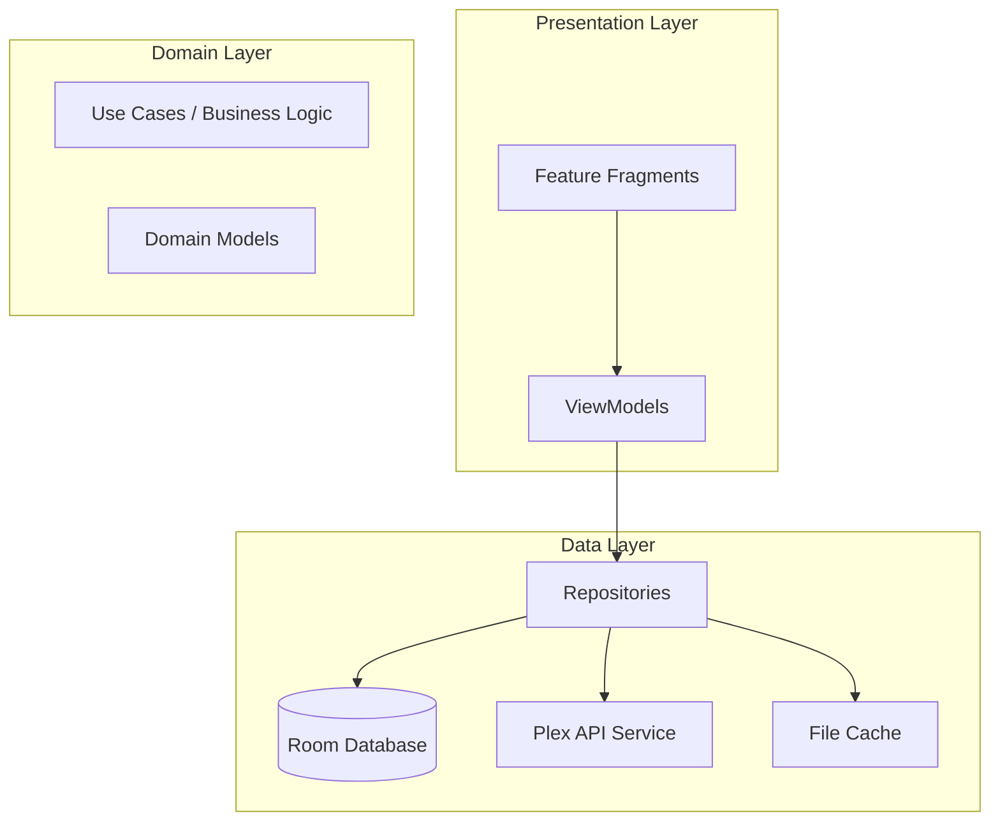
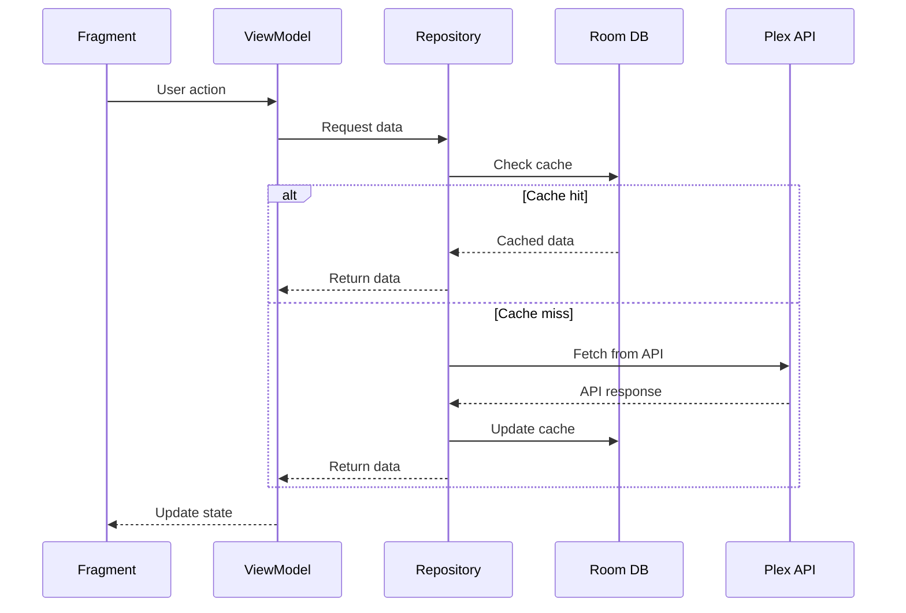

# Architecture Layers

This document describes the layered architecture of Chronicle, with details on each layer's responsibilities and key components.

For a high-level overview, see the [Architecture Overview](../ARCHITECTURE.md).

## Overview

Chronicle follows a layered MVVM architecture with three primary layers:



---

## Presentation Layer

Located in [`features/`](../../app/src/main/java/local/oss/chronicle/features/)

The presentation layer contains all UI-related code organized by feature. Each feature module follows the MVVM pattern.

### Feature Modules

| Feature | Purpose |
|---------|---------|
| [`login/`](../../app/src/main/java/local/oss/chronicle/features/login/) | OAuth flow, server/user/library selection |
| [`home/`](../../app/src/main/java/local/oss/chronicle/features/home/) | Recently listened, recently added books |
| [`library/`](../../app/src/main/java/local/oss/chronicle/features/library/) | Full audiobook library with search/filter |
| [`bookdetails/`](../../app/src/main/java/local/oss/chronicle/features/bookdetails/) | Audiobook details, chapters, playback |
| [`collections/`](../../app/src/main/java/local/oss/chronicle/features/collections/) | Plex collections browsing |
| [`currentlyplaying/`](../../app/src/main/java/local/oss/chronicle/features/currentlyplaying/) | Full-screen player UI |
| [`player/`](../../app/src/main/java/local/oss/chronicle/features/player/) | MediaPlayerService, ExoPlayer integration |
| [`settings/`](../../app/src/main/java/local/oss/chronicle/features/settings/) | App preferences |

### Feature Module Structure

Each feature contains:

- **Fragment** (UI) - Handles view rendering and user interaction
- **ViewModel** (UI State & Logic) - Manages UI state and orchestrates business logic
- **Adapters** (RecyclerView) - Binds data to list views
- **Binding Adapters** (Data Binding) - Custom XML attribute bindings

### Example Feature Structure

```
features/bookdetails/
├── AudiobookDetailsFragment.kt      # UI Fragment
├── AudiobookDetailsViewModel.kt     # State management
├── ChapterListAdapter.kt            # RecyclerView adapter
└── AudiobookDetailsBindingAdapters.kt  # Data binding extensions
```

---

## Domain Layer

The domain layer contains business logic and domain models. In Chronicle, business logic is primarily distributed between ViewModels and Repositories.

### Domain Models

Located in [`data/model/`](../../app/src/main/java/local/oss/chronicle/data/model/):

| Model | Purpose |
|-------|---------|
| [`Audiobook`](../../app/src/main/java/local/oss/chronicle/data/model/Audiobook.kt) | Core audiobook entity with metadata |
| [`MediaItemTrack`](../../app/src/main/java/local/oss/chronicle/data/model/MediaItemTrack.kt) | Individual audio track/file |
| [`Chapter`](../../app/src/main/java/local/oss/chronicle/data/model/Chapter.kt) | Chapter marker within a track |
| [`Collection`](../../app/src/main/java/local/oss/chronicle/data/model/Collection.kt) | Plex collection |
| [`PlexLibrary`](../../app/src/main/java/local/oss/chronicle/data/model/PlexLibrary.kt) | Plex library information |

### Business Logic Distribution

| Component | Responsibility |
|-----------|----------------|
| **ViewModels** | UI state management, user action handling, orchestrating repository calls |
| **Repositories** | Data access abstraction, caching strategy, sync logic |
| **Workers** | Background tasks (sync, downloads) |

---

## Data Layer

Located in [`data/`](../../app/src/main/java/local/oss/chronicle/data/)

The data layer handles all data operations, including local storage, remote API calls, and caching.

### Local Storage

Located in [`data/local/`](../../app/src/main/java/local/oss/chronicle/data/local/):

| Component | Purpose |
|-----------|---------|
| [`BookDatabase.kt`](../../app/src/main/java/local/oss/chronicle/data/local/BookDatabase.kt) | Room database for audiobook metadata |
| [`BookRepository.kt`](../../app/src/main/java/local/oss/chronicle/data/local/BookRepository.kt) | Audiobook data access |
| [`TrackDatabase.kt`](../../app/src/main/java/local/oss/chronicle/data/local/TrackDatabase.kt) | Room database for audio tracks |
| [`TrackRepository.kt`](../../app/src/main/java/local/oss/chronicle/data/local/TrackRepository.kt) | Track data access |
| [`ChapterDatabase.kt`](../../app/src/main/java/local/oss/chronicle/data/local/ChapterDatabase.kt) | Room database for chapters |
| [`ChapterRepository.kt`](../../app/src/main/java/local/oss/chronicle/data/local/ChapterRepository.kt) | Chapter data access |
| [`CollectionsDatabase.kt`](../../app/src/main/java/local/oss/chronicle/data/local/CollectionsDatabase.kt) | Room database for collections |
| [`CollectionsRepository.kt`](../../app/src/main/java/local/oss/chronicle/data/local/CollectionsRepository.kt) | Collection data access |
| [`SharedPreferencesPrefsRepo.kt`](../../app/src/main/java/local/oss/chronicle/data/local/SharedPreferencesPrefsRepo.kt) | App preferences storage |

### Remote Data Sources

Located in [`data/sources/plex/`](../../app/src/main/java/local/oss/chronicle/data/sources/plex/):

| Component | Purpose |
|-----------|---------|
| [`PlexService.kt`](../../app/src/main/java/local/oss/chronicle/data/sources/plex/PlexService.kt) | Retrofit API interface |
| [`PlexMediaRepository.kt`](../../app/src/main/java/local/oss/chronicle/data/sources/plex/PlexMediaRepository.kt) | Plex content access |
| [`PlexLoginRepo.kt`](../../app/src/main/java/local/oss/chronicle/data/sources/plex/PlexLoginRepo.kt) | Authentication handling |
| [`PlexConfig.kt`](../../app/src/main/java/local/oss/chronicle/data/sources/plex/PlexConfig.kt) | Server configuration |
| [`PlexInterceptor.kt`](../../app/src/main/java/local/oss/chronicle/data/sources/plex/PlexInterceptor.kt) | HTTP header injection |

### File Cache

| Component | Purpose |
|-----------|---------|
| [`CachedFileManager.kt`](../../app/src/main/java/local/oss/chronicle/data/sources/plex/CachedFileManager.kt) | Manages cached/downloaded audio files |

---

## Data Flow



---

## Related Documentation

- [Architecture Overview](../ARCHITECTURE.md) - High-level architecture diagrams
- [Dependency Injection](dependency-injection.md) - Dagger component hierarchy
- [Architectural Patterns](patterns.md) - Key patterns used in Chronicle
- [Plex Integration](plex-integration.md) - Plex-specific implementation details
