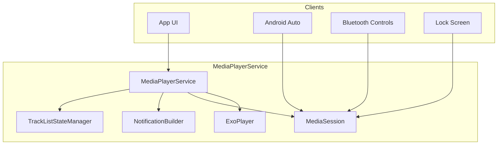
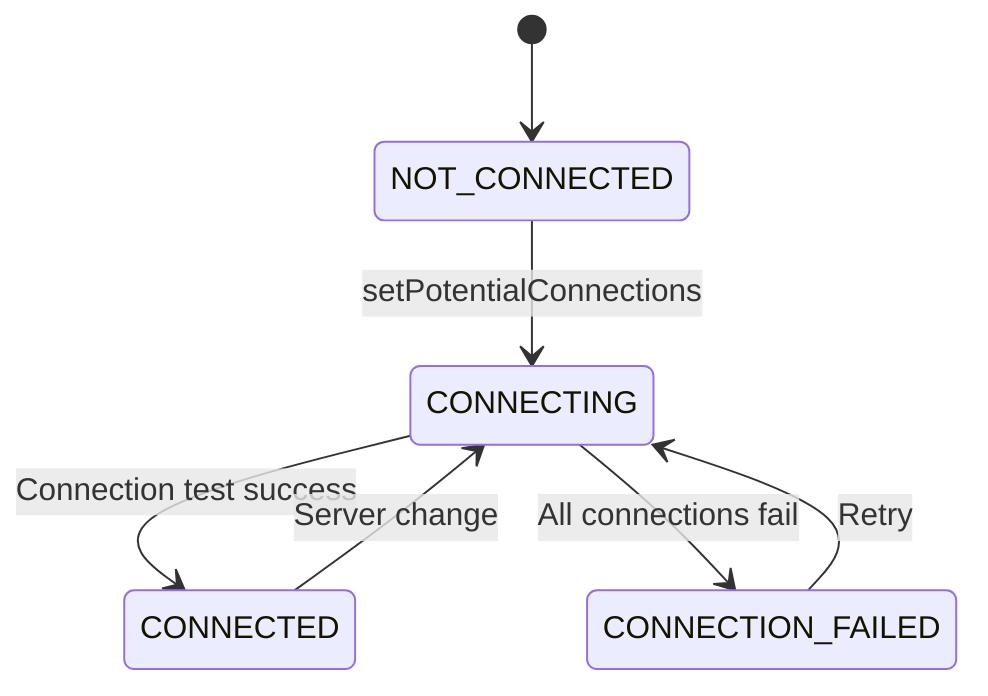
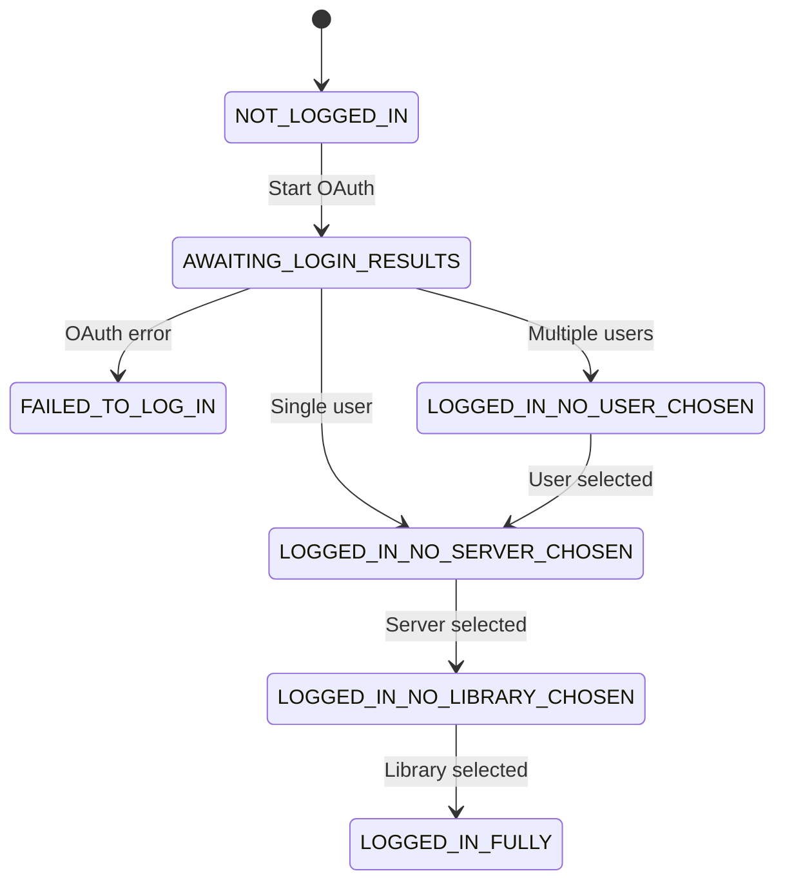
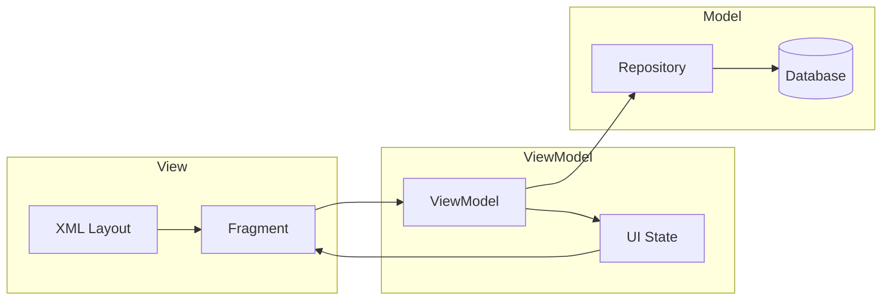
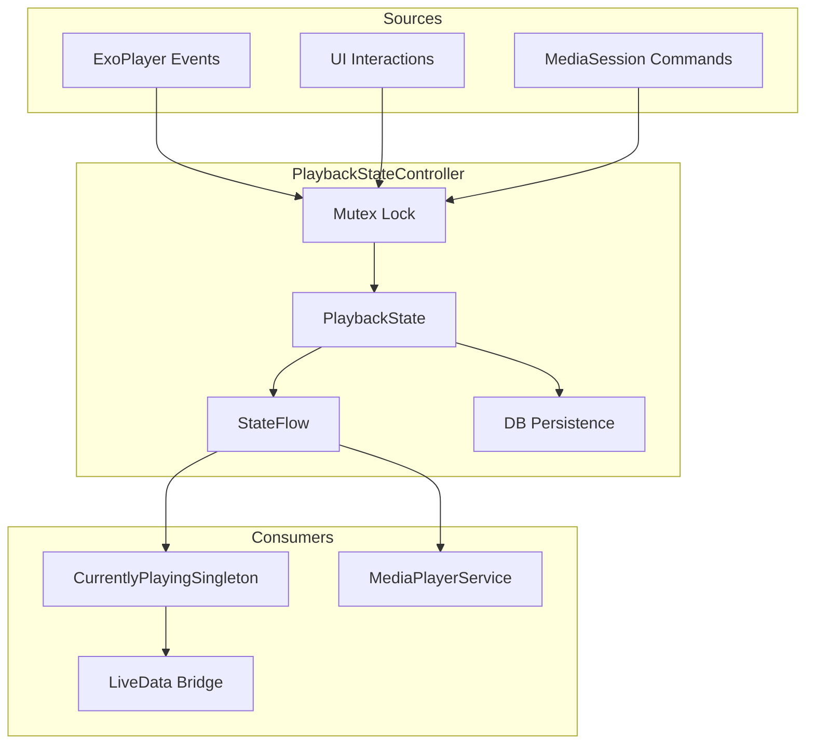

# Architectural Patterns

This document describes the key architectural patterns used in Chronicle.

For a high-level overview, see the [Architecture Overview](../ARCHITECTURE.md).

---

## Repository Pattern

Repositories abstract data sources, providing a single source of truth by combining local (Room) and remote (Plex API) data.

### Implementation

```kotlin
class BookRepository(
    private val bookDao: BookDao,
    private val plexService: PlexMediaService,
    private val plexConfig: PlexConfig
) : IBookRepository {
    // Combines local cache with network data
    
    suspend fun getAudiobook(id: String): Audiobook {
        // 1. Check local cache
        val cached = bookDao.getById(id)
        if (cached != null && !isStale(cached)) {
            return cached
        }
        
        // 2. Fetch from network
        val remote = plexService.getAlbum(id)
        
        // 3. Update cache
        bookDao.insert(remote.toAudiobook())
        
        return remote.toAudiobook()
    }
}
```

### Repository Classes

| Repository | Purpose |
|------------|---------|
| [`BookRepository`](../../app/src/main/java/local/oss/chronicle/data/local/BookRepository.kt) | Audiobook metadata access |
| [`TrackRepository`](../../app/src/main/java/local/oss/chronicle/data/local/TrackRepository.kt) | Audio track management |
| [`ChapterRepository`](../../app/src/main/java/local/oss/chronicle/data/local/ChapterRepository.kt) | Chapter marker access |
| [`CollectionsRepository`](../../app/src/main/java/local/oss/chronicle/data/local/CollectionsRepository.kt) | Plex collections access |
| [`PlexMediaRepository`](../../app/src/main/java/local/oss/chronicle/data/sources/plex/PlexMediaRepository.kt) | Remote Plex content access |

---

## MediaBrowserService Architecture

[`MediaPlayerService`](../../app/src/main/java/local/oss/chronicle/features/player/MediaPlayerService.kt) extends `MediaBrowserServiceCompat` to provide:

- **Background audio playback** - Continues playing when app is backgrounded
- **Android Auto/Automotive support** - Browse and play from car displays
- **Media button handling** - Hardware buttons, Bluetooth controls
- **Lock screen controls** - System media controls integration

### Component Interaction



### Key Components

| Component | Purpose |
|-----------|---------|
| [`MediaPlayerService`](../../app/src/main/java/local/oss/chronicle/features/player/MediaPlayerService.kt) | Main service managing playback lifecycle |
| [`AudiobookMediaSessionCallback`](../../app/src/main/java/local/oss/chronicle/features/player/AudiobookMediaSessionCallback.kt) | Handles play/pause/seek commands |
| [`TrackListStateManager`](../../app/src/main/java/local/oss/chronicle/features/player/TrackListStateManager.kt) | Manages playlist state and chapter detection |
| [`PlaybackStateController`](../../app/src/main/java/local/oss/chronicle/features/player/PlaybackStateController.kt) | Single source of truth for playback state |
| [`PlaybackUrlResolver`](../../app/src/main/java/local/oss/chronicle/data/sources/plex/PlaybackUrlResolver.kt) | Resolves streaming URLs with authentication |
| [`SeekHandler`](../../app/src/main/java/local/oss/chronicle/features/player/SeekHandler.kt) | Atomic seek operations with timeout |
| [`ChapterValidator`](../../app/src/main/java/local/oss/chronicle/features/player/ChapterValidator.kt) | Validates positions against chapter bounds |
| [`NotificationBuilder`](../../app/src/main/java/local/oss/chronicle/features/player/NotificationBuilder.kt) | Creates playback notifications |

---

## Dual HTTP Client Architecture

Chronicle uses two separate HTTP client configurations for different purposes:

| Client | Purpose | Configuration |
|--------|---------|---------------|
| OkHttp + PlexInterceptor | API calls, metadata | Adds all Plex headers |
| ExoPlayer DefaultHttpDataSource | Audio streaming | Must also include Plex headers |

### Why Two Clients?

1. **API Client (Retrofit + OkHttp)** - Used for JSON API calls to fetch metadata, collections, library content. Configured with Moshi for JSON parsing.

2. **Streaming Client (ExoPlayer)** - Used for audio streaming. ExoPlayer manages its own HTTP connections for efficient media loading with buffering, seeking, and adaptive bitrate support.

### Critical: Both clients must include Plex headers

Both clients must include the `X-Plex-Client-Profile-Extra` header. This header tells Plex which audio formats the app supports and is critical for proper playback.

See [`PlexInterceptor`](../../app/src/main/java/local/oss/chronicle/data/sources/plex/PlexInterceptor.kt) for header implementation.

---

## State Machines

Chronicle uses state machine patterns for complex state management.

### Connection State Machine

Manages the connection lifecycle to Plex servers:



**States:**
- `NOT_CONNECTED` - No server connection configured
- `CONNECTING` - Testing potential connections (local, remote, relay)
- `CONNECTED` - Successfully connected to a Plex server
- `CONNECTION_FAILED` - All connection attempts failed

**Implementation:** [`PlexConfig`](../../app/src/main/java/local/oss/chronicle/data/sources/plex/PlexConfig.kt)

### Login State Machine

Manages the multi-step login flow:



**States:**
- `NOT_LOGGED_IN` - No authentication
- `AWAITING_LOGIN_RESULTS` - OAuth in progress
- `FAILED_TO_LOG_IN` - Authentication failed
- `LOGGED_IN_NO_USER_CHOSEN` - Authenticated but no user selected (managed users)
- `LOGGED_IN_NO_SERVER_CHOSEN` - User selected but no server chosen
- `LOGGED_IN_NO_LIBRARY_CHOSEN` - Server connected but no library selected
- `LOGGED_IN_FULLY` - Fully authenticated and configured

**Implementation:** [`PlexLoginRepo`](../../app/src/main/java/local/oss/chronicle/data/sources/plex/PlexLoginRepo.kt)

---

## MVVM Pattern

Each feature module follows the Model-View-ViewModel pattern:



### Responsibilities

| Component | Responsibility |
|-----------|----------------|
| **Fragment** | UI rendering, user input handling, lifecycle management |
| **ViewModel** | UI state management, business logic orchestration, survives configuration changes |
| **Repository** | Data access abstraction, caching, sync logic |
| **Data Binding** | Declarative UI binding in XML layouts |

### Example

```kotlin
// ViewModel
class AudiobookDetailsViewModel @Inject constructor(
    private val bookRepository: BookRepository,
    private val trackRepository: TrackRepository
) : ViewModel() {
    
    private val _uiState = MutableLiveData<AudiobookDetailsState>()
    val uiState: LiveData<AudiobookDetailsState> = _uiState
    
    fun loadAudiobook(id: String) {
        viewModelScope.launch {
            _uiState.value = AudiobookDetailsState.Loading
            try {
                val book = bookRepository.getAudiobook(id)
                val tracks = trackRepository.getTracksForBook(id)
                _uiState.value = AudiobookDetailsState.Success(book, tracks)
            } catch (e: Exception) {
                _uiState.value = AudiobookDetailsState.Error(e.message)
            }
        }
    }
}
```

---

## Observer Pattern with LiveData/Flow

Chronicle uses Android's LiveData and Kotlin Flow for reactive data streams:

### LiveData

Used for UI state that Fragments observe:

```kotlin
// ViewModel
val playbackState: LiveData<PlaybackState> = mediaServiceConnection.playbackState

// Fragment
viewModel.playbackState.observe(viewLifecycleOwner) { state ->
    updatePlaybackUI(state)
}
```

### Flow

Used for continuous data streams from repositories:

```kotlin
// Repository
fun observeAudiobooks(): Flow<List<Audiobook>> = bookDao.observeAll()

// ViewModel
val audiobooks = bookRepository.observeAudiobooks()
    .stateIn(viewModelScope, SharingStarted.WhileSubscribed(5000), emptyList())
```

---

## PlaybackStateController Pattern

The [`PlaybackStateController`](../../app/src/main/java/local/oss/chronicle/features/player/PlaybackStateController.kt) is the single source of truth for all playback state, providing thread-safe, reactive state management.

### Architecture



### Key Design Principles

1. **Immutable State**: [`PlaybackState`](../../app/src/main/java/local/oss/chronicle/features/player/PlaybackState.kt) is immutable; updates create new instances via `copy()`
2. **Thread Safety**: All updates go through a `Mutex` to prevent race conditions
3. **StateFlow Observation**: State changes propagate reactively via `StateFlow`
4. **Debounced Persistence**: Database writes are debounced to reduce I/O overhead

### Implementation

```kotlin
@Singleton
class PlaybackStateController @Inject constructor(
    private val bookRepository: BookRepository
) {
    private val mutex = Mutex()
    private val _state = MutableStateFlow(PlaybackState.EMPTY)
    val state: StateFlow<PlaybackState> = _state.asStateFlow()
    
    suspend fun updatePosition(trackIndex: Int, positionMs: Long) = mutex.withLock {
        val newState = _state.value.withPosition(trackIndex, positionMs)
        _state.value = newState
        scheduleDatabaseWrite(newState)
    }
}
```

### StateFlow → LiveData Bridge

The [`CurrentlyPlayingSingleton`](../../app/src/main/java/local/oss/chronicle/features/currentlyplaying/CurrentlyPlayingSingleton.kt) bridges StateFlow to LiveData for UI consumption:

```kotlin
// Convert StateFlow to LiveData for Fragments
val bookPositionMs: LiveData<Long> = playbackStateController.state
    .map { it.bookPositionMs }
    .asLiveData()
```

---

## Retry with Exponential Backoff Pattern

For resilient network operations, Chronicle uses [`withRetry()`](../../app/src/main/java/local/oss/chronicle/util/RetryHandler.kt) with configurable exponential backoff.

### Configuration

```kotlin
data class RetryConfig(
    val maxAttempts: Int = 3,
    val initialDelayMs: Long = 1000L,
    val maxDelayMs: Long = 30_000L,
    val multiplier: Double = 2.0
)
```

### Usage

```kotlin
val result = withRetry(
    config = RetryConfig(maxAttempts = 3),
    shouldRetry = { error -> error is IOException },
    onRetry = { attempt, delay, error ->
        Timber.w("Retry $attempt after ${delay}ms: $error")
    }
) { attempt ->
    plexService.fetchMetadata(bookId)
}

when (result) {
    is RetryResult.Success -> handleSuccess(result.value)
    is RetryResult.Failure -> handleError(result.error)
}
```

### Backoff Timeline

```
Attempt 1: Immediate
Attempt 2: 1000ms delay
Attempt 3: 2000ms delay
Attempt 4: 4000ms delay (capped at maxDelayMs)
```

---

## Structured Error Handling Pattern

Chronicle uses a [`ChronicleError`](../../app/src/main/java/local/oss/chronicle/util/ErrorHandling.kt) sealed class for type-safe error handling.

### Error Categories

```kotlin
sealed class ChronicleError(
    open val message: String,
    open val cause: Throwable? = null
) {
    data class NetworkError(...)     // Connectivity issues
    data class AuthenticationError(...)  // Token/login issues
    data class PlaybackError(...)    // Player failures
    data class StorageError(...)     // File/database errors
    data class UnknownError(...)     // Fallback
}
```

### Usage

```kotlin
// Convert any throwable to structured error
val error = exception.toChronicleError()

when (error) {
    is ChronicleError.NetworkError -> showRetryDialog()
    is ChronicleError.AuthenticationError -> navigateToLogin()
    is ChronicleError.PlaybackError -> showPlaybackError(error.trackKey)
    is ChronicleError.StorageError -> showStorageError()
    is ChronicleError.UnknownError -> showGenericError()
}
```

---

## Thread Safety with Mutex Pattern

[`TrackListStateManager`](../../app/src/main/java/local/oss/chronicle/features/player/TrackListStateManager.kt) uses Kotlin's `Mutex` for thread-safe state updates.

### Implementation

```kotlin
class TrackListStateManager {
    private val mutex = Mutex()
    private var currentState: PlayerState? = null
    
    suspend fun updateState(newState: PlayerState) = mutex.withLock {
        currentState = newState
        notifyListeners(newState)
    }
    
    suspend fun <T> withState(action: (PlayerState?) -> T): T = mutex.withLock {
        action(currentState)
    }
}
```

### Why Mutex over synchronized?

- Works with coroutines (non-blocking suspension)
- More idiomatic in Kotlin coroutine code
- Prevents thread starvation in high-contention scenarios

---

## Related Documentation

- [Architecture Overview](../ARCHITECTURE.md) - High-level architecture diagrams
- [Architecture Layers](layers.md) - Layer descriptions and responsibilities
- [Dependency Injection](dependency-injection.md) - Dagger component hierarchy
- [Plex Integration](plex-integration.md) - Plex-specific implementation details
- [Playback Feature](../features/playback.md) - Full playback architecture
