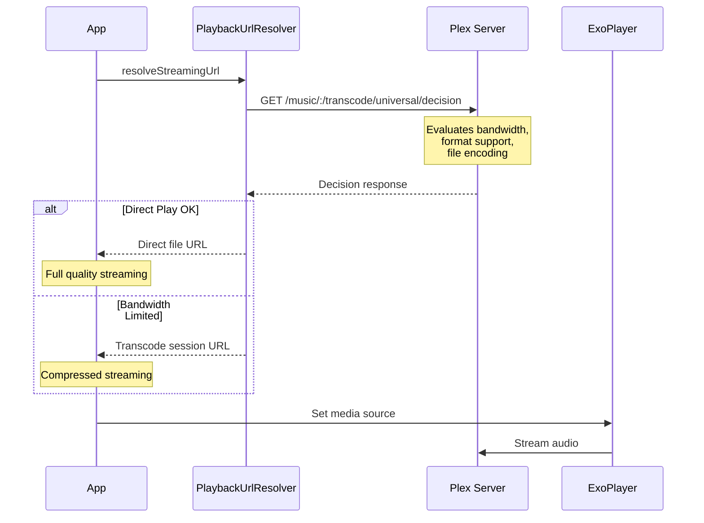
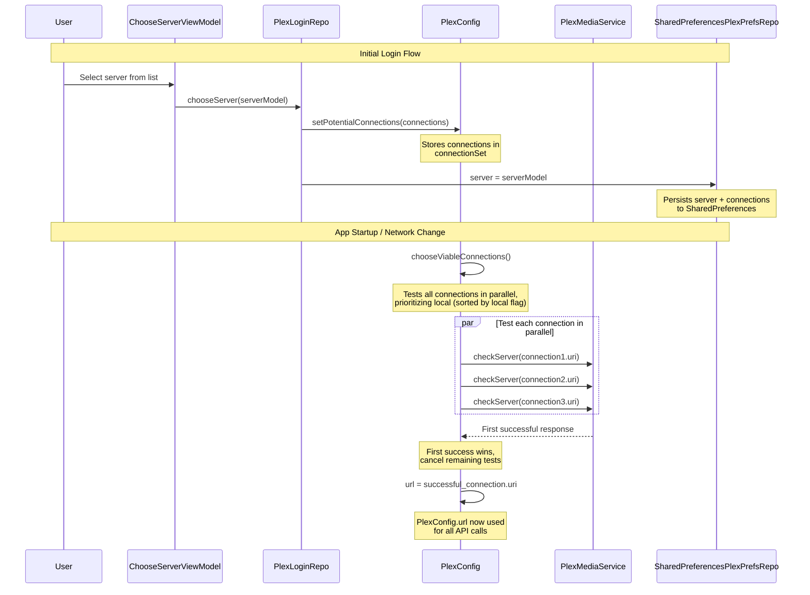
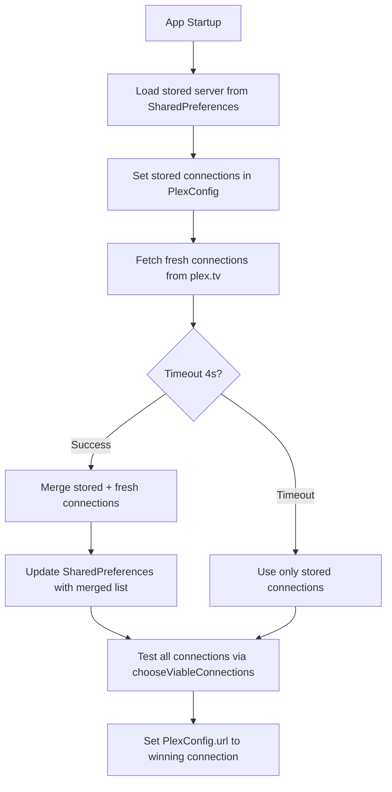
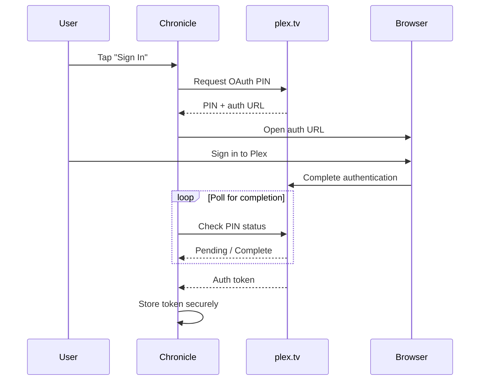
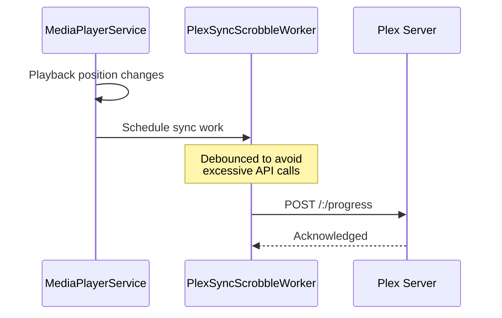

# Plex Integration Architecture

This document describes Chronicle's integration with Plex Media Server, including the client profile system, audio format support, and bandwidth-aware playback.

For a high-level overview, see the [Architecture Overview](../ARCHITECTURE.md).

---

## Overview

Chronicle interacts with two separate Plex endpoints:

| Endpoint | Purpose | Implementation |
|----------|---------|----------------|
| **plex.tv** | Authentication, account management, server discovery | OAuth flow, user profile |
| **Plex Media Server** | Content delivery, metadata, streaming | User's server URL |

Both endpoints require proper authentication headers. See [`PlexInterceptor`](../../app/src/main/java/local/oss/chronicle/data/sources/plex/PlexInterceptor.kt) for header implementation.

---

## Plex Client Profile System

Chronicle declares its audio playback capabilities via the `X-Plex-Client-Profile-Extra` header. This allows Plex to make intelligent decisions about direct play vs. transcoding.

### Profile Declaration

```kotlin
"add-direct-play-profile(type=musicProfile&container=mp4,m4a,m4b,mp3,flac,ogg,opus&audioCodec=aac,mp3,flac,vorbis,opus&videoCodec=*&subtitleCodec=*)"
```

This tells Plex:
- **Container formats supported:** mp4, m4a, m4b, mp3, flac, ogg, opus
- **Audio codecs supported:** AAC, MP3, FLAC, Vorbis, Opus
- **Type:** Music profile (appropriate for audiobooks)

### Supported Audio Formats

| Format | Container | Codec | Direct Play |
|--------|-----------|-------|-------------|
| AAC | mp4/m4a/m4b | aac | ✅ |
| MP3 | mp3 | mp3 | ✅ |
| FLAC | flac | flac | ✅ |
| Vorbis | ogg | vorbis | ✅ |
| Opus | opus/ogg | opus | ✅ |

Formats not in this list will be transcoded by Plex before streaming.

---

## Required HTTP Headers

All Plex API requests require specific headers. These are injected by [`PlexInterceptor`](../../app/src/main/java/local/oss/chronicle/data/sources/plex/PlexInterceptor.kt):

| Header | Purpose | Required |
|--------|---------|----------|
| `X-Plex-Token` | Authentication token | Yes (all requests) |
| `X-Plex-Client-Identifier` | Unique device identifier | Yes |
| `X-Plex-Product` | Application name | Yes |
| `X-Plex-Version` | App version | Yes |
| `X-Plex-Platform` | Platform (Android) | Yes |
| `X-Plex-Device` | Device model | Yes |
| `X-Plex-Client-Profile-Extra` | Audio format capabilities | Critical for playback |

### Critical: X-Plex-Client-Profile-Extra

This header is **essential for audio playback**. Without it, Plex may:
- Refuse to serve audio files
- Transcode unnecessarily
- Return unsupported formats

Both the API client (OkHttp) and streaming client (ExoPlayer) must include this header.

---

## Bandwidth-Aware Playback

Chronicle uses Plex's transcode decision endpoint to negotiate optimal playback quality based on available bandwidth.

### Decision Flow



### Decision Endpoint

**Endpoint:** `/music/:/transcode/universal/decision`

**Key Parameters:**
- `path` - Media item path
- `maxAudioBitrate` - Maximum acceptable bitrate
- `directPlay` - Whether direct play is preferred
- `directStream` - Whether direct stream is acceptable

### Benefits

This approach provides:
- **Graceful degradation** - Audio plays even on slow connections
- **Quality optimization** - Best quality when bandwidth allows
- **Battery efficiency** - Lower bitrates reduce data processing

### Implementation

See [`PlaybackUrlResolver`](../../app/src/main/java/local/oss/chronicle/data/sources/plex/PlaybackUrlResolver.kt) for the decision negotiation implementation.

---

## Server Connection Selection

Chronicle must handle multiple connection URIs for each Plex server (local IP addresses, remote URLs, plex.direct relay addresses). The connection selection system automatically chooses the best available connection and adapts to network changes.

### The Connection Problem

When querying plex.tv for available servers, each server returns multiple `Connection` objects with different URIs:

- **Local connections** - Direct LAN access (e.g., `http://192.168.1.100:32400`)
- **Remote connections** - Direct WAN access (e.g., `http://203.0.113.42:32400`)
- **Relay connections** - Plex.direct relay URLs (e.g., `https://abc123.plex.direct:443`)

The app must:
1. Test all connections to find working ones
2. Prefer local connections when available (lowest latency)
3. Adapt to network changes (switching between WiFi/cellular)
4. Persist connections across app restarts

### Connection Flow Overview



### Detailed Connection Selection Process

#### 1. Server Discovery (Login Flow)

When a user logs in, [`ChooseServerViewModel`](../../app/src/main/java/local/oss/chronicle/features/login/ChooseServerViewModel.kt:53-76) fetches available servers from plex.tv:

```kotlin
// ChooseServerViewModel.loadServers()
val serverContainer = plexLoginService.resources()
val servers = serverContainer
    .filter { it.provides.contains("server") }
    .map { it.asServer() }
```

Each server contains multiple `Connection` objects with different URIs.

#### 2. User Selection & Storage

When the user selects a server, [`PlexLoginRepo.chooseServer()`](../../app/src/main/java/local/oss/chronicle/data/sources/plex/PlexLoginRepo.kt:151-157) stores all connections:

```kotlin
// PlexLoginRepo.chooseServer()
plexConfig.setPotentialConnections(serverModel.connections)
plexPrefsRepo.server = serverModel
```

The connections are persisted to [`SharedPreferences`](../../app/src/main/java/local/oss/chronicle/data/sources/plex/SharedPreferencesPlexPrefsRepo.kt:149-167) as part of the `ServerModel`.

#### 3. Parallel Connection Testing

When the app needs to connect (startup or network change), [`PlexConfig.chooseViableConnections()`](../../app/src/main/java/local/oss/chronicle/data/sources/plex/PlexConfig.kt:369-465) tests all connections in parallel:

**Key characteristics:**
- **Sorted by local flag** - Local connections tested first for priority
- **Parallel execution** - All connections tested simultaneously using coroutines
- **First success wins** - Returns immediately on first successful connection
- **Timeout protection** - 10 second timeout per connection attempt
- **Cancellation** - Remaining tests cancelled once one succeeds

```kotlin
// PlexConfig.chooseViableConnections()
val connections = connectionSet.sortedByDescending { it.local }

// Test all in parallel
val deferredConnections = connections.map { conn ->
    async {
        val result = plexMediaService.checkServer(conn.uri)
        if (result.isSuccessful) {
            Success(conn.uri)
        } else {
            Failure(result.message() ?: "Failed")
        }
    }
}

// Return first success
while (deferredConnections.any { it.isActive }) {
    deferredConnections.forEach { deferred ->
        if (deferred.isCompleted && deferred.getCompleted() is Success) {
            deferredConnections.forEach { it.cancel() }
            return@withTimeoutOrNull completed
        }
    }
}
```

#### 4. Selected URL Storage

The winning connection URI is stored in [`PlexConfig.url`](../../app/src/main/java/local/oss/chronicle/data/sources/plex/PlexConfig.kt:66):

```kotlin
// PlexConfig.connectToServerInternal()
if (connectionResult is Success && connectionResult.url != PLACEHOLDER_URL) {
    url = connectionResult.url
}
```

This `url` field is used by:
- All Plex API calls via [`PlexConfig.toServerString()`](../../app/src/main/java/local/oss/chronicle/data/sources/plex/PlexConfig.kt:97-107)
- [`PlaybackUrlResolver`](../../app/src/main/java/local/oss/chronicle/data/sources/plex/PlaybackUrlResolver.kt) for streaming URLs
- Image thumbnail generation via [`PlexConfig.makeThumbUri()`](../../app/src/main/java/local/oss/chronicle/data/sources/plex/PlexConfig.kt:165-175)

### Server List Refresh Policy

To prevent stale server connections from accumulating, Chronicle implements time-based server list refresh logic:

**Refresh Schedule:**
- **Debug builds**: Server list refreshes on every app startup
- **Release builds**: Server list refreshes if last refresh was more than 24 hours ago

**Implementation:**

The refresh timestamp is tracked in [`SharedPreferencesPlexPrefsRepo`](../../app/src/main/java/local/oss/chronicle/data/sources/plex/SharedPreferencesPlexPrefsRepo.kt) using the `serverListLastRefreshed` property, stored in SharedPreferences.

During app startup in [`ChronicleApplication.setupNetwork()`](../../app/src/main/java/local/oss/chronicle/application/ChronicleApplication.kt:136-207), the app:

1. Checks if refresh is needed based on build type and last refresh time
2. If refresh is needed, fetches fresh server list from plex.tv
3. **Replaces** (not merges) stored connections with fresh connections
4. Updates the `serverListLastRefreshed` timestamp

This approach ensures that:
- Stale connections are removed instead of accumulating
- Debug builds always get fresh connections for testing
- Release builds balance freshness with API call efficiency
- Users have up-to-date connection information without excessive network requests

**Key Files:**
- [`ChronicleApplication.kt`](../../app/src/main/java/local/oss/chronicle/application/ChronicleApplication.kt) - Implements refresh logic
- [`SharedPreferencesPlexPrefsRepo.kt`](../../app/src/main/java/local/oss/chronicle/data/sources/plex/SharedPreferencesPlexPrefsRepo.kt) - Stores refresh timestamp

### App Startup Connection Refresh

On app startup, [`ChronicleApplication.setupNetwork()`](../../app/src/main/java/local/oss/chronicle/application/ChronicleApplication.kt:136-207) refreshes connections by merging stored and fresh data:



**Why merge stored + fresh?**
- **Stored connections** may have changed (server IP changed)
- **Fresh connections** require network call to plex.tv (may fail if offline)
- **Merging** maximizes likelihood of finding a working connection

```kotlin
// ChronicleApplication.setupNetwork()
val server = plexPrefs.server
plexConfig.setPotentialConnections(server.connections)

val retrievedConnections = withTimeoutOrNull(4000L) {
    plexLoginService.resources()
        .filter { it.provides.contains("server") }
        .map { it.asServer() }
        .filter { it.serverId == server.serverId }
        .flatMap { it.connections }
} ?: emptyList()

val mergedConnections = server.connections + retrievedConnections
plexPrefs.server = server.copy(connections = mergedConnections)
plexConfig.connectToServer(plexMediaService)
```

### Network Change Handling

Chronicle monitors network connectivity via [`ConnectivityManager.NetworkCallback`](../../app/src/main/java/local/oss/chronicle/application/ChronicleApplication.kt:140-158):

- **`onAvailable()`** - Network becomes available → reconnect to server
- **`onLost()`** - Network lost → update connection state to NOT_CONNECTED

This allows the app to automatically switch between WiFi and cellular, preferring local connections when on the same network as the server.

### Connection Types

| Type | Example | Characteristics |
|------|---------|----------------|
| **Local** | `http://192.168.1.100:32400` | Low latency, only works on same LAN, highest priority |
| **Remote** | `http://203.0.113.42:32400` | Direct connection over internet, requires port forwarding |
| **Relay** | `https://abc-123-xyz.plex.direct:443` | Plex relay servers, works behind NAT, higher latency |

Local connections are identified by the `Connection.local` boolean flag from plex.tv.

### Retry Logic

Connection attempts use exponential backoff retry logic via [`PlexConfig.connectToServerWithRetry()`](../../app/src/main/java/local/oss/chronicle/data/sources/plex/PlexConfig.kt:280-310):

**Retry configuration:**
- **Max attempts:** 3
- **Initial delay:** 1 second
- **Max delay:** 5 seconds
- **Multiplier:** 2.0 (exponential backoff)
- **Retryable errors:** `SocketTimeoutException`, `UnknownHostException`, `ConnectException`, `IOException`

### Connection State Management

[`PlexConfig.connectionState`](../../app/src/main/java/local/oss/chronicle/data/sources/plex/PlexConfig.kt:72-85) LiveData exposes connection status to the UI:

| State | Meaning |
|-------|---------|
| `CONNECTING` | Testing connections in progress |
| `CONNECTED` | Successfully connected to server |
| `NOT_CONNECTED` | Network lost or not yet connected |
| `CONNECTION_FAILED` | All connection attempts failed |

### Debug Logging

The codebase includes extensive debug logging with the `URL_DEBUG` tag for troubleshooting connection issues:

```kotlin
Timber.d("URL_DEBUG: Discovered ${servers.size} servers from plex.tv")
Timber.d("URL_DEBUG: User selected server '${serverModel.name}' with ${serverModel.connections.size} connections")
Timber.d("URL_DEBUG: Testing ${connections.size} connections")
Timber.d("URL_DEBUG: Connection test SUCCESS: ${conn.uri} (local=${conn.local})")
Timber.d("URL_DEBUG: SELECTED URL (first success): ${completed.url}")
Timber.d("URL_DEBUG: Connection established - PlexConfig.url set to: $url")
```

Filter Logcat by `URL_DEBUG` to trace the entire connection selection flow.

### Key Files & Responsibilities

| File | Responsibility |
|------|----------------|
| [`PlexConfig.kt`](../../app/src/main/java/local/oss/chronicle/data/sources/plex/PlexConfig.kt) | Manages `connectionSet`, tests connections in parallel, stores selected `url` |
| [`PlexConfig.chooseViableConnections()`](../../app/src/main/java/local/oss/chronicle/data/sources/plex/PlexConfig.kt:369-465) | Core parallel connection testing logic with timeout |
| [`PlexConfig.setPotentialConnections()`](../../app/src/main/java/local/oss/chronicle/data/sources/plex/PlexConfig.kt:177-181) | Sets available connections from server selection or app startup |
| [`ChooseServerViewModel.loadServers()`](../../app/src/main/java/local/oss/chronicle/features/login/ChooseServerViewModel.kt:53-76) | Fetches servers from plex.tv during login |
| [`PlexLoginRepo.chooseServer()`](../../app/src/main/java/local/oss/chronicle/data/sources/plex/PlexLoginRepo.kt:151-157) | Handles user server selection, stores connections |
| [`SharedPreferencesPlexPrefsRepo`](../../app/src/main/java/local/oss/chronicle/data/sources/plex/SharedPreferencesPlexPrefsRepo.kt:133-167) | Persists server and connections to SharedPreferences |
| [`ChronicleApplication.setupNetwork()`](../../app/src/main/java/local/oss/chronicle/application/ChronicleApplication.kt:136-207) | App startup connection refresh with stored + fresh connection merge |
| [`PlaybackUrlResolver`](../../app/src/main/java/local/oss/chronicle/data/sources/plex/PlaybackUrlResolver.kt) | Uses `PlexConfig.url` to resolve streaming URLs |

### Connection Endpoint

Connections are tested via the Plex `/identity` endpoint:

```kotlin
// PlexService.kt
@GET("/identity")
suspend fun checkServer(@Url serverUrl: String): Response<PlexMediaContainer>
```

This lightweight endpoint verifies server reachability without transferring large amounts of data.

---

## Authentication Flow

Chronicle uses OAuth for Plex authentication:



### OAuth Components

| Component | Purpose |
|-----------|---------|
| [`PlexLoginRepo`](../../app/src/main/java/local/oss/chronicle/data/sources/plex/PlexLoginRepo.kt) | Manages OAuth flow and token storage |
| [`PlexOAuthDialogFragment`](../../app/src/main/java/local/oss/chronicle/features/login/PlexOAuthDialogFragment.kt) | WebView for OAuth UI |
| [`PlexOAuthViewModel`](../../app/src/main/java/local/oss/chronicle/features/login/PlexOAuthViewModel.kt) | OAuth state management |

For detailed OAuth flow documentation, see [`docs/example-query-responses/oauth-flow.md`](../example-query-responses/oauth-flow.md).

---

## Plex API Services

Chronicle uses Retrofit for Plex API calls:

### PlexService Interface

Located in [`PlexService.kt`](../../app/src/main/java/local/oss/chronicle/data/sources/plex/PlexService.kt)

Key endpoints:
- Library browsing
- Album/audiobook metadata
- Track information
- Collections
- Playback progress sync (scrobbling)

### Data Models

Plex API response models in [`data/sources/plex/model/`](../../app/src/main/java/local/oss/chronicle/data/sources/plex/model/):

| Model | Purpose |
|-------|---------|
| [`PlexMediaContainer`](../../app/src/main/java/local/oss/chronicle/data/sources/plex/model/PlexMediaContainer.kt) | Standard Plex response wrapper |
| [`PlexDirectory`](../../app/src/main/java/local/oss/chronicle/data/sources/plex/model/PlexDirectory.kt) | Library/collection metadata |
| [`TrackPlexModel`](../../app/src/main/java/local/oss/chronicle/data/sources/plex/model/TrackPlexModel.kt) | Audio track information |
| [`PlexChapter`](../../app/src/main/java/local/oss/chronicle/data/sources/plex/model/PlexChapter.kt) | Chapter marker data |

---

## Playback Position Sync

Chronicle syncs playback position with Plex using WorkManager:

### Sync Flow



### Implementation

[`PlexSyncScrobbleWorker`](../../app/src/main/java/local/oss/chronicle/data/sources/plex/PlexSyncScrobbleWorker.kt) handles:
- Progress updates during playback
- Marking items as played/unplayed
- Syncing across devices

---

## API Response Examples

Real Plex API response examples are documented in [`docs/example-query-responses/`](../example-query-responses/):

| File | Content |
|------|---------|
| [`oauth-flow.md`](../example-query-responses/oauth-flow.md) | OAuth authentication flow |
| [`request-album-info.md`](../example-query-responses/request-album-info.md) | Album/audiobook metadata |
| [`request_track_info.md`](../example-query-responses/request_track_info.md) | Track information |
| [`request-collections-info.md`](../example-query-responses/request-collections-info.md) | Collections data |

---

## Related Documentation

- [Architecture Overview](../ARCHITECTURE.md) - High-level architecture diagrams
- [Architecture Layers](layers.md) - Layer descriptions and responsibilities
- [Dependency Injection](dependency-injection.md) - Dagger component hierarchy
- [Architectural Patterns](patterns.md) - Key patterns used in Chronicle
- [API Flows](../API_FLOWS.md) - Detailed API flow documentation
