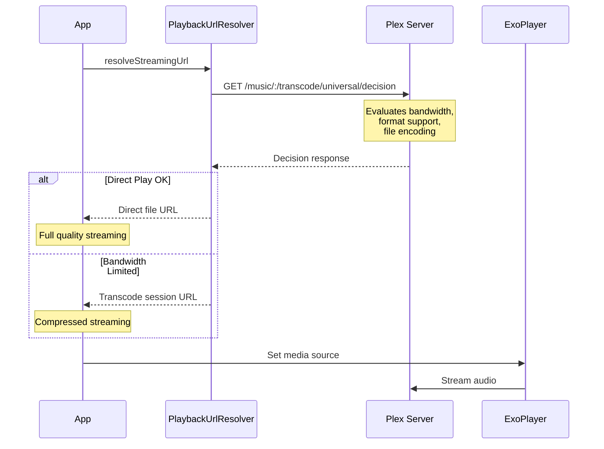
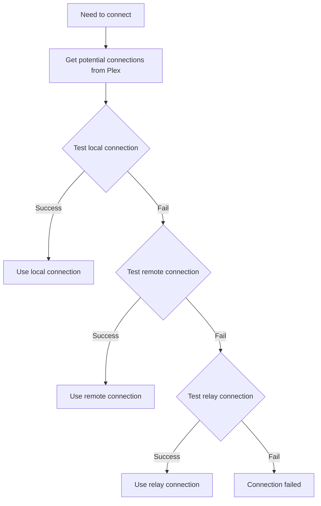
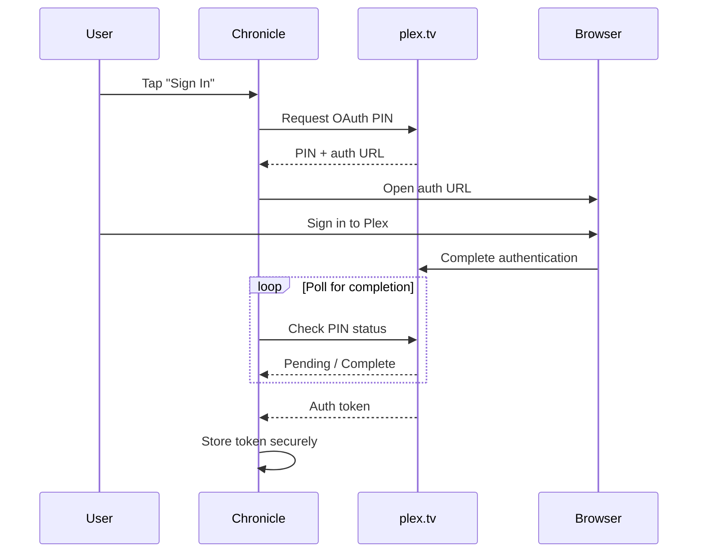
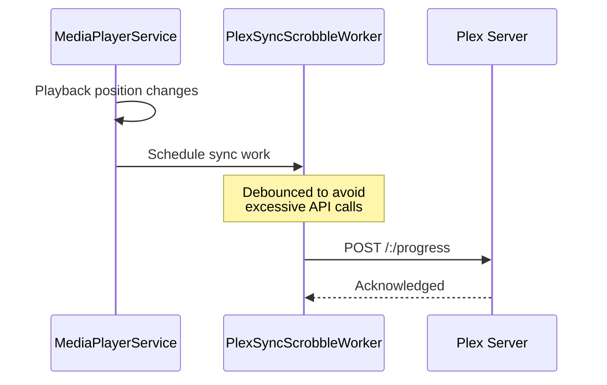

# Plex Integration Architecture

This document describes Chronicle's integration with Plex Media Server, including the client profile system, audio format support, and bandwidth-aware playback.

For a high-level overview, see the [Architecture Overview](../ARCHITECTURE.md).

---

## Overview

Chronicle interacts with two separate Plex endpoints:

| Endpoint | Purpose | Implementation |
|----------|---------|----------------|
| **plex.tv** | Authentication, account management, server discovery | OAuth flow, user profile |
| **Plex Media Server** | Content delivery, metadata, streaming | User's server URL |

Both endpoints require proper authentication headers. See [`PlexInterceptor`](../../app/src/main/java/local/oss/chronicle/data/sources/plex/PlexInterceptor.kt) for header implementation.

---

## Plex Client Profile System

Chronicle declares its audio playback capabilities via the `X-Plex-Client-Profile-Extra` header. This allows Plex to make intelligent decisions about direct play vs. transcoding.

### Profile Declaration

```kotlin
"add-direct-play-profile(type=musicProfile&container=mp4,m4a,m4b,mp3,flac,ogg,opus&audioCodec=aac,mp3,flac,vorbis,opus&videoCodec=*&subtitleCodec=*)"
```

This tells Plex:
- **Container formats supported:** mp4, m4a, m4b, mp3, flac, ogg, opus
- **Audio codecs supported:** AAC, MP3, FLAC, Vorbis, Opus
- **Type:** Music profile (appropriate for audiobooks)

### Supported Audio Formats

| Format | Container | Codec | Direct Play |
|--------|-----------|-------|-------------|
| AAC | mp4/m4a/m4b | aac | ✅ |
| MP3 | mp3 | mp3 | ✅ |
| FLAC | flac | flac | ✅ |
| Vorbis | ogg | vorbis | ✅ |
| Opus | opus/ogg | opus | ✅ |

Formats not in this list will be transcoded by Plex before streaming.

---

## Required HTTP Headers

All Plex API requests require specific headers. These are injected by [`PlexInterceptor`](../../app/src/main/java/local/oss/chronicle/data/sources/plex/PlexInterceptor.kt):

| Header | Purpose | Required |
|--------|---------|----------|
| `X-Plex-Token` | Authentication token | Yes (all requests) |
| `X-Plex-Client-Identifier` | Unique device identifier | Yes |
| `X-Plex-Product` | Application name | Yes |
| `X-Plex-Version` | App version | Yes |
| `X-Plex-Platform` | Platform (Android) | Yes |
| `X-Plex-Device` | Device model | Yes |
| `X-Plex-Client-Profile-Extra` | Audio format capabilities | Critical for playback |

### Critical: X-Plex-Client-Profile-Extra

This header is **essential for audio playback**. Without it, Plex may:
- Refuse to serve audio files
- Transcode unnecessarily
- Return unsupported formats

Both the API client (OkHttp) and streaming client (ExoPlayer) must include this header.

---

## Bandwidth-Aware Playback

Chronicle uses Plex's transcode decision endpoint to negotiate optimal playback quality based on available bandwidth.

### Decision Flow



### Decision Endpoint

**Endpoint:** `/music/:/transcode/universal/decision`

**Key Parameters:**
- `path` - Media item path
- `maxAudioBitrate` - Maximum acceptable bitrate
- `directPlay` - Whether direct play is preferred
- `directStream` - Whether direct stream is acceptable

### Benefits

This approach provides:
- **Graceful degradation** - Audio plays even on slow connections
- **Quality optimization** - Best quality when bandwidth allows
- **Battery efficiency** - Lower bitrates reduce data processing

### Implementation

See [`PlaybackUrlResolver`](../../app/src/main/java/local/oss/chronicle/data/sources/plex/PlaybackUrlResolver.kt) for the decision negotiation implementation.

---

## Connection Management

Chronicle supports multiple connection types to Plex servers:

### Connection Types

| Type | Description | Use Case |
|------|-------------|----------|
| **Local** | Direct LAN connection | Same network as server |
| **Remote** | Direct WAN connection | Port forwarded server |
| **Relay** | Plex relay servers | Server behind NAT without port forwarding |

### Connection Selection



### Implementation

Connection management is handled by [`PlexConfig`](../../app/src/main/java/local/oss/chronicle/data/sources/plex/PlexConfig.kt), which:
- Tests connections in priority order (local → remote → relay)
- Caches successful connection for reuse
- Handles connection failures gracefully

---

## Authentication Flow

Chronicle uses OAuth for Plex authentication:



### OAuth Components

| Component | Purpose |
|-----------|---------|
| [`PlexLoginRepo`](../../app/src/main/java/local/oss/chronicle/data/sources/plex/PlexLoginRepo.kt) | Manages OAuth flow and token storage |
| [`PlexOAuthDialogFragment`](../../app/src/main/java/local/oss/chronicle/features/login/PlexOAuthDialogFragment.kt) | WebView for OAuth UI |
| [`PlexOAuthViewModel`](../../app/src/main/java/local/oss/chronicle/features/login/PlexOAuthViewModel.kt) | OAuth state management |

For detailed OAuth flow documentation, see [`docs/example-query-responses/oauth-flow.md`](../example-query-responses/oauth-flow.md).

---

## Plex API Services

Chronicle uses Retrofit for Plex API calls:

### PlexService Interface

Located in [`PlexService.kt`](../../app/src/main/java/local/oss/chronicle/data/sources/plex/PlexService.kt)

Key endpoints:
- Library browsing
- Album/audiobook metadata
- Track information
- Collections
- Playback progress sync (scrobbling)

### Data Models

Plex API response models in [`data/sources/plex/model/`](../../app/src/main/java/local/oss/chronicle/data/sources/plex/model/):

| Model | Purpose |
|-------|---------|
| [`PlexMediaContainer`](../../app/src/main/java/local/oss/chronicle/data/sources/plex/model/PlexMediaContainer.kt) | Standard Plex response wrapper |
| [`PlexDirectory`](../../app/src/main/java/local/oss/chronicle/data/sources/plex/model/PlexDirectory.kt) | Library/collection metadata |
| [`TrackPlexModel`](../../app/src/main/java/local/oss/chronicle/data/sources/plex/model/TrackPlexModel.kt) | Audio track information |
| [`PlexChapter`](../../app/src/main/java/local/oss/chronicle/data/sources/plex/model/PlexChapter.kt) | Chapter marker data |

---

## Playback Position Sync

Chronicle syncs playback position with Plex using WorkManager:

### Sync Flow



### Implementation

[`PlexSyncScrobbleWorker`](../../app/src/main/java/local/oss/chronicle/data/sources/plex/PlexSyncScrobbleWorker.kt) handles:
- Progress updates during playback
- Marking items as played/unplayed
- Syncing across devices

---

## API Response Examples

Real Plex API response examples are documented in [`docs/example-query-responses/`](../example-query-responses/):

| File | Content |
|------|---------|
| [`oauth-flow.md`](../example-query-responses/oauth-flow.md) | OAuth authentication flow |
| [`request-album-info.md`](../example-query-responses/request-album-info.md) | Album/audiobook metadata |
| [`request_track_info.md`](../example-query-responses/request_track_info.md) | Track information |
| [`request-collections-info.md`](../example-query-responses/request-collections-info.md) | Collections data |

---

## Related Documentation

- [Architecture Overview](../ARCHITECTURE.md) - High-level architecture diagrams
- [Architecture Layers](layers.md) - Layer descriptions and responsibilities
- [Dependency Injection](dependency-injection.md) - Dagger component hierarchy
- [Architectural Patterns](patterns.md) - Key patterns used in Chronicle
- [API Flows](../API_FLOWS.md) - Detailed API flow documentation
