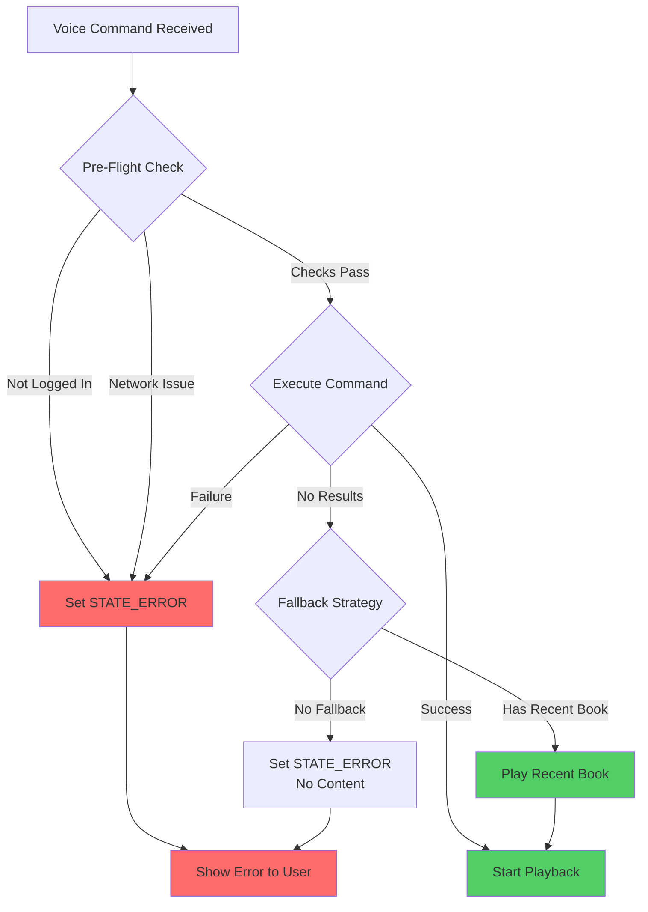
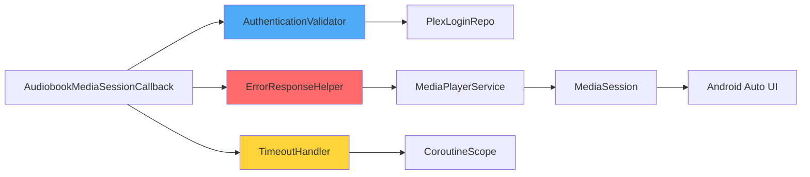
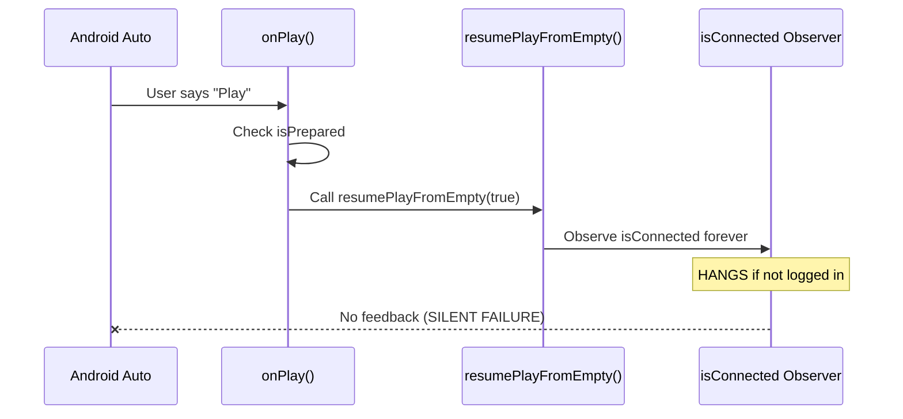
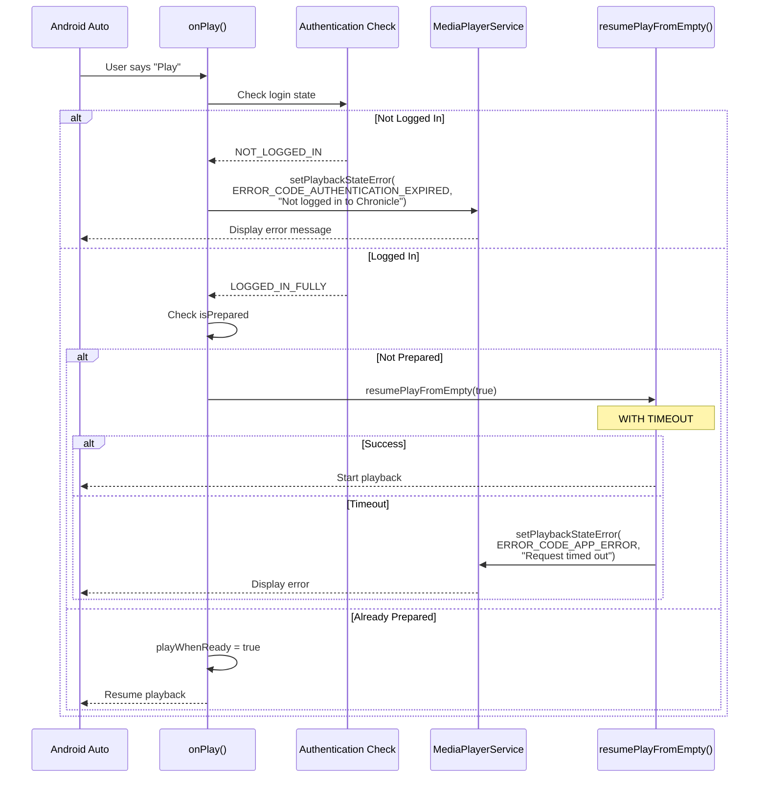
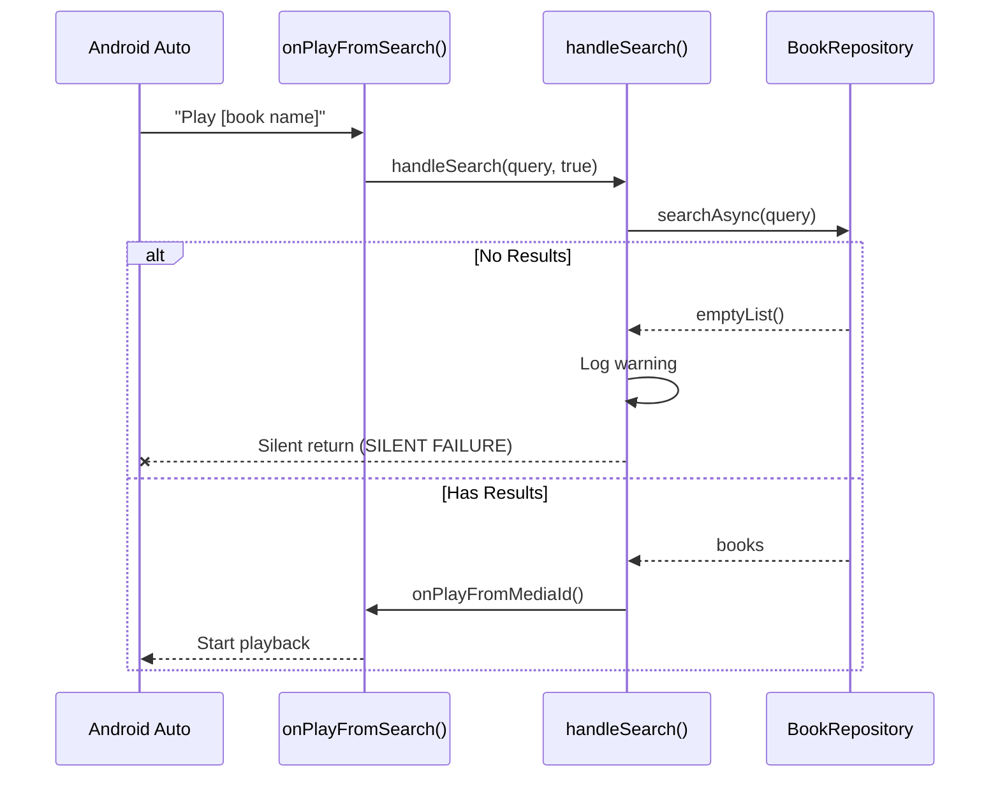
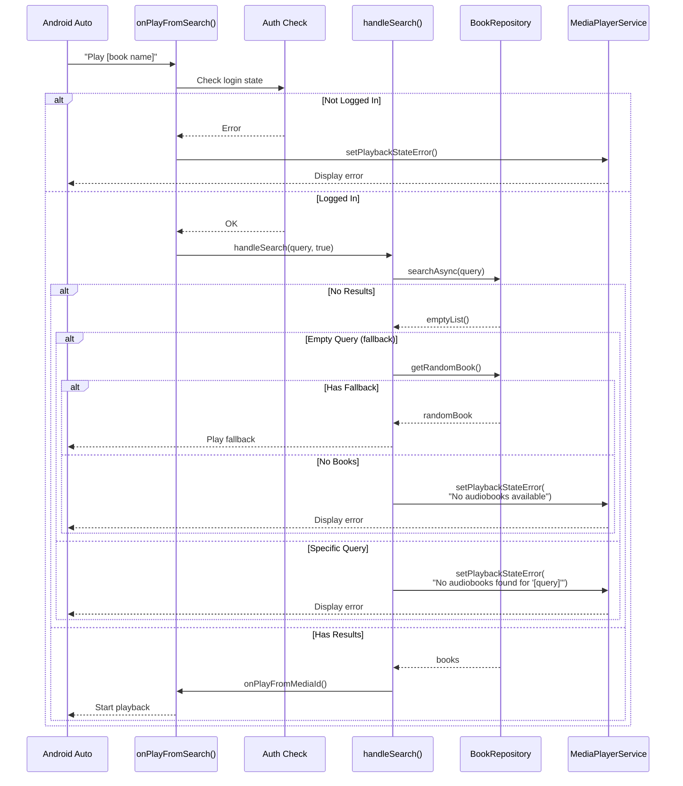
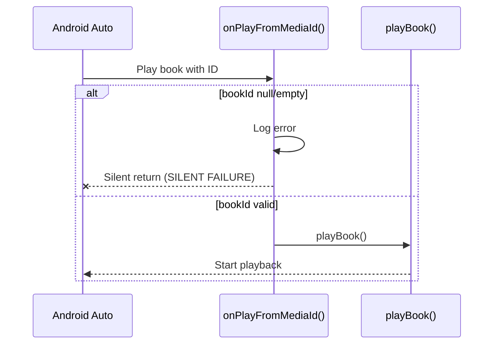
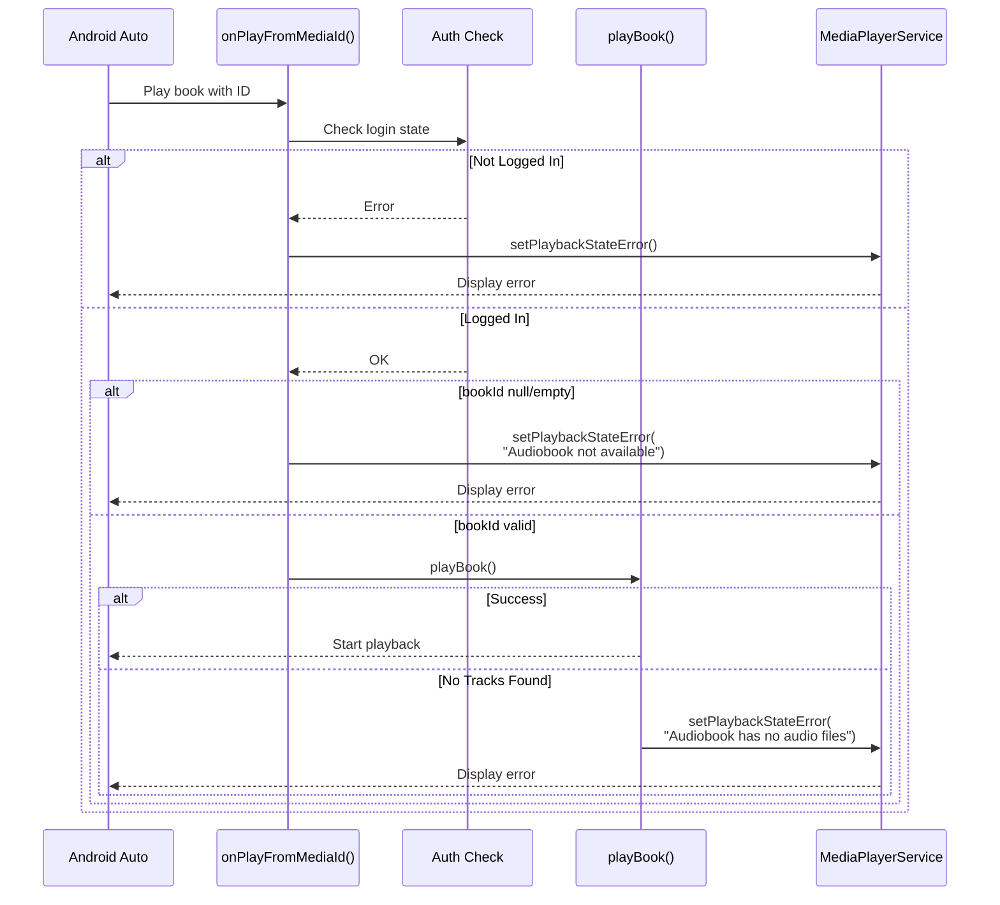
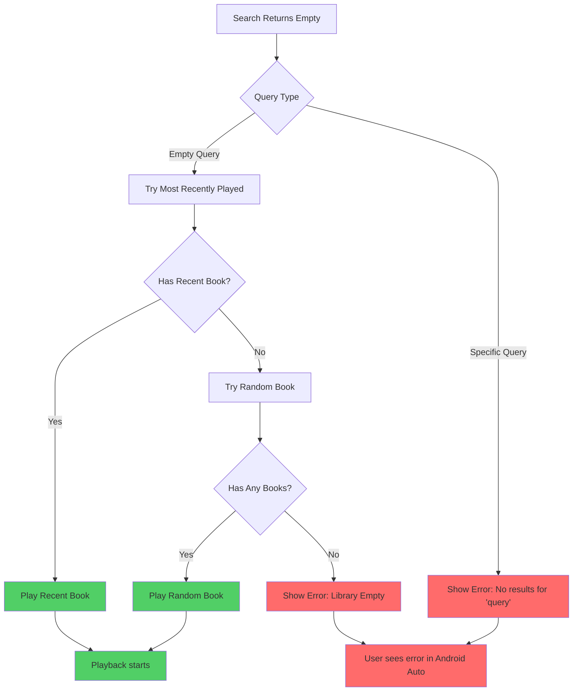

# Voice Command Error Handling Architecture

**Document Version:** 1.0  
**Created:** 2026-01-31  
**Status:** Design Proposal  
**Related Issue:** Google Play Store rejection - voice commands fail silently in Android Auto

## Table of Contents

1. [Overview & Problem Statement](#overview--problem-statement)
2. [Solution Architecture](#solution-architecture)
3. [Error Response Strategy](#error-response-strategy)
4. [Detailed Design for Each Callback](#detailed-design-for-each-callback)
5. [Timeout Strategy](#timeout-strategy)
6. [Fallback Playback Behavior](#fallback-playback-behavior)
7. [Integration Points](#integration-points)
8. [Testing Strategy](#testing-strategy)
9. [Implementation Checklist](#implementation-checklist)

---

## Overview & Problem Statement

### Google Play Store Requirements

Google requires that **all voice commands via Android Auto MUST either:**
1. **Start playback successfully**, OR
2. **Display a clear error message to the user**

**Silent failures are not allowed** and result in app rejection.

### Current Gaps in Chronicle

The following silent failure points exist in [`AudiobookMediaSessionCallback.kt`](../../app/src/main/java/local/oss/chronicle/features/player/AudiobookMediaSessionCallback.kt):

| Callback | Lines | Issue | Impact |
|----------|-------|-------|--------|
| `onPlay()` | 224-233 | No authentication check; `resumePlayFromEmpty()` waits indefinitely | User sees spinning loader forever |
| `onPlayFromSearch()` | 82-92 | No auth check; empty search results → silent return | User gets no feedback |
| `onPlayFromMediaId()` | 280-294 | No auth check; null/empty bookId → silent return | User gets no feedback |
| `resumePlayFromEmpty()` | 534-561 | Observes `isConnected` forever with no timeout | Hangs indefinitely when not logged in |

### Root Causes

1. **No Pre-Flight Authentication Checks**: Callbacks don't verify user is logged in before attempting operations
2. **Incorrect Error Handling**: [`setSessionCustomErrorMessage()`](../../app/src/main/java/local/oss/chronicle/features/player/MediaPlayerService.kt:294-297) sets error message but **doesn't set `STATE_ERROR`**
3. **No Timeout Mechanism**: `resumePlayFromEmpty()` can wait forever on connection observer
4. **Silent Empty Results**: Search returning no results triggers only a log warning, no user feedback

---

## Solution Architecture

### High-Level Error Flow



### Component Architecture



---

## Error Response Strategy

### PlaybackStateCompat Error Codes Mapping

Chronicle must use appropriate Android error codes for different failure scenarios:

| Scenario | Error Code | Example Message |
|----------|-----------|-----------------|
| Not logged in | `ERROR_CODE_AUTHENTICATION_EXPIRED` | "Not logged in to Chronicle" |
| No server chosen | `ERROR_CODE_NOT_AVAILABLE_IN_REGION` | "No server chosen" |
| No user/library | `ERROR_CODE_AUTHENTICATION_EXPIRED` | "Setup incomplete" |
| Network unavailable | `ERROR_CODE_NOT_AVAILABLE_IN_REGION` | "Network unavailable" |
| Search no results | `ERROR_CODE_APP_ERROR` | "No audiobooks found for '[query]'" |
| Book not found | `ERROR_CODE_APP_ERROR` | "Audiobook not available" |
| Timeout | `ERROR_CODE_APP_ERROR` | "Request timed out" |

### New Helper Method: `setPlaybackStateError()`

Add to [`MediaPlayerService.kt`](../../app/src/main/java/local/oss/chronicle/features/player/MediaPlayerService.kt):

```kotlin
/**
 * Sets the MediaSession playback state to STATE_ERROR with appropriate error code and message.
 * This ensures Android Auto displays the error to the user instead of failing silently.
 *
 * @param errorCode PlaybackStateCompat error code (e.g., ERROR_CODE_AUTHENTICATION_EXPIRED)
 * @param errorMessage User-facing error message to display in Android Auto
 */
fun setPlaybackStateError(errorCode: Int, errorMessage: String) {
    Timber.e("[AndroidAuto] Setting error state: code=$errorCode, message=$errorMessage")
    
    sessionErrorMessage = errorMessage
    
    val errorState = PlaybackStateCompat.Builder()
        .setActions(basePlaybackActions())
        .setState(
            PlaybackStateCompat.STATE_ERROR,
            PlaybackStateCompat.PLAYBACK_POSITION_UNKNOWN,
            0f
        )
        .setErrorMessage(errorCode, errorMessage)
        .build()
    
    mediaSession.setPlaybackState(errorState)
}
```

### Modified `setSessionCustomErrorMessage()`

Update existing method:

```kotlin
private fun setSessionCustomErrorMessage(message: String?) {
    if (message != null) {
        // When setting error message, also set STATE_ERROR
        setPlaybackStateError(PlaybackStateCompat.ERROR_CODE_APP_ERROR, message)
    } else {
        // Clear error state
        sessionErrorMessage = null
        updateSessionPlaybackState()
    }
}
```

---

## Detailed Design for Each Callback

### 1. `onPlay()` - Resume/Start Playback

#### Current Flow (Broken)


#### Proposed Flow (Fixed)


#### Implementation Changes

```kotlin
override fun onPlay() {
    // NEW: Pre-flight authentication check
    val loginState = plexLoginRepo.loginEvent.value?.peekContent()
    
    when (loginState) {
        NOT_LOGGED_IN -> {
            Timber.w("[AndroidAuto] onPlay failed - not logged in")
            serviceController.setPlaybackStateError(
                PlaybackStateCompat.ERROR_CODE_AUTHENTICATION_EXPIRED,
                appContext.getString(R.string.auto_access_error_not_logged_in)
            )
            return
        }
        LOGGED_IN_NO_USER_CHOSEN -> {
            serviceController.setPlaybackStateError(
                PlaybackStateCompat.ERROR_CODE_AUTHENTICATION_EXPIRED,
                appContext.getString(R.string.auto_access_error_no_user_chosen)
            )
            return
        }
        LOGGED_IN_NO_SERVER_CHOSEN -> {
            serviceController.setPlaybackStateError(
                PlaybackStateCompat.ERROR_CODE_NOT_AVAILABLE_IN_REGION,
                appContext.getString(R.string.auto_access_error_no_server_chosen)
            )
            return
        }
        LOGGED_IN_NO_LIBRARY_CHOSEN -> {
            serviceController.setPlaybackStateError(
                PlaybackStateCompat.ERROR_CODE_AUTHENTICATION_EXPIRED,
                appContext.getString(R.string.auto_access_error_no_library_chosen)
            )
            return
        }
        LOGGED_IN_FULLY -> {
            // Proceed with playback
        }
        else -> {
            Timber.w("[AndroidAuto] onPlay - unknown login state: $loginState")
            serviceController.setPlaybackStateError(
                PlaybackStateCompat.ERROR_CODE_APP_ERROR,
                "Please open Chronicle app to complete setup"
            )
            return
        }
    }
    
    // Existing logic
    if (!mediaController.playbackState.isPrepared) {
        Timber.i("Started from dead")
        resumePlayFromEmpty(true)  // Now with timeout
    } else {
        currentPlayer.playWhenReady = true
    }
}
```

---

### 2. `onPlayFromSearch()` - Voice Search

#### Current Flow (Broken)


#### Proposed Flow (Fixed)


#### Implementation Changes

```kotlin
override fun onPlayFromSearch(
    query: String?,
    extras: Bundle?,
) {
    Timber.i("[AndroidAuto] Play from search: $query")
    
    // NEW: Pre-flight authentication check
    val loginState = plexLoginRepo.loginEvent.value?.peekContent()
    if (loginState != LOGGED_IN_FULLY) {
        handleAuthenticationError(loginState)
        return
    }
    
    try {
        handleSearch(query, true)
    } catch (e: Exception) {
        Timber.e(e, "[AndroidAuto] Error in onPlayFromSearch")
        serviceController.setPlaybackStateError(
            PlaybackStateCompat.ERROR_CODE_APP_ERROR,
            "Search failed: ${e.localizedMessage}"
        )
    }
}

private fun handleSearch(
    query: String?,
    playWhenReady: Boolean,
) {
    if (query.isNullOrEmpty()) {
        // Empty query: use fallback strategy
        serviceScope.launch(Injector.get().unhandledExceptionHandler()) {
            try {
                val mostRecentlyPlayed = bookRepository.getMostRecentlyPlayed()
                val bookToPlay =
                    if (mostRecentlyPlayed == EMPTY_AUDIOBOOK) {
                        bookRepository.getRandomBookAsync()
                    } else {
                        mostRecentlyPlayed
                    }

                if (bookToPlay == EMPTY_AUDIOBOOK) {
                    // NEW: Show error instead of silent failure
                    Timber.w("[AndroidAuto] No book available for empty search query")
                    serviceController.setPlaybackStateError(
                        PlaybackStateCompat.ERROR_CODE_APP_ERROR,
                        "No audiobooks available to play"
                    )
                    return@launch
                }

                if (playWhenReady) {
                    onPlayFromMediaId(bookToPlay.id.toString(), null)
                } else {
                    onPrepareFromMediaId(bookToPlay.id.toString(), null)
                }
            } catch (e: Exception) {
                Timber.e(e, "[AndroidAuto] Error handling empty search query")
                serviceController.setPlaybackStateError(
                    PlaybackStateCompat.ERROR_CODE_APP_ERROR,
                    "Failed to find audiobook: ${e.localizedMessage}"
                )
            }
        }
        return
    }
    
    // Non-empty query: search for specific book
    serviceScope.launch(Injector.get().unhandledExceptionHandler()) {
        try {
            val matchingBooks = bookRepository.searchAsync(query)
            if (matchingBooks.isNotEmpty()) {
                val result = matchingBooks.first().id.toString()
                if (playWhenReady) {
                    onPlayFromMediaId(result, null)
                } else {
                    onPrepareFromMediaId(result, null)
                }
            } else {
                // NEW: Show error instead of silent warning
                Timber.w("[AndroidAuto] No matching books found for query: $query")
                serviceController.setPlaybackStateError(
                    PlaybackStateCompat.ERROR_CODE_APP_ERROR,
                    "No audiobooks found for \"$query\""
                )
            }
        } catch (e: Exception) {
            Timber.e(e, "[AndroidAuto] Error searching for query: $query")
            serviceController.setPlaybackStateError(
                PlaybackStateCompat.ERROR_CODE_APP_ERROR,
                "Search failed: ${e.localizedMessage}"
            )
        }
    }
}

// NEW: Helper method for authentication error handling
private fun handleAuthenticationError(loginState: LoginState?) {
    val (errorCode, errorMessage) = when (loginState) {
        NOT_LOGGED_IN -> Pair(
            PlaybackStateCompat.ERROR_CODE_AUTHENTICATION_EXPIRED,
            appContext.getString(R.string.auto_access_error_not_logged_in)
        )
        LOGGED_IN_NO_USER_CHOSEN -> Pair(
            PlaybackStateCompat.ERROR_CODE_AUTHENTICATION_EXPIRED,
            appContext.getString(R.string.auto_access_error_no_user_chosen)
        )
        LOGGED_IN_NO_SERVER_CHOSEN -> Pair(
            PlaybackStateCompat.ERROR_CODE_NOT_AVAILABLE_IN_REGION,
            appContext.getString(R.string.auto_access_error_no_server_chosen)
        )
        LOGGED_IN_NO_LIBRARY_CHOSEN -> Pair(
            PlaybackStateCompat.ERROR_CODE_AUTHENTICATION_EXPIRED,
            appContext.getString(R.string.auto_access_error_no_library_chosen)
        )
        else -> Pair(
            PlaybackStateCompat.ERROR_CODE_APP_ERROR,
            "Please open Chronicle app to complete setup"
        )
    }
    
    serviceController.setPlaybackStateError(errorCode, errorMessage)
}
```

---

### 3. `onPlayFromMediaId()` - Play Specific Book

#### Current Flow (Broken)


#### Proposed Flow (Fixed)


#### Implementation Changes

```kotlin
override fun onPlayFromMediaId(
    bookId: String?,
    extras: Bundle?,
) {
    try {
        // NEW: Pre-flight authentication check
        val loginState = plexLoginRepo.loginEvent.value?.peekContent()
        if (loginState != LOGGED_IN_FULLY) {
            handleAuthenticationError(loginState)
            return
        }
        
        if (bookId.isNullOrEmpty()) {
            // NEW: Show error instead of silent return
            Timber.e("[AndroidAuto] onPlayFromMediaId called with null/empty bookId")
            serviceController.setPlaybackStateError(
                PlaybackStateCompat.ERROR_CODE_APP_ERROR,
                "Audiobook not available"
            )
            return
        }
        
        Timber.i("[AndroidAuto] Playing media from ID: $bookId")
        playBook(bookId, extras ?: Bundle(), true)
    } catch (e: Exception) {
        Timber.e(e, "[AndroidAuto] Error in onPlayFromMediaId for bookId=$bookId")
        serviceController.setPlaybackStateError(
            PlaybackStateCompat.ERROR_CODE_APP_ERROR,
            "Failed to play audiobook: ${e.localizedMessage}"
        )
    }
}

// Also update handlePlayBookWithNoTracks() to show error on final failure
private suspend fun handlePlayBookWithNoTracks(
    bookId: String,
    tracks: List<MediaItemTrack>,
    extras: Bundle,
    playWhenReady: Boolean,
) {
    Timber.i("No known tracks for book: $bookId, attempting to fetch them")
    val networkTracks =
        withContext(Dispatchers.IO) {
            trackRepository.loadTracksForAudiobook(bookId.toInt())
        }
    if (networkTracks is Ok) {
        // ... existing logic ...
        playBook(bookId, extras, playWhenReady)
    } else {
        // NEW: Show error when network fetch also fails
        Timber.e("[AndroidAuto] Failed to load tracks for book $bookId from network")
        serviceController.setPlaybackStateError(
            PlaybackStateCompat.ERROR_CODE_APP_ERROR,
            "Audiobook has no audio files available"
        )
    }
}
```

---

## Timeout Strategy

### Problem: `resumePlayFromEmpty()` Can Hang Indefinitely

The current implementation observes `plexConfig.isConnected` with no timeout:

```kotlin
// CURRENT (BROKEN)
private fun resumePlayFromEmpty(playWhenReady: Boolean) {
    val connectedObserver =
        object : Observer<Boolean> {
            override fun onChanged(isConnected: Boolean) {
                if (!isConnected) {
                    return  // WAITS FOREVER
                }
                // ... playback logic
            }
        }
    plexConfig.isConnected.observeForever(connectedObserver)
}
```

### Proposed Solution: Timeout with Coroutine

```kotlin
/**
 * Resume playback from empty state with timeout protection.
 * If connection is not established within RESUME_TIMEOUT_SECONDS, show error.
 */
private fun resumePlayFromEmpty(playWhenReady: Boolean) {
    val timeoutJob = serviceScope.launch {
        try {
            // Wait for connection with timeout
            withTimeout(RESUME_TIMEOUT_MILLIS) {
                suspendCancellableCoroutine<Unit> { continuation ->
                    val connectedObserver = object : Observer<Boolean> {
                        override fun onChanged(isConnected: Boolean) {
                            if (!isConnected) {
                                return
                            }
                            
                            plexConfig.isConnected.removeObserver(this)
                            
                            serviceScope.launch(Injector.get().unhandledExceptionHandler()) {
                                val mostRecentBook = bookRepository.getMostRecentlyPlayed()
                                if (mostRecentBook == EMPTY_AUDIOBOOK) {
                                    serviceController.setPlaybackStateError(
                                        PlaybackStateCompat.ERROR_CODE_APP_ERROR,
                                        "No audiobooks available to play"
                                    )
                                    return@launch
                                }
                                if (playWhenReady) {
                                    onPlayFromMediaId(mostRecentBook.id.toString(), null)
                                } else {
                                    onPrepareFromMediaId(mostRecentBook.id.toString(), null)
                                }
                            }
                            
                            continuation.resume(Unit)
                        }
                    }
                    
                    plexConfig.isConnected.observeForever(connectedObserver)
                    
                    continuation.invokeOnCancellation {
                        plexConfig.isConnected.removeObserver(connectedObserver)
                    }
                }
            }
        } catch (e: TimeoutCancellationException) {
            Timber.w("[AndroidAuto] resumePlayFromEmpty timed out after ${RESUME_TIMEOUT_MILLIS}ms")
            serviceController.setPlaybackStateError(
                PlaybackStateCompat.ERROR_CODE_APP_ERROR,
                "Connection timeout - please check your network and Plex login"
            )
        } catch (e: Exception) {
            Timber.e(e, "[AndroidAuto] Error in resumePlayFromEmpty")
            serviceController.setPlaybackStateError(
                PlaybackStateCompat.ERROR_CODE_APP_ERROR,
                "Failed to resume playback: ${e.localizedMessage}"
            )
        }
    }
}

companion object {
    // Timeout for resuming playback from empty state
    private const val RESUME_TIMEOUT_MILLIS = 10_000L  // 10 seconds
}
```

### Timeout Values

| Operation | Timeout | Rationale |
|-----------|---------|-----------|
| `resumePlayFromEmpty()` | 10 seconds | Network connection check + DB query should complete quickly |
| Search query | 15 seconds | May involve network request to Plex server |
| Load tracks | 20 seconds | Network-heavy operation, may download track metadata |

---

## Fallback Playback Behavior

### Decision Tree



### Fallback Strategy Rules

1. **Empty/Generic Voice Command** ("Play audiobook", "Resume"):
   - Try most recently played book
   - Fallback to random book if no recent history
   - Show error if library is completely empty

2. **Specific Search** ("Play [book name]"):
   - **DO NOT use fallback** - show error with search query
   - User needs to know their specific request failed
   - Error message: "No audiobooks found for '[query]'"

3. **Direct Media ID**:
   - **NO fallback** - requested specific content
   - Show error: "Audiobook not available"

---

## Integration Points

### Changes to `MediaPlayerService.kt`

```kotlin
// ADD: New public method
fun setPlaybackStateError(errorCode: Int, errorMessage: String) {
    Timber.e("[AndroidAuto] Setting error state: code=$errorCode, message=$errorMessage")
    
    sessionErrorMessage = errorMessage
    
    val errorState = PlaybackStateCompat.Builder()
        .setActions(basePlaybackActions())
        .setState(
            PlaybackStateCompat.STATE_ERROR,
            PlaybackStateCompat.PLAYBACK_POSITION_UNKNOWN,
            0f
        )
        .setErrorMessage(errorCode, errorMessage)
        .build()
    
    mediaSession.setPlaybackState(errorState)
}

// MODIFY: Update existing method
private fun setSessionCustomErrorMessage(message: String?) {
    if (message != null) {
        setPlaybackStateError(PlaybackStateCompat.ERROR_CODE_APP_ERROR, message)
    } else {
        sessionErrorMessage = null
        updateSessionPlaybackState()
    }
}
```

### Changes to `AudiobookMediaSessionCallback.kt`

```kotlin
// ADD: Inject MediaPlayerService (already available via serviceController)
// The serviceController already implements ForegroundServiceController
// We need to expose setPlaybackStateError through it

// ADD: Companion object constants
companion object {
    const val ACTION_SEEK = "seek"
    const val OFFSET_MS = "offset"
    
    // NEW: Timeout for resuming from empty state
    private const val RESUME_TIMEOUT_MILLIS = 10_000L  // 10 seconds
}

// ADD: Helper method
private fun handleAuthenticationError(loginState: LoginState?) {
    val (errorCode, errorMessage) = when (loginState) {
        NOT_LOGGED_IN -> Pair(
            PlaybackStateCompat.ERROR_CODE_AUTHENTICATION_EXPIRED,
            appContext.getString(R.string.auto_access_error_not_logged_in)
        )
        LOGGED_IN_NO_USER_CHOSEN -> Pair(
            PlaybackStateCompat.ERROR_CODE_AUTHENTICATION_EXPIRED,
            appContext.getString(R.string.auto_access_error_no_user_chosen)
        )
        LOGGED_IN_NO_SERVER_CHOSEN -> Pair(
            PlaybackStateCompat.ERROR_CODE_NOT_AVAILABLE_IN_REGION,
            appContext.getString(R.string.auto_access_error_no_server_chosen)
        )
        LOGGED_IN_NO_LIBRARY_CHOSEN -> Pair(
            PlaybackStateCompat.ERROR_CODE_AUTHENTICATION_EXPIRED,
            appContext.getString(R.string.auto_access_error_no_library_chosen)
        )
        else -> Pair(
            PlaybackStateCompat.ERROR_CODE_APP_ERROR,
            "Please open Chronicle app to complete setup"
        )
    }
    
    // Access via MediaPlayerService instance
    (serviceController as? MediaPlayerService)?.setPlaybackStateError(errorCode, errorMessage)
}

// MODIFY: Update all three callbacks (onPlay, onPlayFromSearch, onPlayFromMediaId)
// as detailed in "Detailed Design for Each Callback" section
```

### New Interface/Contract

To properly expose `setPlaybackStateError`, we should either:

**Option A**: Add to existing interface

```kotlin
interface ServiceController {
    fun stopService()
    fun setPlaybackStateError(errorCode: Int, errorMessage: String)  // NEW
}
```

**Option B**: Access MediaPlayerService directly (less clean)

```kotlin
// In AudiobookMediaSessionCallback
private val mediaPlayerService: MediaPlayerService 
    get() = serviceController as MediaPlayerService
```

**Recommendation**: Use **Option A** - cleaner separation of concerns.

### Dependencies Required

No new dependencies needed. All functionality uses existing Android Media APIs:
- `PlaybackStateCompat.STATE_ERROR`
- `PlaybackStateCompat.ERROR_CODE_*` constants
- `withTimeout()` from Kotlin coroutines (already used)

---

## Testing Strategy

### Unit Tests

Create test file: `app/src/test/java/local/oss/chronicle/features/player/VoiceCommandErrorHandlingTest.kt`

```kotlin
@RunWith(MockitoJUnitRunner::class)
class VoiceCommandErrorHandlingTest {
    
    @Mock private lateinit var plexLoginRepo: IPlexLoginRepo
    @Mock private lateinit var bookRepository: IBookRepository
    @Mock private lateinit var mediaPlayerService: MediaPlayerService
    @Mock private lateinit var mediaController: MediaControllerCompat
    
    private lateinit var callback: AudiobookMediaSessionCallback
    
    @Before
    fun setup() {
        // Setup mocks
    }
    
    @Test
    fun `onPlay shows error when not logged in`() {
        // Given: User is not logged in
        val loginState = MutableLiveData<Event<LoginState>>()
        loginState.value = Event(NOT_LOGGED_IN)
        `when`(plexLoginRepo.loginEvent).thenReturn(loginState)
        
        // When: onPlay is called
        callback.onPlay()
        
        // Then: Error state is set
        verify(mediaPlayerService).setPlaybackStateError(
            eq(PlaybackStateCompat.ERROR_CODE_AUTHENTICATION_EXPIRED),
            any()
        )
    }
    
    @Test
    fun `onPlayFromSearch shows error when search returns empty`() {
        // Given: User is logged in, search returns nothing
        setupLoggedInState()
        `when`(bookRepository.searchAsync("nonexistent")).thenReturn(emptyList())
        
        // When: Search is performed
        callback.onPlayFromSearch("nonexistent", null)
        
        // Then: Error is shown
        verify(mediaPlayerService).setPlaybackStateError(
            eq(PlaybackStateCompat.ERROR_CODE_APP_ERROR),
            contains("No audiobooks found for")
        )
    }
    
    @Test
    fun `onPlayFromMediaId shows error when bookId is null`() {
        // Given: User is logged in
        setupLoggedInState()
        
        // When: Called with null bookId
        callback.onPlayFromMediaId(null, null)
        
        // Then: Error is shown
        verify(mediaPlayerService).setPlaybackStateError(
            eq(PlaybackStateCompat.ERROR_CODE_APP_ERROR),
            contains("not available")
        )
    }
    
    @Test
    fun `resumePlayFromEmpty shows error on timeout`() = runTest {
        // Given: User is logged in, connection never establishes
        setupLoggedInState()
        val isConnected = MutableLiveData<Boolean>()
        isConnected.value = false
        `when`(plexConfig.isConnected).thenReturn(isConnected)
        
        // When: Resume from empty with timeout
        callback.resumePlayFromEmpty(true)
        
        // Wait for timeout
        advanceTimeBy(RESUME_TIMEOUT_MILLIS + 1000)
        
        // Then: Timeout error is shown
        verify(mediaPlayerService).setPlaybackStateError(
            eq(PlaybackStateCompat.ERROR_CODE_APP_ERROR),
            contains("timeout")
        )
    }
    
    @Test
    fun `empty search uses fallback to recent book`() = runTest {
        // Given: User is logged in, has recently played book
        setupLoggedInState()
        val recentBook = createMockAudiobook(id = 123)
        `when`(bookRepository.getMostRecentlyPlayed()).thenReturn(recentBook)
        
        // When: Empty search query
        callback.onPlayFromSearch("", null)
        
        // Then: Recent book is played (no error shown)
        verify(mediaPlayerService, never()).setPlaybackStateError(any(), any())
        // Would verify onPlayFromMediaId is called, but that's internal
    }
    
    private fun setupLoggedInState() {
        val loginState = MutableLiveData<Event<LoginState>>()
        loginState.value = Event(LOGGED_IN_FULLY)
        `when`(plexLoginRepo.loginEvent).thenReturn(loginState)
    }
}
```

### Manual Testing Checklist for Android Auto

Test these scenarios in **Android Auto simulator** or **real vehicle**:

#### Authentication Scenarios

- [ ] **Not logged in**
  - Say: "Ok Google, play audiobook"
  - Expected: Error message "Not logged in to Chronicle"
  
- [ ] **No server chosen**
  - Log in but don't choose server
  - Say: "Ok Google, play audiobook"
  - Expected: Error message "No server chosen..."
  
- [ ] **No library chosen**
  - Log in, choose server, don't choose library
  - Say: "Ok Google, play audiobook"
  - Expected: Error message "No library chosen..."

#### Search Scenarios

- [ ] **Search for non-existent book**
  - Say: "Ok Google, play XYZ123NonExistent"
  - Expected: Error message "No audiobooks found for 'XYZ123NonExistent'"
  
- [ ] **Generic play command (has recent)**
  - Say: "Ok Google, play audiobook"
  - Expected: Plays most recently listened book
  
- [ ] **Generic play command (no books)**
  - Have empty library
  - Say: "Ok Google, play audiobook"
  - Expected: Error message "No audiobooks available to play"

#### Timeout Scenarios

- [ ] **Timeout on resume from empty**
  - Log out, then say: "Ok Google, play audiobook"
  - Expected: Error after 10 seconds (not infinite wait)

#### Recovery Scenarios

- [ ] **Error clears after successful playback**
  - Trigger error, then successfully play book
  - Expected: Error message disappears, playback starts

#### Edge Cases

- [ ] **Null media ID**
  - Test programmatically (hard to trigger via voice)
  - Expected: Error message shown
  
- [ ] **Empty library search**
  - Empty library, say: "Ok Google, play [anything]"
  - Expected: Appropriate error message

---

## Implementation Checklist

### Phase 1: Core Error Handling (High Priority)

- [ ] Add `setPlaybackStateError()` method to [`MediaPlayerService.kt`](../../app/src/main/java/local/oss/chronicle/features/player/MediaPlayerService.kt)
- [ ] Update `ServiceController` interface to expose `setPlaybackStateError()`
- [ ] Modify `setSessionCustomErrorMessage()` to set `STATE_ERROR`
- [ ] Add `handleAuthenticationError()` helper to [`AudiobookMediaSessionCallback.kt`](../../app/src/main/java/local/oss/chronicle/features/player/AudiobookMediaSessionCallback.kt)

### Phase 2: Callback Updates (High Priority)

- [ ] Update `onPlay()` with authentication check
- [ ] Update `onPlayFromSearch()` with authentication check and error handling
- [ ] Update `onPlayFromMediaId()` with authentication check and null handling
- [ ] Update `handleSearch()` to show errors instead of silent returns
- [ ] Update `handlePlayBookWithNoTracks()` to show error on final failure

### Phase 3: Timeout Implementation (High Priority)

- [ ] Refactor `resumePlayFromEmpty()` with timeout logic
- [ ] Add timeout constant to companion object
- [ ] Test timeout behavior with unit tests

### Phase 4: Testing (Medium Priority)

- [ ] Write unit tests for authentication error scenarios
- [ ] Write unit tests for search empty results
- [ ] Write unit tests for timeout behavior
- [ ] Write unit tests for fallback playback
- [ ] Perform manual testing with Android Auto simulator
- [ ] Test on real Android Auto device (if available)

### Phase 5: Documentation (Low Priority)

- [ ] Update [`docs/features/android-auto.md`](../features/android-auto.md) with error handling details
- [ ] Add code comments explaining error handling strategy
- [ ] Update [`CHANGELOG.md`](../../CHANGELOG.md) for next release

---

## Appendix: Android Error Codes Reference

From `PlaybackStateCompat`:

| Constant | Value | Use Case in Chronicle |
|----------|-------|----------------------|
| `ERROR_CODE_APP_ERROR` | 1 | Generic errors, no results, timeouts |
| `ERROR_CODE_NOT_SUPPORTED` | 2 | Not used |
| `ERROR_CODE_AUTHENTICATION_EXPIRED` | 3 | Not logged in, no user/library |
| `ERROR_CODE_PREMIUM_ACCOUNT_REQUIRED` | 4 | Not used (Chronicle is free) |
| `ERROR_CODE_CONCURRENT_STREAM_LIMIT` | 5 | Not used |
| `ERROR_CODE_PARENTAL_CONTROL_RESTRICTED` | 6 | Not used |
| `ERROR_CODE_NOT_AVAILABLE_IN_REGION` | 7 | No server chosen, network issues |
| `ERROR_CODE_CONTENT_ALREADY_PLAYING` | 8 | Not used |
| `ERROR_CODE_SKIP_LIMIT_REACHED` | 9 | Not used |
| `ERROR_CODE_ACTION_ABORTED` | 10 | Not used |
| `ERROR_CODE_END_OF_QUEUE` | 11 | Not used |

---

**Document Status**: Ready for implementation review  
**Next Steps**: Review with team, prioritize implementation phases, assign tasks
