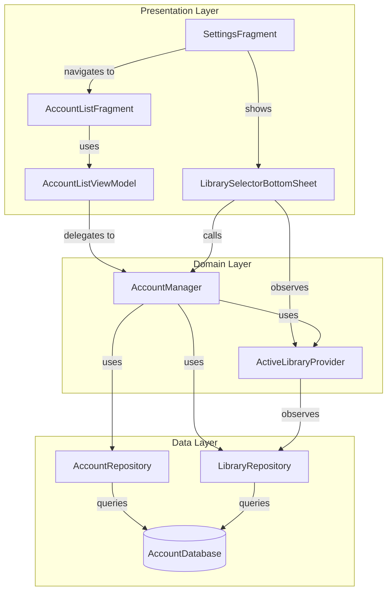
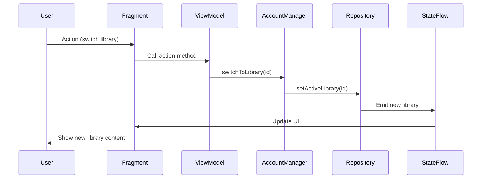
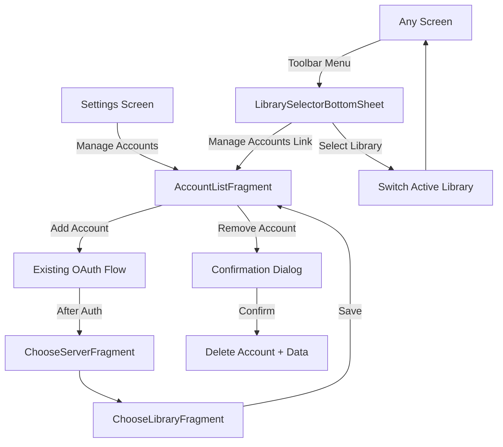

# Account/Library Management UI Design

> **Design Document for Phase 5.1**: Multi-Account Library Support UI Components
> 
> **Created**: 2026-01-28  
> **Status**: Design Phase  
> **Implementation**: Phase 5.2-5.4

---

## 1. Overview

This document defines the UI architecture for account and library management components in Chronicle. These components enable users to:

- View and manage multiple connected Plex accounts
- Switch between different libraries across accounts
- Add new accounts via the existing OAuth flow
- Remove accounts and their associated data

### Design Principles

1. **Consistency**: Follow existing Chronicle UI patterns (Data Binding, MVVM, Fragment navigation)
2. **Reactivity**: Use StateFlow from business logic layer for real-time updates
3. **Simplicity**: Minimize user friction when switching libraries
4. **Safety**: Confirm destructive actions (account removal)

---

## 2. Component Architecture

### 2.1 Architecture Diagram



### 2.2 Data Flow



### 2.3 State Management Strategy

**LiveData vs StateFlow Exposure:**

- **Business Logic Layer** ([`AccountManager`](../../app/src/main/java/local/oss/chronicle/features/account/AccountManager.kt), [`ActiveLibraryProvider`](../../app/src/main/java/local/oss/chronicle/features/account/ActiveLibraryProvider.kt)): Uses `StateFlow` for reactive state
- **ViewModel Layer**: Exposes `LiveData` to UI (Android best practice for lifecycle awareness)
- **Conversion**: ViewModels convert `StateFlow` → `LiveData` via `.asLiveData()`

**Rationale**: StateFlow is more powerful for business logic (no need for initial value handling, better coroutines integration), while LiveData provides built-in lifecycle safety for UI observation.

---

## 3. AccountListFragment Design

### 3.1 Purpose

Full-screen fragment for managing multiple accounts. Accessed from Settings screen.

### 3.2 UI Layout Structure

**File**: `fragment_account_list.xml`

```xml
<layout>
    <data>
        <variable name="viewModel" type="...AccountListViewModel" />
    </data>
    
    <androidx.constraintlayout.widget.ConstraintLayout>
        <!-- Title -->
        <TextView
            android:id="@+id/title"
            android:text="@string/accounts_title"
            android:layout_width="match_parent"
            android:layout_height="wrap_content" />
        
        <!-- Account List (RecyclerView) -->
        <androidx.recyclerview.widget.RecyclerView
            android:id="@+id/account_list"
            android:layout_width="match_parent"
            android:layout_height="0dp"
            app:layoutManager="androidx.recyclerview.widget.LinearLayoutManager" />
        
        <!-- Empty State -->
        <TextView
            android:id="@+id/empty_state"
            android:text="@string/no_accounts_message"
            android:visibility="@{viewModel.hasAccounts ? View.GONE : View.VISIBLE}"
            android:layout_width="match_parent"
            android:layout_height="wrap_content" />
        
        <!-- Add Account FAB -->
        <com.google.android.material.floatingactionbutton.FloatingActionButton
            android:id="@+id/fab_add_account"
            android:onClick="@{() -> viewModel.onAddAccount()}"
            android:layout_width="wrap_content"
            android:layout_height="wrap_content" />
    </androidx.constraintlayout.widget.ConstraintLayout>
</layout>
```

### 3.3 Account List Item Layout

**File**: `list_item_account.xml`

```xml
<layout>
    <data>
        <variable name="account" type="...Account" />
        <variable name="libraryCount" type="int" />
        <variable name="clickListener" type="...AccountClickListener" />
    </data>
    
    <androidx.constraintlayout.widget.ConstraintLayout>
        <!-- Avatar -->
        <ImageView
            android:id="@+id/avatar"
            imageUrl="@{account.avatarUrl}"
            android:layout_width="48dp"
            android:layout_height="48dp" />
        
        <!-- Account Info -->
        <TextView
            android:id="@+id/display_name"
            android:text="@{account.displayName}"
            android:textAppearance="?attr/textAppearanceListItem" />
        
        <TextView
            android:id="@+id/library_count"
            android:text="@{@plurals/library_count(libraryCount, libraryCount)}"
            android:textAppearance="?attr/textAppearanceListItemSecondary" />
        
        <!-- Provider Badge -->
        <TextView
            android:id="@+id/provider_badge"
            android:text="@{account.providerType.toString()}"
            android:background="@drawable/badge_background" />
        
        <!-- Expand/Collapse Button -->
        <ImageButton
            android:id="@+id/expand_button"
            android:src="@drawable/ic_expand_more"
            android:onClick="@{() -> clickListener.onToggleExpand(account)}" />
        
        <!-- Remove Button -->
        <ImageButton
            android:id="@+id/remove_button"
            android:src="@drawable/ic_delete"
            android:onClick="@{() -> clickListener.onRemoveAccount(account)}" />
    </androidx.constraintlayout.widget.ConstraintLayout>
</layout>
```

### 3.4 Expandable Library List

When an account is expanded, show nested RecyclerView with libraries:

**File**: `list_item_library_nested.xml`

```xml
<layout>
    <data>
        <variable name="library" type="...Library" />
        <variable name="isActive" type="boolean" />
        <variable name="clickListener" type="...LibraryClickListener" />
    </data>
    
    <androidx.constraintlayout.widget.ConstraintLayout
        android:onClick="@{() -> clickListener.onClick(library)}"
        android:background="@{isActive ? @color/library_active_background : @color/library_background}">
        
        <!-- Active Indicator -->
        <View
            android:id="@+id/active_indicator"
            android:background="@color/colorAccent"
            android:visibility="@{isActive ? View.VISIBLE : View.GONE}"
            android:layout_width="4dp"
            android:layout_height="match_parent" />
        
        <!-- Library Info -->
        <TextView
            android:id="@+id/library_name"
            android:text="@{library.name}"
            android:textAppearance="?attr/textAppearanceListItem" />
        
        <TextView
            android:id="@+id/server_name"
            android:text="@{library.serverName}"
            android:textAppearance="?attr/textAppearanceListItemSecondary" />
        
        <TextView
            android:id="@+id/item_count"
            android:text="@{@plurals/book_count(library.itemCount, library.itemCount)}"
            android:textAppearance="?attr/textAppearanceCaption" />
    </androidx.constraintlayout.widget.ConstraintLayout>
</layout>
```

### 3.5 AccountListViewModel Interface

**File**: `AccountListViewModel.kt`

```kotlin
class AccountListViewModel @Inject constructor(
    private val accountManager: AccountManager,
    private val activeLibraryProvider: ActiveLibraryProvider,
    private val navigator: Navigator
) : ViewModel() {

    // ===== Exposed State =====
    
    /** All accounts ordered by last used */
    val accounts: LiveData<List<AccountWithLibraries>> = 
        accountManager.getAccountsOrderedByLastUsed()
            .map { accounts ->
                accounts.map { account ->
                    val libraries = accountManager.getLibrariesForAccount(account.id).first()
                    AccountWithLibraries(account, libraries)
                }
            }
            .asLiveData()
    
    /** Currently active library ID */
    val activeLibraryId: LiveData<String?> = 
        activeLibraryProvider.currentLibrary
            .map { it?.id }
            .asLiveData()
    
    /** Expanded account IDs (for UI state) */
    private val _expandedAccountIds = MutableLiveData<Set<String>>(emptySet())
    val expandedAccountIds: LiveData<Set<String>> = _expandedAccountIds
    
    /** Whether any accounts exist */
    val hasAccounts: LiveData<Boolean> = accounts.map { it.isNotEmpty() }
    
    /** User messages (errors, success) */
    private val _userMessage = MutableLiveData<Event<String>>()
    val userMessage: LiveData<Event<String>> = _userMessage
    
    // ===== Actions =====
    
    fun onAddAccount() {
        // Navigate to existing OAuth flow
        navigator.showLogin()
    }
    
    fun onToggleExpand(accountId: String) {
        val current = _expandedAccountIds.value ?: emptySet()
        _expandedAccountIds.value = if (accountId in current) {
            current - accountId
        } else {
            current + accountId
        }
    }
    
    fun onSwitchToLibrary(libraryId: String) {
        viewModelScope.launch {
            try {
                accountManager.switchToLibrary(libraryId)
                _userMessage.value = Event("Switched to library")
            } catch (e: Exception) {
                _userMessage.value = Event("Failed to switch library: ${e.message}")
            }
        }
    }
    
    fun onRemoveAccount(accountId: String) {
        // Show confirmation dialog first (handled by Fragment)
        _confirmRemovalAccountId.value = Event(accountId)
    }
    
    fun confirmRemoveAccount(accountId: String) {
        viewModelScope.launch {
            try {
                accountManager.removeAccount(accountId)
                _userMessage.value = Event("Account removed")
            } catch (e: Exception) {
                _userMessage.value = Event("Failed to remove account: ${e.message}")
            }
        }
    }
    
    private val _confirmRemovalAccountId = MutableLiveData<Event<String>>()
    val confirmRemovalAccountId: LiveData<Event<String>> = _confirmRemovalAccountId
    
    // ===== Helper Data Class =====
    
    data class AccountWithLibraries(
        val account: Account,
        val libraries: List<Library>
    )
    
    // ===== Factory =====
    
    class Factory @Inject constructor(
        private val accountManager: AccountManager,
        private val activeLibraryProvider: ActiveLibraryProvider,
        private val navigator: Navigator
    ) : ViewModelProvider.Factory {
        @Suppress("UNCHECKED_CAST")
        override fun <T : ViewModel> create(modelClass: Class<T>): T {
            return AccountListViewModel(accountManager, activeLibraryProvider, navigator) as T
        }
    }
}
```

### 3.6 AccountListFragment Implementation

**File**: `AccountListFragment.kt`

```kotlin
class AccountListFragment : Fragment() {
    
    @Inject
    lateinit var viewModelFactory: AccountListViewModel.Factory
    
    private lateinit var viewModel: AccountListViewModel
    private lateinit var binding: FragmentAccountListBinding
    private lateinit var accountAdapter: AccountListAdapter
    
    companion object {
        const val TAG = "AccountListFragment"
        fun newInstance() = AccountListFragment()
    }
    
    override fun onAttach(context: Context) {
        (requireActivity() as MainActivity).activityComponent!!.inject(this)
        super.onAttach(context)
    }
    
    override fun onCreateView(
        inflater: LayoutInflater,
        container: ViewGroup?,
        savedInstanceState: Bundle?
    ): View {
        binding = FragmentAccountListBinding.inflate(inflater, container, false)
        binding.lifecycleOwner = viewLifecycleOwner
        
        viewModel = ViewModelProvider(this, viewModelFactory).get(AccountListViewModel::class.java)
        binding.viewModel = viewModel
        
        setupRecyclerView()
        observeViewModel()
        
        return binding.root
    }
    
    private fun setupRecyclerView() {
        accountAdapter = AccountListAdapter(
            accountClickListener = AccountClickListener { account ->
                viewModel.onToggleExpand(account.id)
            },
            libraryClickListener = LibraryClickListener { library ->
                viewModel.onSwitchToLibrary(library.id)
            },
            removeAccountListener = RemoveAccountListener { account ->
                viewModel.onRemoveAccount(account.id)
            }
        )
        binding.accountList.adapter = accountAdapter
    }
    
    private fun observeViewModel() {
        viewModel.accounts.observe(viewLifecycleOwner) { accountsWithLibraries ->
            accountAdapter.submitList(accountsWithLibraries)
        }
        
        viewModel.userMessage.observe(viewLifecycleOwner) { event ->
            if (!event.hasBeenHandled) {
                Toast.makeText(context, event.getContentIfNotHandled(), Toast.LENGTH_SHORT).show()
            }
        }
        
        viewModel.confirmRemovalAccountId.observe(viewLifecycleOwner) { event ->
            if (!event.hasBeenHandled) {
                val accountId = event.getContentIfNotHandled()
                showRemovalConfirmationDialog(accountId)
            }
        }
    }
    
    private fun showRemovalConfirmationDialog(accountId: String) {
        AlertDialog.Builder(requireContext())
            .setTitle(R.string.remove_account_title)
            .setMessage(R.string.remove_account_message)
            .setPositiveButton(R.string.remove) { _, _ ->
                viewModel.confirmRemoveAccount(accountId)
            }
            .setNegativeButton(R.string.cancel, null)
            .show()
    }
}

// Click Listeners
class AccountClickListener(val clickListener: (account: Account) -> Unit) {
    fun onToggleExpand(account: Account) = clickListener(account)
}

class LibraryClickListener(val clickListener: (library: Library) -> Unit) {
    fun onClick(library: Library) = clickListener(library)
}

class RemoveAccountListener(val clickListener: (account: Account) -> Unit) {
    fun onRemove(account: Account) = clickListener(account)
}
```

### 3.7 AccountListAdapter

**File**: `AccountListAdapter.kt`

```kotlin
class AccountListAdapter(
    private val accountClickListener: AccountClickListener,
    private val libraryClickListener: LibraryClickListener,
    private val removeAccountListener: RemoveAccountListener
) : ListAdapter<AccountListViewModel.AccountWithLibraries, AccountViewHolder>(AccountDiffCallback()) {
    
    override fun onCreateViewHolder(parent: ViewGroup, viewType: Int): AccountViewHolder {
        return AccountViewHolder.from(parent)
    }
    
    override fun onBindViewHolder(holder: AccountViewHolder, position: Int) {
        holder.bind(
            getItem(position),
            accountClickListener,
            libraryClickListener,
            removeAccountListener
        )
    }
}

class AccountViewHolder private constructor(
    private val binding: ListItemAccountBinding
) : RecyclerView.ViewHolder(binding.root) {
    
    fun bind(
        item: AccountListViewModel.AccountWithLibraries,
        accountClickListener: AccountClickListener,
        libraryClickListener: LibraryClickListener,
        removeAccountListener: RemoveAccountListener
    ) {
        binding.account = item.account
        binding.libraryCount = item.libraries.size
        binding.clickListener = accountClickListener
        binding.executePendingBindings()
        
        // Nested library list (conditionally visible)
        // Implementation depends on expand/collapse state
    }
    
    companion object {
        fun from(parent: ViewGroup): AccountViewHolder {
            val layoutInflater = LayoutInflater.from(parent.context)
            val binding = ListItemAccountBinding.inflate(layoutInflater, parent, false)
            return AccountViewHolder(binding)
        }
    }
}

class AccountDiffCallback : DiffUtil.ItemCallback<AccountListViewModel.AccountWithLibraries>() {
    override fun areItemsTheSame(
        oldItem: AccountListViewModel.AccountWithLibraries,
        newItem: AccountListViewModel.AccountWithLibraries
    ): Boolean {
        return oldItem.account.id == newItem.account.id
    }
    
    override fun areContentsTheSame(
        oldItem: AccountListViewModel.AccountWithLibraries,
        newItem: AccountListViewModel.AccountWithLibraries
    ): Boolean {
        return oldItem == newItem
    }
}
```

---

## 4. LibrarySelectorBottomSheet Design

### 4.1 Purpose

Quick library switcher accessible from any screen. Modal bottom sheet showing all libraries grouped by account.

### 4.2 UI Layout Structure

**File**: `bottom_sheet_library_selector.xml`

```xml
<layout>
    <data>
        <variable name="activeLibraryId" type="String" />
    </data>
    
    <androidx.constraintlayout.widget.ConstraintLayout>
        <!-- Header -->
        <TextView
            android:id="@+id/title"
            android:text="@string/switch_library"
            android:textAppearance="?attr/textAppearanceHeadline6"
            android:layout_width="match_parent"
            android:layout_height="wrap_content" />
        
        <!-- Library List (Grouped by Account) -->
        <androidx.recyclerview.widget.RecyclerView
            android:id="@+id/library_list"
            android:layout_width="match_parent"
            android:layout_height="wrap_content"
            app:layoutManager="androidx.recyclerview.widget.LinearLayoutManager" />
        
        <!-- Manage Accounts Link -->
        <TextView
            android:id="@+id/manage_accounts_link"
            android:text="@string/manage_accounts"
            android:textColor="@color/colorAccent"
            android:clickable="true"
            android:layout_width="wrap_content"
            android:layout_height="wrap_content" />
    </androidx.constraintlayout.widget.ConstraintLayout>
</layout>
```

### 4.3 Library Selector Item Layout

**File**: `list_item_library_selector.xml`

```xml
<layout>
    <data>
        <variable name="library" type="...Library" />
        <variable name="accountName" type="String" />
        <variable name="isActive" type="boolean" />
        <variable name="clickListener" type="...LibraryClickListener" />
    </data>
    
    <androidx.constraintlayout.widget.ConstraintLayout
        android:onClick="@{() -> clickListener.onClick(library)}"
        android:background="@{isActive ? @drawable/library_selector_active : @drawable/library_selector_default}">
        
        <!-- Active Checkmark -->
        <ImageView
            android:id="@+id/checkmark"
            android:src="@drawable/ic_check"
            android:visibility="@{isActive ? View.VISIBLE : View.GONE}"
            android:layout_width="24dp"
            android:layout_height="24dp" />
        
        <!-- Library Name -->
        <TextView
            android:id="@+id/library_name"
            android:text="@{library.name}"
            android:textAppearance="?attr/textAppearanceBody1"
            android:textStyle="@{isActive ? 'bold' : 'normal'}" />
        
        <!-- Account + Server Info -->
        <TextView
            android:id="@+id/account_server"
            android:text="@{accountName + ' • ' + library.serverName}"
            android:textAppearance="?attr/textAppearanceCaption"
            android:textColor="?attr/colorOnSurfaceVariant" />
        
        <!-- Item Count -->
        <TextView
            android:id="@+id/item_count"
            android:text="@{String.valueOf(library.itemCount)}"
            android:textAppearance="?attr/textAppearanceCaption" />
    </androidx.constraintlayout.widget.ConstraintLayout>
</layout>
```

### 4.4 LibrarySelectorBottomSheet Implementation

**File**: `LibrarySelectorBottomSheet.kt`

```kotlin
class LibrarySelectorBottomSheet : BottomSheetDialogFragment() {
    
    @Inject
    lateinit var accountManager: AccountManager
    
    @Inject
    lateinit var activeLibraryProvider: ActiveLibraryProvider
    
    @Inject
    lateinit var navigator: Navigator
    
    private lateinit var binding: BottomSheetLibrarySelectorBinding
    private lateinit var adapter: LibrarySelectorAdapter
    
    companion object {
        const val TAG = "LibrarySelectorBottomSheet"
        fun newInstance() = LibrarySelectorBottomSheet()
    }
    
    override fun onAttach(context: Context) {
        (requireActivity() as MainActivity).activityComponent!!.inject(this)
        super.onAttach(context)
    }
    
    override fun onCreateView(
        inflater: LayoutInflater,
        container: ViewGroup?,
        savedInstanceState: Bundle?
    ): View {
        binding = BottomSheetLibrarySelectorBinding.inflate(inflater, container, false)
        
        setupRecyclerView()
        observeData()
        setupClickListeners()
        
        return binding.root
    }
    
    private fun setupRecyclerView() {
        adapter = LibrarySelectorAdapter(
            LibraryClickListener { library ->
                switchToLibrary(library.id)
            }
        )
        binding.libraryList.adapter = adapter
    }
    
    private fun observeData() {
        // Combine all accounts with their libraries
        lifecycleScope.launch {
            combine(
                accountManager.getAllAccounts(),
                activeLibraryProvider.currentLibrary
            ) { accounts, activeLibrary ->
                val items = mutableListOf<LibrarySelectorItem>()
                
                accounts.forEach { account ->
                    val libraries = accountManager.getLibrariesForAccount(account.id).first()
                    
                    // Add account header
                    items.add(LibrarySelectorItem.Header(account.displayName))
                    
                    // Add libraries for this account
                    libraries.forEach { library ->
                        items.add(
                            LibrarySelectorItem.LibraryItem(
                                library = library,
                                accountName = account.displayName,
                                isActive = library.id == activeLibrary?.id
                            )
                        )
                    }
                }
                
                items
            }.collect { items ->
                adapter.submitList(items)
            }
        }
    }
    
    private fun setupClickListeners() {
        binding.manageAccountsLink.setOnClickListener {
            navigator.showAccountList()
            dismiss()
        }
    }
    
    private fun switchToLibrary(libraryId: String) {
        lifecycleScope.launch {
            try {
                accountManager.switchToLibrary(libraryId)
                dismiss()
            } catch (e: Exception) {
                Toast.makeText(context, "Failed to switch library", Toast.LENGTH_SHORT).show()
            }
        }
    }
}

// Sealed class for RecyclerView items (headers + libraries)
sealed class LibrarySelectorItem {
    data class Header(val accountName: String) : LibrarySelectorItem()
    data class LibraryItem(
        val library: Library,
        val accountName: String,
        val isActive: Boolean
    ) : LibrarySelectorItem()
}
```

### 4.5 Integration Points

The `LibrarySelectorBottomSheet` can be shown from multiple contexts:

1. **Settings Screen**: Via "Switch Library" button
2. **Home Screen**: Via toolbar menu item
3. **Library Screen**: Via toolbar menu item
4. **Anywhere**: Any fragment can show it via:

```kotlin
LibrarySelectorBottomSheet.newInstance()
    .show(parentFragmentManager, LibrarySelectorBottomSheet.TAG)
```

---

## 5. DI Integration Plan

### 5.1 ActivityComponent Changes

**File**: [`ActivityComponent.kt`](../../app/src/main/java/local/oss/chronicle/injection/components/ActivityComponent.kt)

Add injection methods:

```kotlin
@ActivityScope
@Component(dependencies = [AppComponent::class], modules = [ActivityModule::class])
interface ActivityComponent {
    // ... existing methods ...
    
    // NEW: Account management UI
    fun accountListViewModelFactory(): AccountListViewModel.Factory
    
    fun inject(accountListFragment: AccountListFragment)
    fun inject(librarySelectorBottomSheet: LibrarySelectorBottomSheet)
}
```

### 5.2 ActivityModule Changes

**File**: `ActivityModule.kt`

Add ViewModel factory providers:

```kotlin
@Module
class ActivityModule(private val activity: AppCompatActivity) {
    // ... existing providers ...
    
    @Provides
    @ActivityScope
    fun provideAccountListViewModelFactory(
        accountManager: AccountManager,
        activeLibraryProvider: ActiveLibraryProvider,
        navigator: Navigator
    ): AccountListViewModel.Factory {
        return AccountListViewModel.Factory(accountManager, activeLibraryProvider, navigator)
    }
}
```

### 5.3 AppComponent (No Changes Needed)

[`AccountManager`](../../app/src/main/java/local/oss/chronicle/features/account/AccountManager.kt) and [`ActiveLibraryProvider`](../../app/src/main/java/local/oss/chronicle/features/account/ActiveLibraryProvider.kt) are already provided at `@Singleton` scope via existing modules.

---

## 6. Navigation Plan

### 6.1 Navigator Changes

**File**: [`Navigator.kt`](../../app/src/main/java/local/oss/chronicle/navigation/Navigator.kt)

Add new navigation methods:

```kotlin
class Navigator @Inject constructor(
    private val fragmentManager: FragmentManager,
    private val plexConfig: PlexConfig,
    plexLoginRepo: IPlexLoginRepo,
    activity: AppCompatActivity
) {
    // ... existing methods ...
    
    /**
     * Show the Account List screen from Settings.
     */
    fun showAccountList() {
        val accountListFragment = AccountListFragment.newInstance()
        fragmentManager.beginTransaction()
            .replace(R.id.fragNavHost, accountListFragment)
            .addToBackStack(AccountListFragment.TAG)
            .commit()
    }
    
    /**
     * Show the Library Selector bottom sheet.
     * Can be called from any fragment.
     */
    fun showLibrarySelector(fragmentManager: FragmentManager) {
        LibrarySelectorBottomSheet.newInstance()
            .show(fragmentManager, LibrarySelectorBottomSheet.TAG)
    }
}
```

### 6.2 Entry Points

#### 6.2.1 From Settings Screen

**File**: `SettingsFragment.kt`

Add a clickable preference item in settings:

```kotlin
// In SettingsViewModel
val onManageAccountsClick = {
    navigator.showAccountList()
}
```

**Layout**: `fragment_settings.xml`

Add preference item (or update `SettingsList` custom view):

```xml
<local.oss.chronicle.views.PreferenceItemClickable
    android:id="@+id/manage_accounts"
    title="@string/manage_accounts"
    summary="@string/manage_accounts_summary"
    icon="@drawable/ic_person"
    android:onClick="@{() -> viewModel.onManageAccountsClick()}" />
```

#### 6.2.2 From Toolbar (Quick Switch)

Add menu item to `home_menu.xml`, `library_menu.xml`:

```xml
<item
    android:id="@+id/action_switch_library"
    android:title="@string/switch_library"
    android:icon="@drawable/ic_library_switch"
    app:showAsAction="ifRoom" />
```

Handle in fragments:

```kotlin
override fun onOptionsItemSelected(item: MenuItem): Boolean {
    return when (item.itemId) {
        R.id.action_switch_library -> {
            LibrarySelectorBottomSheet.newInstance()
                .show(parentFragmentManager, LibrarySelectorBottomSheet.TAG)
            true
        }
        else -> super.onOptionsItemSelected(item)
    }
}
```

### 6.3 Navigation Flow Diagram



---

## 7. Visual Indicators

### 7.1 Toolbar Subtitle (Current Library Name)

**File**: `MainActivity.kt`

Update toolbar to show current library:

```kotlin
class MainActivity : AppCompatActivity() {
    // ... existing code ...
    
    @Inject
    lateinit var activeLibraryProvider: ActiveLibraryProvider
    
    override fun onCreate(savedInstanceState: Bundle?) {
        super.onCreate(savedInstanceState)
        
        // Observe active library and update toolbar
        lifecycleScope.launch {
            activeLibraryProvider.currentLibrary.collect { library ->
                supportActionBar?.subtitle = library?.name ?: ""
            }
        }
    }
}
```

### 7.2 Account Avatar Display

For future enhancement, show account avatar in toolbar/navigation drawer.

---

## 8. String Resources

**File**: `app/src/main/res/values/strings.xml`

Add required strings:

```xml
<!-- Account Management -->
<string name="accounts_title">Accounts &amp; Libraries</string>
<string name="no_accounts_message">No accounts connected.\nAdd a Plex account to get started.</string>
<string name="manage_accounts">Manage Accounts</string>
<string name="manage_accounts_summary">Add or remove Plex accounts</string>
<string name="switch_library">Switch Library</string>
<string name="remove_account_title">Remove Account?</string>
<string name="remove_account_message">This will delete the account and all associated data (books, progress, downloads). This cannot be undone.</string>
<string name="remove">Remove</string>
<string name="cancel">Cancel</string>

<!-- Plurals -->
<plurals name="library_count">
    <item quantity="one">%d library</item>
    <item quantity="other">%d libraries</item>
</plurals>
<plurals name="book_count">
    <item quantity="one">%d book</item>
    <item quantity="other">%d books</item>
</plurals>
```

---

## 9. Testing Strategy

### 9.1 Unit Tests

**File**: `AccountListViewModelTest.kt`

```kotlin
class AccountListViewModelTest {
    @Test
    fun `switching library updates active library`()
    
    @Test
    fun `removing account triggers confirmation event`()
    
    @Test
    fun `expanding account updates expanded state`()
    
    @Test
    fun `accounts flow emits combined account and library data`()
}
```

### 9.2 UI Tests (Manual)

1. **Account List**: Verify expand/collapse, library switching, account removal
2. **Library Selector**: Verify grouping by account, active indicator, quick switch
3. **Navigation**: Verify transitions between screens, back stack behavior
4. **Visual Indicators**: Verify toolbar subtitle updates on library switch

---

## 10. Implementation Checklist

### Phase 5.2: AccountListFragment/ViewModel

- [ ] Create `fragment_account_list.xml` layout
- [ ] Create `list_item_account.xml` layout
- [ ] Create `list_item_library_nested.xml` layout
- [ ] Implement `AccountListViewModel.kt`
- [ ] Implement `AccountListFragment.kt`
- [ ] Implement `AccountListAdapter.kt`
- [ ] Add string resources
- [ ] Write unit tests for ViewModel

### Phase 5.3: LibrarySelectorBottomSheet

- [ ] Create `bottom_sheet_library_selector.xml` layout
- [ ] Create `list_item_library_selector.xml` layout
- [ ] Implement `LibrarySelectorBottomSheet.kt`
- [ ] Implement `LibrarySelectorAdapter.kt`
- [ ] Add sealed class for grouped items (headers + libraries)

### Phase 5.4: DI and Navigation

- [ ] Update `ActivityComponent.kt` with inject methods
- [ ] Update `ActivityModule.kt` with ViewModel factory
- [ ] Update `Navigator.kt` with navigation methods
- [ ] Update `SettingsFragment.kt` to navigate to AccountList
- [ ] Add toolbar menu items for library switching
- [ ] Update `MainActivity.kt` for toolbar subtitle

---

## 11. Design Decisions

### 11.1 Why Expandable Lists for Accounts?

**Decision**: Use expandable RecyclerView instead of separate account/library screens.

**Rationale**:
- Reduces navigation depth (single screen shows all accounts + libraries)
- Follows Android Material Design patterns for hierarchical data
- Allows quick comparison across accounts without navigation

### 11.2 Why Bottom Sheet for Quick Switching?

**Decision**: Use modal bottom sheet instead of navigation drawer or dialog.

**Rationale**:
- Consistent with existing bottom sheet pattern ([`ModalBottomSheetSpeedChooser`](../../app/src/main/java/local/oss/chronicle/views/ModalBottomSheetSpeedChooser.kt))
- Accessible from anywhere without disrupting navigation flow
- Material Design best practice for contextual actions

### 11.3 Why LiveData in ViewModel vs StateFlow?

**Decision**: Expose LiveData from ViewModel, use StateFlow internally in business logic.

**Rationale**:
- LiveData is lifecycle-aware by default (safer for UI)
- StateFlow is better for business logic (no need for initial value handling)
- Easy conversion via `.asLiveData()` extension
- Follows Android Architecture Components best practices

### 11.4 Why No Jetpack Navigation?

**Decision**: Stick with existing [`Navigator`](../../app/src/main/java/local/oss/chronicle/navigation/Navigator.kt) pattern.

**Rationale**:
- Consistent with existing codebase architecture
- Low risk (no need to migrate entire app)
- Navigator pattern already handles complex login flows
- Can migrate to Jetpack Navigation in future refactor if needed

---

## 12. Future Enhancements

### 12.1 Account Avatars in Navigation Drawer

Display account avatar and quick library switcher in navigation drawer (like Gmail).

### 12.2 Library Sync Status Indicators

Show sync progress, last sync time, pending items in library list.

### 12.3 Multi-Account Export/Import

Allow users to export account configurations for backup/restore.

### 12.4 Per-Library Preferences

Allow different playback settings per library (e.g., different playback speeds for different accounts).

---

**Last Updated**: 2026-01-28  
**Next Steps**: Proceed to Phase 5.2 (Implementation)
