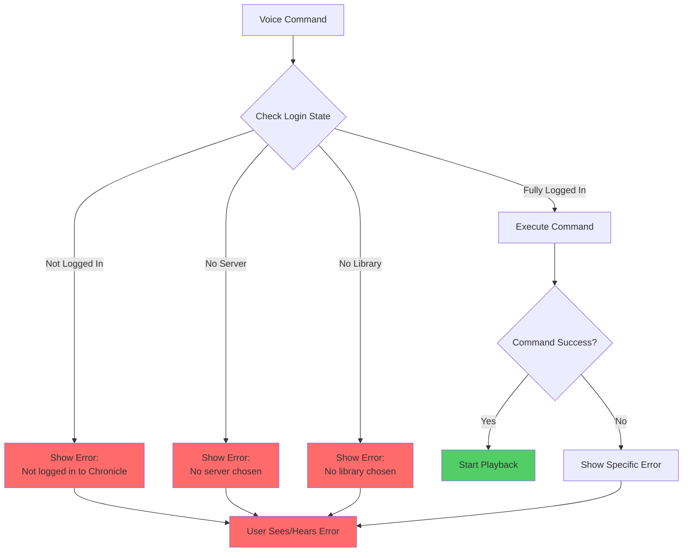

# Android Auto Support

This document covers Chronicle's Android Auto integration for in-car audiobook playback.

## Overview

Chronicle supports Android Auto, allowing users to browse and play audiobooks directly from their car's infotainment system.

---

## Media Browser Structure

```
Root
├── Recently Listened
├── Offline (Downloaded)
├── Recently Added
└── Library (All Books)
```

The media browser hierarchy is designed for easy navigation while driving, with the most commonly accessed content at the top level.

---

## Features

| Feature | Description |
|---------|-------------|
| **Voice search** | Search for audiobooks by title or author |
| **Playback controls** | Play, pause, skip forward/back |
| **Book artwork** | Cover images displayed on screen |
| **Progress indicators** | Shows playback progress for each book |

---

## Implementation

### Key Methods

| Method | Purpose |
|--------|---------|
| [`MediaPlayerService.onGetRoot()`](../../app/src/main/java/local/oss/chronicle/features/player/MediaPlayerService.kt) | Returns root of browsable content |
| [`MediaPlayerService.onLoadChildren()`](../../app/src/main/java/local/oss/chronicle/features/player/MediaPlayerService.kt) | Loads content for a browsable node |
| [`MediaPlayerService.onSearch()`](../../app/src/main/java/local/oss/chronicle/features/player/MediaPlayerService.kt) | Handles voice search queries |
| [`AudiobookMediaSessionCallback`](../../app/src/main/java/local/oss/chronicle/features/player/AudiobookMediaSessionCallback.kt) | Handles playback commands with error handling |

### Client Validation

Chronicle validates that the connecting client is an authorized Android Auto client:

- [`PackageValidator`](../../app/src/main/java/local/oss/chronicle/util/PackageValidator.kt) - Validates Auto client signatures

---

## Configuration

### XML Configuration Files

| File | Purpose |
|------|---------|
| [`auto_allowed_callers.xml`](../../app/src/main/res/xml/auto_allowed_callers.xml) | List of allowed Android Auto client packages |
| [`automotive_app_desc.xml`](../../app/src/main/res/xml/automotive_app_desc.xml) | Declares Auto capabilities to the system |

### Enabling Android Auto

Users must enable Android Auto support in Chronicle's settings:

1. Go to Settings
2. Toggle "Allow Android Auto" on
3. Connect to Android Auto in vehicle

---

## MediaBrowserService Flow


---

## Error Handling

### Logging and Debugging

Android Auto operations use `[AndroidAuto]` prefixed log tags for easier debugging:

```kotlin
Timber.d("[AndroidAuto] Loading children for parentId: $parentId")
Timber.e("[AndroidAuto] Error loading book: ${error.message}")
```

### Defensive Null Checks

All browse tree operations include null safety:

```kotlin
// Safe book lookup with fallback
val books = bookRepository.getAllBooks()
    .filterNotNull()
    .map { it.toMediaItem() }
```

### Error Recovery

When media loading fails:

1. Log error with `[AndroidAuto]` tag
2. Return empty browser result (not crash)
3. Display user-friendly message if possible

---

## MediaSession State Synchronization

Android Auto receives playback state through [`PlaybackStateController`](../../app/src/main/java/local/oss/chronicle/features/player/PlaybackStateController.kt):


### State Synchronization

| State | Source | Update Trigger |
|-------|--------|----------------|
| Playing/Paused | ExoPlayer | Player state change |
| Position | PlaybackStateController | Position updates (debounced) |
| Track metadata | TrackListStateManager | Track change |
| Error state | ChronicleError | Playback error |

## Safety Considerations

- UI is simplified for driver safety
- Large touch targets for easy tapping
- Voice control support reduces distraction
- No text input while driving

---

## Voice Command Handling

Chronicle fully supports voice commands from Android Auto and Google Assistant, meeting Google Play Store requirements that **all voice commands must either start playback or show a visible error message** (silent failures are not allowed).

### Supported Voice Commands

Chronicle handles the following MediaSession callbacks for voice commands:

| Callback | Triggered By | Example |
|----------|--------------|---------|
| [`onPlay()`](../../app/src/main/java/local/oss/chronicle/features/player/AudiobookMediaSessionCallback.kt) | Generic play command | "Hey Google, play on Chronicle" |
| [`onPlayFromSearch()`](../../app/src/main/java/local/oss/chronicle/features/player/AudiobookMediaSessionCallback.kt) | Search query | "Hey Google, play [book name] on Chronicle" |
| [`onPlayFromMediaId()`](../../app/src/main/java/local/oss/chronicle/features/player/AudiobookMediaSessionCallback.kt) | Direct media selection | User taps book in Android Auto UI |

**Critical Requirement**: Every command **must** result in either:
- ✅ Successful playback starts
- ✅ User sees/hears an error message

Silent failures result in app rejection from Google Play.

---

### Error Response Strategy

Chronicle uses the [`IPlaybackErrorReporter`](../../app/src/main/java/local/oss/chronicle/features/player/IPlaybackErrorReporter.kt) interface to communicate errors from the MediaSession callback to the service:

```kotlin
interface IPlaybackErrorReporter {
    fun setPlaybackStateError(errorCode: Int, errorMessage: String)
    fun clearPlaybackError()
}
```

#### Implementation

[`MediaPlayerService`](../../app/src/main/java/local/oss/chronicle/features/player/MediaPlayerService.kt) implements this interface and sets `PlaybackStateCompat.STATE_ERROR`, which causes Android Auto to display the error message both visually on screen and via Google Assistant voice feedback.

#### Error Scenarios and Messages

| Scenario | Error Message | User Action Required |
|----------|---------------|---------------------|
| Not logged in | "Not logged in to Chronicle" | Open app and log in |
| No server chosen | "No server chosen. Please return to Chronicle and choose a server and library" | Complete Plex server setup |
| No user chosen | "No user chosen. Please return to Chronicle and finish logging in" | Complete user selection |
| No library chosen | "No library chosen. Please return to Chronicle and choose a library" | Select audiobook library |
| Search returns no results | "No audiobooks found for '[query]'" | Try different search terms |
| Empty library | "Your audiobook library is empty" | Add audiobooks to Plex |
| Connection timeout | "Connection timeout - please check your network" | Check network/Plex connection |
| Audiobook not available | "This audiobook is not available" | Book may have been removed |
| Playback failed | "Unable to play audiobook" | Check app/server state |

All error strings are defined in [`strings.xml`](../../app/src/main/res/values/strings.xml) with the `auto_access_error_` prefix.

---

### Authentication Checks

**All voice command callbacks check authentication state before proceeding.** This prevents silent failures when users aren't fully logged in.

The [`checkAuthenticationOrError()`](../../app/src/main/java/local/oss/chronicle/features/player/AudiobookMediaSessionCallback.kt) helper method validates:

1. User is logged in to Plex
2. Server has been chosen
3. User account selected (for managed users)
4. Audiobook library selected

If any check fails, an appropriate error message is shown immediately via `setPlaybackStateError()`.

**Example Flow:**


---

### Fallback Playback Behavior

Chronicle implements intelligent fallback behavior for generic vs. specific commands:

#### Empty/Generic Queries

**Voice command**: "Hey Google, play on Chronicle" (no specific book requested)

**Fallback strategy**:
1. Try to play most recently listened audiobook
2. If no recent history, play a random audiobook
3. If library is empty, show error: "Your audiobook library is empty"

#### Specific Search Queries

**Voice command**: "Hey Google, play [specific book name] on Chronicle"

**No fallback** - Show error with the search query so user knows their specific request wasn't found:
- "No audiobooks found for '[query]'"

**Rationale**: Users need to know that their specific request failed, not just get random playback.

#### Direct Media ID

When browsing Android Auto UI and tapping a book, there is **no fallback** - only that specific book should play or show an error.

---

### Timeout Handling

To prevent infinite waiting when network/server isn't available, Chronicle implements a **10-second timeout** for connection establishment.

**Constant**: `RESUME_TIMEOUT_MILLIS = 10_000L` in [`AudiobookMediaSessionCallback`](../../app/src/main/java/local/oss/chronicle/features/player/AudiobookMediaSessionCallback.kt)

**When timeout occurs**:
- User sees error: "Connection timeout - please check your network"
- No infinite spinners or hanging state
- User can retry by issuing command again

This prevents the Google Play violation where apps hang indefinitely without feedback.

---

### Manual Testing Checklist

Use the **Android Auto Desktop Head Unit (DHU)** simulator or a real vehicle to test:

#### Logged Out Scenarios
- [ ] "Hey Google, play on Chronicle" → Shows "Not logged in to Chronicle" error
- [ ] "Hey Google, play [book name] on Chronicle" → Shows "Not logged in to Chronicle" error
- [ ] Verify error is shown on Android Auto screen
- [ ] Verify error is spoken by Google Assistant

#### Logged In Scenarios
- [ ] "Hey Google, play on Chronicle" → Plays last played or random audiobook
- [ ] "Hey Google, play [existing book] on Chronicle" → Plays matching audiobook
- [ ] "Hey Google, play [nonexistent book] on Chronicle" → Shows "No audiobooks found for '[query]'" error
- [ ] Generic play with no history → Plays random book
- [ ] Generic play with recent book → Resumes recent book

#### Setup Incomplete Scenarios
- [ ] Logged in, no server chosen → Shows "No server chosen" error
- [ ] Logged in, no library chosen → Shows "No library chosen" error
- [ ] Each error message is clear and actionable

#### Edge Cases
- [ ] Empty library + generic play → Shows "library is empty" error
- [ ] Empty library + search → Shows "library is empty" error
- [ ] Network disconnected → Shows timeout error after 10 seconds (not infinite wait)
- [ ] Invalid media ID from browse → Shows "audiobook not available" error
- [ ] Book with no tracks → Shows appropriate error

#### Error Message Verification
- [ ] All error messages appear on Android Auto screen
- [ ] All errors are spoken by Google Assistant
- [ ] App doesn't crash on any error scenario
- [ ] Error state clears when playback succeeds
- [ ] No silent failures - every command produces visible feedback

#### Performance
- [ ] Commands respond within 2-3 seconds under normal conditions
- [ ] Timeout occurs at exactly 10 seconds (not sooner or later)
- [ ] No memory leaks when triggering multiple errors

---

## Related Documentation

- [Features Index](../FEATURES.md) - Overview of all features
- [Playback](playback.md) - Media playback architecture and state management
- [Settings](settings.md) - Enabling Android Auto
- [Architecture Patterns](../architecture/patterns.md) - MediaBrowserService pattern, PlaybackStateController
- [Voice Command Error Handling Architecture](../architecture/voice-command-error-handling.md) - Detailed design and implementation
- [Voice Command Async Test Issues](../testing/voice-command-async-test-issues.md) - Testing challenges and solutions
