# Android Auto Support

This document covers Chronicle's Android Auto integration for in-car audiobook playback.

## Overview

Chronicle supports Android Auto, allowing users to browse and play audiobooks directly from their car's infotainment system.

---

## Media Browser Structure

```
Root
├── Recently Listened
├── Offline (Downloaded)
├── Recently Added
└── Library (All Books)
```

The media browser hierarchy is designed for easy navigation while driving, with the most commonly accessed content at the top level.

---

## Features

| Feature | Description |
|---------|-------------|
| **Voice search** | Search for audiobooks by title or author |
| **Playback controls** | Play, pause, skip forward/back |
| **Book artwork** | Cover images displayed on screen |
| **Progress indicators** | Shows playback progress for each book |

---

## Implementation

### Key Methods

| Method | Purpose |
|--------|---------|
| [`MediaPlayerService.onGetRoot()`](../../app/src/main/java/local/oss/chronicle/features/player/MediaPlayerService.kt) | Returns root of browsable content |
| [`MediaPlayerService.onLoadChildren()`](../../app/src/main/java/local/oss/chronicle/features/player/MediaPlayerService.kt) | Loads content for a browsable node |
| [`MediaPlayerService.onSearch()`](../../app/src/main/java/local/oss/chronicle/features/player/MediaPlayerService.kt) | Handles voice search queries |

### Client Validation

Chronicle validates that the connecting client is an authorized Android Auto client:

- [`PackageValidator`](../../app/src/main/java/local/oss/chronicle/util/PackageValidator.kt) - Validates Auto client signatures

---

## Configuration

### XML Configuration Files

| File | Purpose |
|------|---------|
| [`auto_allowed_callers.xml`](../../app/src/main/res/xml/auto_allowed_callers.xml) | List of allowed Android Auto client packages |
| [`automotive_app_desc.xml`](../../app/src/main/res/xml/automotive_app_desc.xml) | Declares Auto capabilities to the system |

### Enabling Android Auto

Users must enable Android Auto support in Chronicle's settings:

1. Go to Settings
2. Toggle "Allow Android Auto" on
3. Connect to Android Auto in vehicle

---

## MediaBrowserService Flow

```mermaid
sequenceDiagram
    participant Auto as Android Auto
    participant MPS as MediaPlayerService
    participant Repo as BookRepository
    
    Auto->>MPS: connect
    MPS->>MPS: validate client
    MPS-->>Auto: connection accepted
    
    Auto->>MPS: onGetRoot
    MPS-->>Auto: root node
    
    Auto->>MPS: onLoadChildren root
    MPS-->>Auto: Recently Listened, Offline, Recently Added, Library
    
    Auto->>MPS: onLoadChildren Library
    MPS->>Repo: getAllBooks
    Repo-->>MPS: books list
    MPS-->>Auto: browsable book items
    
    Auto->>MPS: playFromMediaId bookId
    MPS->>MPS: start playback
```



---

## Safety Considerations

- UI is simplified for driver safety
- Large touch targets for easy tapping
- Voice control support reduces distraction
- No text input while driving

---

## Related Documentation

- [Features Index](../FEATURES.md) - Overview of all features
- [Playback](playback.md) - Media playback architecture
- [Settings](settings.md) - Enabling Android Auto
- [Architecture Patterns](../architecture/patterns.md) - MediaBrowserService pattern
