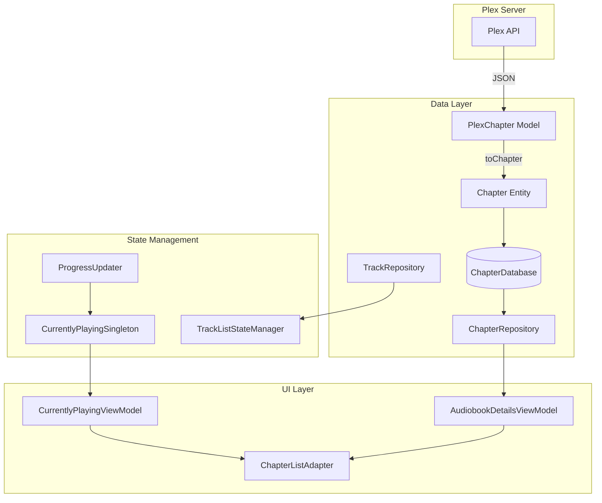
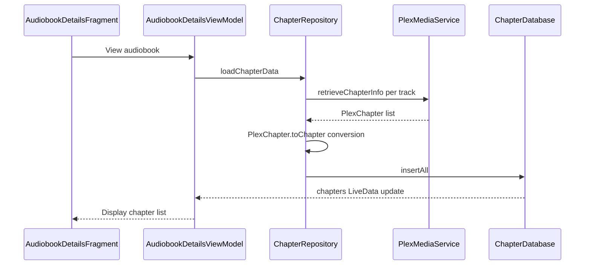
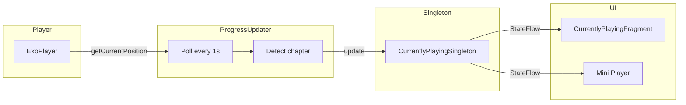
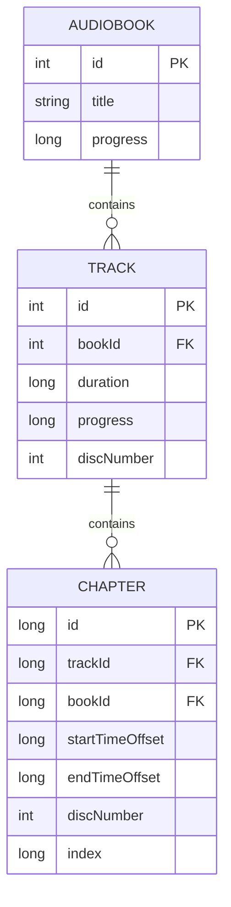
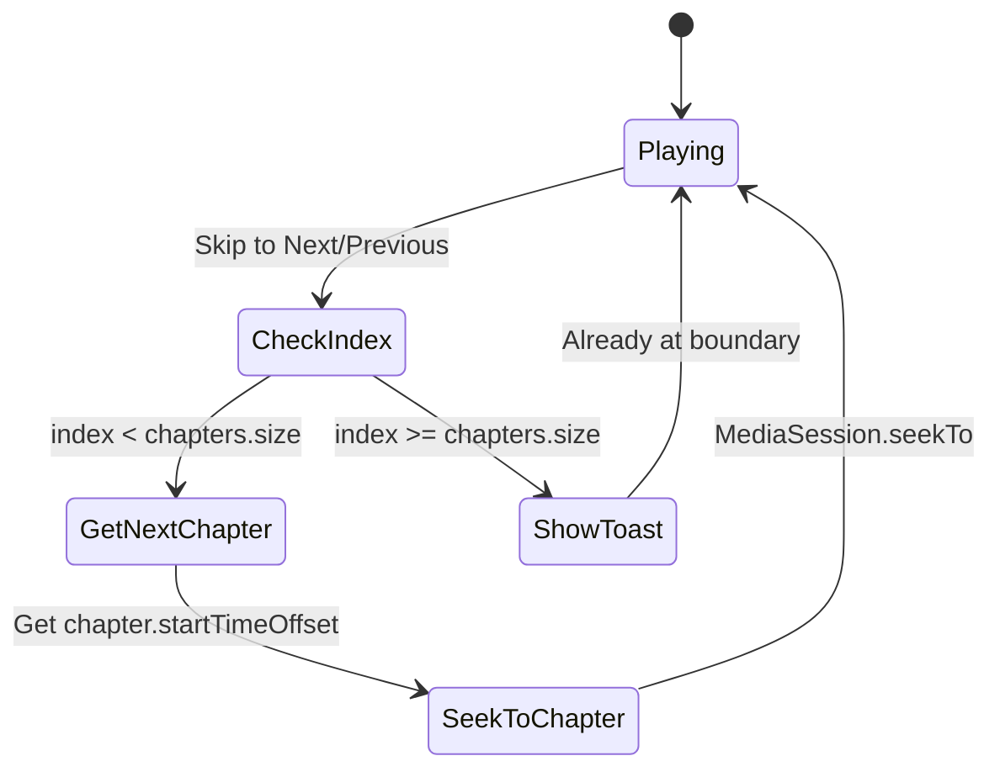
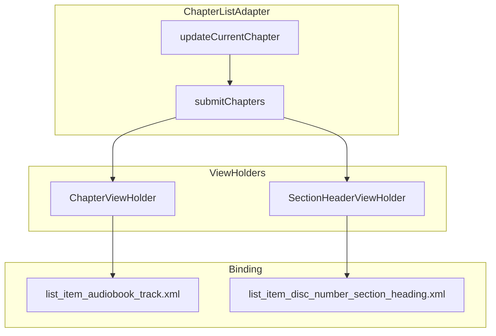

# Chapter System

This document covers Chronicle's chapter system, including chapter data flow, detection algorithm, track-to-chapter mapping, and navigation implementation.

## Overview

Chronicle supports chapter navigation for audiobooks, with chapters sourced from:
1. **M4B files** - Chapters embedded in the audio file, retrieved from Plex API
2. **Multi-file audiobooks** - Each audio file treated as a chapter

Chapters enable:
- Displaying progress within logical book sections
- Skip to next/previous chapter navigation
- Seekbar scoped to current chapter
- Chapter title display in player and mini player

---

## Architecture



---

## Key Components

| Component | Purpose |
|-----------|---------|
| [`Chapter`](../../app/src/main/java/local/oss/chronicle/data/model/Chapter.kt) | Entity storing chapter metadata with Room persistence |
| [`PlexChapter`](../../app/src/main/java/local/oss/chronicle/data/sources/plex/model/PlexChapter.kt) | Plex API chapter model |
| [`ChapterDatabase`](../../app/src/main/java/local/oss/chronicle/data/local/ChapterDatabase.kt) | Room database for chapter persistence |
| [`ChapterRepository`](../../app/src/main/java/local/oss/chronicle/data/local/ChapterRepository.kt) | Loads and persists chapter data |
| [`ChapterListAdapter`](../../app/src/main/java/local/oss/chronicle/features/bookdetails/ChapterListAdapter.kt) | RecyclerView adapter for chapter list UI |
| [`TrackListStateManager`](../../app/src/main/java/local/oss/chronicle/features/player/TrackListStateManager.kt) | Manages track queue and position state |
| [`CurrentlyPlayingSingleton`](../../app/src/main/java/local/oss/chronicle/features/currentlyplaying/CurrentlyPlayingSingleton.kt) | Single source of truth for current playback state |
| [`ProgressUpdater`](../../app/src/main/java/local/oss/chronicle/features/player/ProgressUpdater.kt) | Polls player position and updates chapter state |

---

## Data Model

### Chapter Entity

The [`Chapter`](../../app/src/main/java/local/oss/chronicle/data/model/Chapter.kt:10) entity stores chapter metadata:

```kotlin
@Entity
data class Chapter(
    val title: String,
    @PrimaryKey val id: Long,
    val index: Long,
    val discNumber: Int,
    val startTimeOffset: Long,  // Milliseconds from track start
    val endTimeOffset: Long,    // Milliseconds from track start
    val downloaded: Boolean,
    val trackId: Long,          // Parent track ID
    val bookId: Long,           // Parent audiobook ID
)
```

**Key Properties**:
- `startTimeOffset` / `endTimeOffset` - Position offsets relative to the **containing track**, not the book
- `trackId` - Links chapter to its containing audio file
- `discNumber` - Used for multi-disc audiobooks with section headers

### Chapter Detection

The [`getChapterAt()`](../../app/src/main/java/local/oss/chronicle/data/model/Chapter.kt:51) extension function finds the chapter at a given position:

```kotlin
fun List<Chapter>.getChapterAt(trackId: Long, timeStamp: Long): Chapter {
    for (chapter in this) {
        if (chapter.trackId == trackId && 
            timeStamp in chapter.startTimeOffset until chapter.endTimeOffset) {
            return chapter
        }
    }
    return EMPTY_CHAPTER
}
```

The function matches a chapter when:
1. The `trackId` matches the current playing track
2. The `timeStamp` falls within `[startTimeOffset, endTimeOffset)`

---

## Data Flow

### Chapter Loading



**Implementation**: [`ChapterRepository.loadChapterData()`](../../app/src/main/java/local/oss/chronicle/data/local/ChapterRepository.kt:43)

### Fallback Behavior

When a track has no embedded chapters:
- A chapter is synthesized from the [`MediaItemTrack`](../../app/src/main/java/local/oss/chronicle/data/model/MediaItemTrack.kt) using [`track.asChapter()`](../../app/src/main/java/local/oss/chronicle/data/local/ChapterRepository.kt:66)
- The track title becomes the chapter title
- Chapter spans the entire track duration

---

## Chapter Detection During Playback

### Single Source of Truth Architecture

After the flip-flop fix, chapter detection follows a strict single-source-of-truth pattern:



### Detection Algorithm

[`ProgressUpdater`](../../app/src/main/java/local/oss/chronicle/features/player/ProgressUpdater.kt) is the **sole component** that updates chapter state during playback:

1. Every ~1 second, polls `MediaPlayer.getCurrentPosition()`
2. Calculates absolute book position using track offsets
3. Determines current chapter using [`getChapterAt()`](../../app/src/main/java/local/oss/chronicle/data/model/Chapter.kt:51)
4. Updates [`CurrentlyPlayingSingleton`](../../app/src/main/java/local/oss/chronicle/features/currentlyplaying/CurrentlyPlayingSingleton.kt) with new state
5. [`CurrentlyPlayingSingleton`](../../app/src/main/java/local/oss/chronicle/features/currentlyplaying/CurrentlyPlayingSingleton.kt) deduplicates identical updates to prevent UI flicker

### Deduplication Guard

To prevent flip-flopping, [`CurrentlyPlayingSingleton.update()`](../../app/src/main/java/local/oss/chronicle/features/currentlyplaying/CurrentlyPlayingSingleton.kt) includes a deduplication check:

```kotlin
fun update(/* parameters */) {
    // Skip identical updates to prevent flip-flopping
    if (/* values are identical to current state */) {
        Log.d(TAG, "Skipping identical update")
        return
    }
    // Proceed with state update and emissions
}
```

---

## Track-to-Chapter Mapping

### Relationship Model



### Position Types

Chronicle distinguishes between two position types:

| Type | Description | Example |
|------|-------------|---------|
| **Track-relative** | Milliseconds from start of current track | Chapter navigation within a track |
| **Book-absolute** | Milliseconds from start of first track | Overall progress, seekbar position |

**Critical**: The [`EXTRA_ABSOLUTE_TRACK_POSITION`](../../app/src/main/java/local/oss/chronicle/features/player/ProgressUpdater.kt) extras key provides the authoritative absolute position, avoiding manual calculation errors.

### Conversion Logic

[`TrackListStateManager`](../../app/src/main/java/local/oss/chronicle/features/player/TrackListStateManager.kt) handles position conversions:

```kotlin
val currentBookPosition: Long
    get() = trackList.getTrackStartTime(currentTrack) + currentTrackProgress
```

Where:
- `getTrackStartTime()` sums durations of all tracks before the current one
- `currentTrackProgress` is the offset within the current track

---

## Chapter Navigation

### Skip to Next/Previous Chapter

The [`CurrentlyPlayingViewModel`](../../app/src/main/java/local/oss/chronicle/features/currentlyplaying/CurrentlyPlayingViewModel.kt) implements chapter navigation:



**Implementation**:
- [`skipToNext()`](../../app/src/main/java/local/oss/chronicle/features/currentlyplaying/CurrentlyPlayingViewModel.kt:432)
- [`skipToPrevious()`](../../app/src/main/java/local/oss/chronicle/features/currentlyplaying/CurrentlyPlayingViewModel.kt:436)

### Jump to Chapter from List

When the user taps a chapter in the book details view:

1. [`ChapterListAdapter`](../../app/src/main/java/local/oss/chronicle/features/bookdetails/ChapterListAdapter.kt) invokes [`TrackClickListener.onClick(chapter)`](../../app/src/main/java/local/oss/chronicle/features/bookdetails/ChapterListAdapter.kt:229)
2. [`AudiobookDetailsViewModel.jumpToChapter()`](../../app/src/main/java/local/oss/chronicle/features/bookdetails/AudiobookDetailsViewModel.kt) is called with `chapter.startTimeOffset` and `chapter.trackId`
3. MediaSession transport controls seek to the chapter position

---

## UI Display

### Chapter List in Book Details

[`ChapterListAdapter`](../../app/src/main/java/local/oss/chronicle/features/bookdetails/ChapterListAdapter.kt) displays chapters with:
- Chapter title and duration
- Active chapter highlighting
- Disc section headers for multi-disc books



### Active Chapter Tracking

The adapter tracks the active chapter using a Triple:

```kotlin
private var activeChapter = Triple(trackId, discNumber, chapterIndex)

fun isActive(chapter: Chapter) =
    chapter.trackId == activeChapter.first &&
    chapter.discNumber == activeChapter.second &&
    chapter.index == activeChapter.third
```

Updates come from observing [`AudiobookDetailsViewModel.activeChapter`](../../app/src/main/java/local/oss/chronicle/features/bookdetails/AudiobookDetailsViewModel.kt) LiveData.

---

## Historical Fixes: Chapter Flip-Flop Bug

### Problem

Chapters would rapidly flip-flop between values during playback, causing UI flicker and incorrect chapter display.

### Root Causes

1. **Multiple update sources** - Several components updated [`CurrentlyPlayingSingleton`](../../app/src/main/java/local/oss/chronicle/features/currentlyplaying/CurrentlyPlayingSingleton.kt) with conflicting values
2. **Stale database reads** - Components reading from the database got values before [`ProgressUpdater`](../../app/src/main/java/local/oss/chronicle/features/player/ProgressUpdater.kt) had written
3. **Position confusion** - Mixing chapter-relative and book-absolute positions

### Solution

1. **Single update source** - Only [`ProgressUpdater`](../../app/src/main/java/local/oss/chronicle/features/player/ProgressUpdater.kt) updates playback state
2. **Deduplication guard** - [`CurrentlyPlayingSingleton`](../../app/src/main/java/local/oss/chronicle/features/currentlyplaying/CurrentlyPlayingSingleton.kt) skips identical consecutive updates
3. **Authoritative position** - Use [`EXTRA_ABSOLUTE_TRACK_POSITION`](../../app/src/main/java/local/oss/chronicle/features/player/ProgressUpdater.kt) from extras bundle, never calculate manually
4. **Removed conflicting updates** - Eliminated `currentlyPlaying.update()` from [`OnMediaChangedCallback.onMetadataChanged()`](../../app/src/main/java/local/oss/chronicle/features/player/OnMediaChangedCallback.kt)

For detailed fix documentation, see [`plans/CHAPTER_FLIPFLOP_FIX.md`](../../plans/CHAPTER_FLIPFLOP_FIX.md).

---

## Critical Implementation Constraints

1. **Single Update Source**: Only [`ProgressUpdater`](../../app/src/main/java/local/oss/chronicle/features/player/ProgressUpdater.kt) should update [`CurrentlyPlayingSingleton`](../../app/src/main/java/local/oss/chronicle/features/currentlyplaying/CurrentlyPlayingSingleton.kt) during playback

2. **Use Absolute Positions**: Always use `EXTRA_ABSOLUTE_TRACK_POSITION` from extras bundle - never manually calculate from chapter offsets

3. **Database is Async**: Never assume database reads reflect the latest state - use in-memory state from [`CurrentlyPlayingSingleton`](../../app/src/main/java/local/oss/chronicle/features/currentlyplaying/CurrentlyPlayingSingleton.kt) when available

4. **Chapter State is Derived**: The current chapter is calculated from position at runtime using [`getChapterAt()`](../../app/src/main/java/local/oss/chronicle/data/model/Chapter.kt:51), not stored separately

5. **Track-Relative Offsets**: Chapter `startTimeOffset` and `endTimeOffset` are relative to the containing track, not the book

---

## Related Documentation

- [Media Playback](playback.md) - Player architecture and controls
- [Data Layer](../DATA_LAYER.md) - Database patterns
- [Track Info API](../example-query-responses/request_track_info.md) - Track metadata examples
- [Album Info API](../example-query-responses/request-album-info.md) - Audiobook metadata examples
- [Flip-Flop Fix Plan](../../plans/CHAPTER_FLIPFLOP_FIX.md) - Detailed fix documentation

---

**Last Updated**: 2026-01-23
