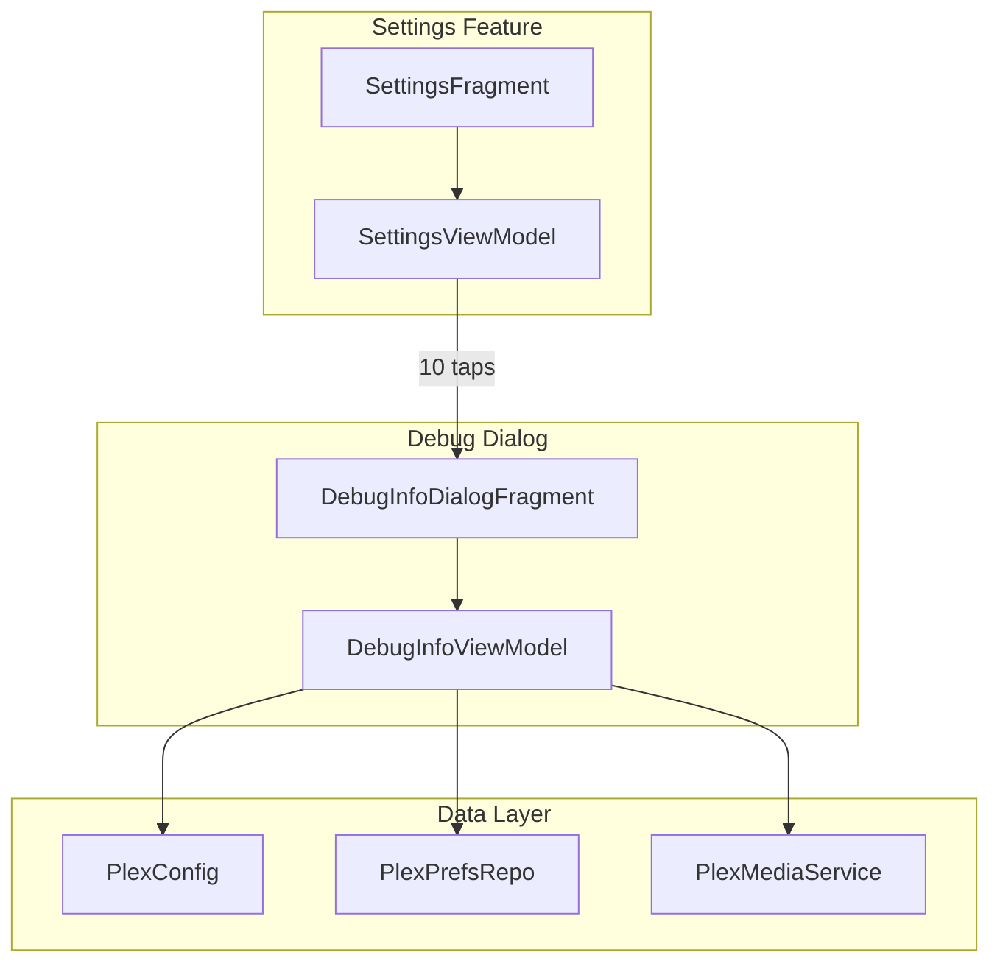
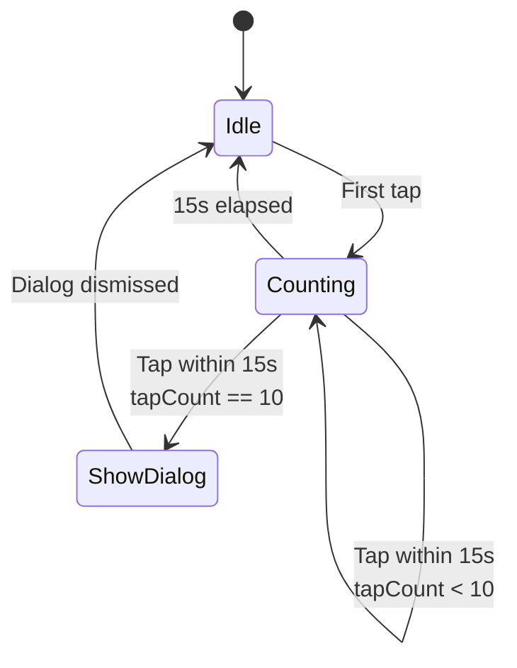

# Debug Easter Egg Feature

## Overview

A hidden debug screen accessible via an Easter egg in Settings that displays connection debugging information. Users can view available server URLs, the currently connected URL, and test connections to diagnose connectivity issues.

## Usage

To access the debug screen:

1. Navigate to **Settings**
2. Tap the **version information** preference 10 times within 15 seconds
3. A full-screen debug dialog will appear

## Features

The debug dialog displays:

- **App Version** - Version name and build number
- **Server Name** - Name of the connected Plex server
- **Connection Status** - Current connection state (Connected, Connecting, Not Connected, etc.)
- **Active URL** - The currently used server URL
- **Available Connections** - List of all potential connection URLs with:
  - **Local/Remote labels** - `(L)` for local connections, `(R)` for remote connections
  - **Status indicators:**
    - `●` (filled circle) - Currently connected
    - `✓` (checkmark) - Test successful
    - `✗` (X) - Test failed
    - `⟳` (loading) - Test in progress
- **Test All Connections** button - Tests each URL against the `/identity` endpoint

This feature is available in **all builds** (production and debug).

## Implementation

### Architecture

The feature follows the app's MVVM architecture with a `DialogFragment` for the UI and a `ViewModel` for state management.



### Implementation Files

**New Files:**

- [`DebugInfoDialogFragment.kt`](../../app/src/main/java/local/oss/chronicle/features/settings/DebugInfoDialogFragment.kt) - Dialog UI controller
- [`DebugInfoViewModel.kt`](../../app/src/main/java/local/oss/chronicle/features/settings/DebugInfoViewModel.kt) - Dialog state management
- [`dialog_debug_info.xml`](../../app/src/main/res/layout/dialog_debug_info.xml) - Full-screen dialog layout
- [`list_item_debug_connection.xml`](../../app/src/main/res/layout/list_item_debug_connection.xml) - Connection list item layout

**Modified Files:**

- [`PlexConfig.kt`](../../app/src/main/java/local/oss/chronicle/data/sources/plex/PlexConfig.kt) - Added `getAvailableConnections()` method to expose connection set
- [`SettingsViewModel.kt`](../../app/src/main/java/local/oss/chronicle/features/settings/SettingsViewModel.kt) - Added tap counter logic and `showDebugDialog` LiveData event
- [`SettingsFragment.kt`](../../app/src/main/java/local/oss/chronicle/features/settings/SettingsFragment.kt) - Observes debug dialog event and shows the dialog
- [`ActivityComponent.kt`](../../app/src/main/java/local/oss/chronicle/injection/components/ActivityComponent.kt) - Added `inject(DebugInfoDialogFragment)` for dependency injection

### Tap Detection

The version preference click handler in [`SettingsViewModel`](../../app/src/main/java/local/oss/chronicle/features/settings/SettingsViewModel.kt) tracks taps within a 15-second window:



**Implementation:**
- Maintains a list of tap timestamps
- On each tap, removes taps older than 15 seconds
- When 10 taps are detected, triggers the debug dialog via LiveData event

### Connection Testing

When the user clicks "Test All Connections":

1. Each connection URL is marked as "Testing" (`⟳`)
2. The app makes a request to `{url}/identity` endpoint
3. Status updates to either:
   - `✓` Success - Server responded successfully
   - `✗` Failed - Server request failed or timed out
4. The currently active connection always shows `●` Connected

All testing happens sequentially to avoid overloading the server or network.

### Dependency Injection

[`DebugInfoDialogFragment`](../../app/src/main/java/local/oss/chronicle/features/settings/DebugInfoDialogFragment.kt) uses Dagger 2 injection in `onAttach()`:

```kotlin
override fun onAttach(context: Context) {
    (requireActivity() as MainActivity).activityComponent!!.inject(this)
    super.onAttach(context)
}
```

**Injected dependencies:**
- `PlexConfig` - For current URL, connection state, and available connections
- `PlexPrefsRepo` - For server name and connection list
- `PlexMediaService` - For testing connections via `/identity` endpoint

## Testing

### Manual Testing

1. Navigate to Settings
2. Tap version info 10 times within 15 seconds
3. Verify debug dialog appears with correct information
4. Test the "Test All Connections" button
5. Verify status indicators update correctly for each connection
6. Test with different connection scenarios (local only, remote only, mixed)

---

**Related Documentation:**
- [`settings.md`](settings.md) - Settings feature overview
- [`plex-integration.md`](../architecture/plex-integration.md) - Plex connection architecture
