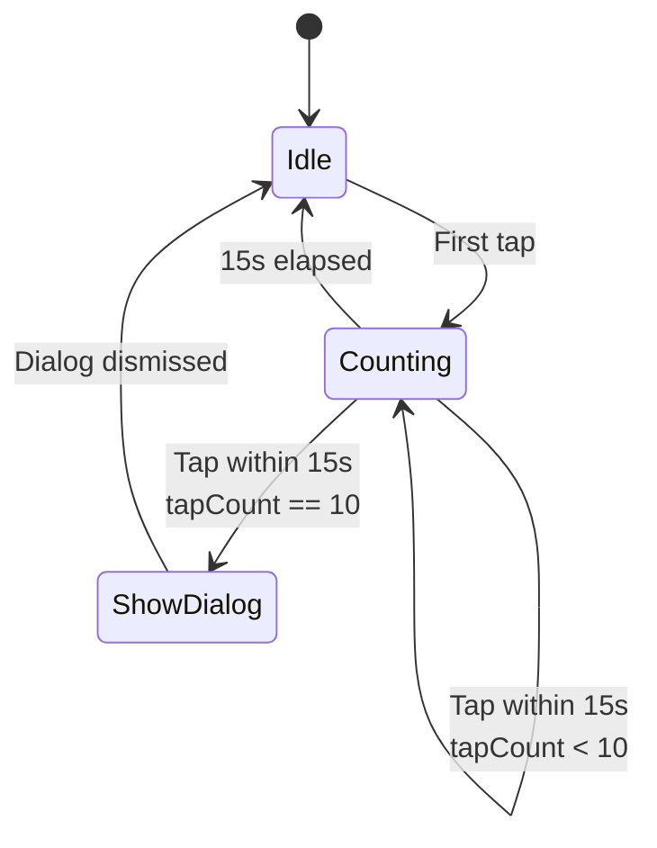
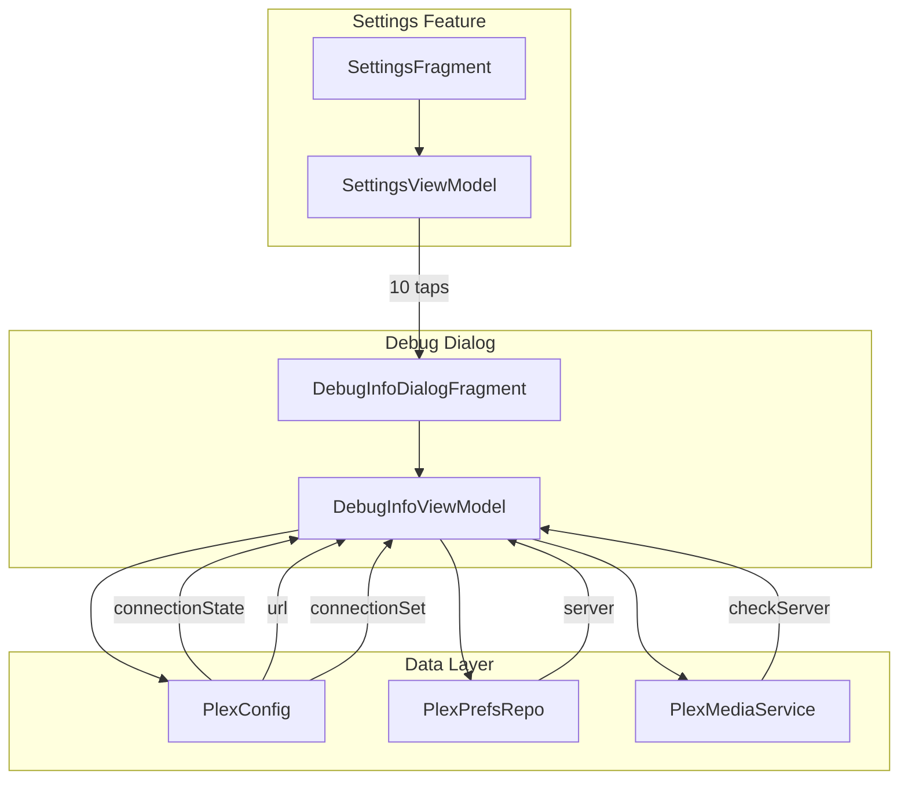
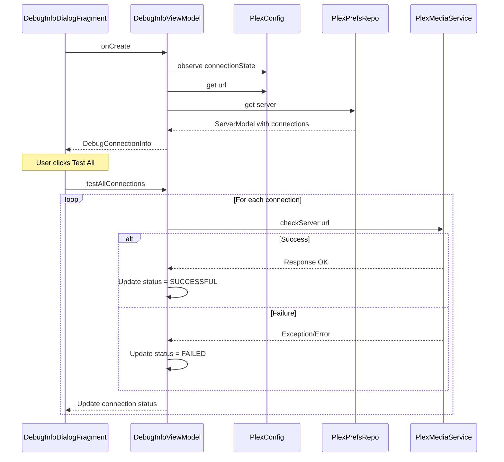

# Debug Easter Egg Feature

## Overview

An Easter egg debug screen triggered by tapping 10 times within 15 seconds on the version information in Settings. This feature displays connection debugging information including available server URLs, the currently connected URL, and the ability to test connections.

## Trigger Mechanism

### Tap Detection



**Implementation approach:**
- Create a `TapCounter` utility class to track taps within a time window
- Maintain a timestamp list of recent taps
- On each tap:
  1. Remove taps older than 15 seconds
  2. Add current tap timestamp
  3. If count >= 10, trigger dialog and reset

**Code location:** Store tap tracking state in [`SettingsViewModel`](../../app/src/main/java/local/oss/chronicle/features/settings/SettingsViewModel.kt)

### Integration Point

Modify the version preference in [`SettingsViewModel.makePreferences()`](../../app/src/main/java/local/oss/chronicle/features/settings/SettingsViewModel.kt:879) to add a click handler:

```kotlin
PreferenceModel(
    type = PreferenceType.CLICKABLE,
    title = FormattableString.from(R.string.settings_version_title),
    explanation = FormattableString.from(BuildConfig.VERSION_NAME),
    click = object : PreferenceClick {
        override fun onClick() {
            onVersionTapped()
        }
    },
)
```

## Debug Dialog Design

### Dialog Type

Use a `DialogFragment` for consistency with existing patterns like [`PlexOAuthDialogFragment`](../../app/src/main/java/local/oss/chronicle/features/login/PlexOAuthDialogFragment.kt).

**New file:** `app/src/main/java/local/oss/chronicle/features/settings/DebugInfoDialogFragment.kt`

### UI Structure

```
+------------------------------------------+
|  Connection Debug Info           [X]     |
+------------------------------------------+
|  App Version                             |
|  └─ 2.1.0 (Build 42)                     |
|                                          |
|  Server                                  |
|  └─ My Plex Server                       |
|                                          |
|  Connection Status                       |
|  └─ ● Connected                          |
|                                          |
|  Active URL                              |
|  └─ https://192.168.1.100:32400          |
|                                          |
|  ─────────────────────────────────────── |
|  Available Connections                   |
|  ┌───────────────────────────────────┐   |
|  │ ● https://192.168.1.100:32400 L   │   |
|  │ ○ https://myserver.plex.direct:443│   |
|  │ ✖ https://relay.plex.tv:443       │   |
|  └───────────────────────────────────┘   |
|                                          |
|  Legend: ●=Connected ○=Available ✖=Failed|
|          L=Local R=Remote                |
|                                          |
|  [   Test All Connections   ]            |
+------------------------------------------+
```

**Legend:**
- ● Green dot = Currently active/successful connection
- ○ Gray dot = Available but untested
- ✖ Red X = Failed connection test
- L = Local connection
- R = Remote connection

### Layout File

**New file:** `app/src/main/res/layout/dialog_debug_info.xml`

```xml
<?xml version="1.0" encoding="utf-8"?>
<layout xmlns:android="http://schemas.android.com/apk/res/android"
    xmlns:app="http://schemas.android.com/apk/res-auto">

    <data>
        <variable
            name="viewModel"
            type="local.oss.chronicle.features.settings.DebugInfoViewModel" />
    </data>

    <androidx.constraintlayout.widget.ConstraintLayout
        android:layout_width="match_parent"
        android:layout_height="wrap_content"
        android:padding="16dp">

        <com.google.android.material.appbar.MaterialToolbar
            android:id="@+id/toolbar"
            ... />

        <ScrollView
            android:layout_width="match_parent"
            android:layout_height="wrap_content">
            
            <!-- App info, server info, connection list -->
            
        </ScrollView>

        <Button
            android:id="@+id/testConnectionsButton"
            android:text="Test All Connections"
            ... />
            
    </androidx.constraintlayout.widget.ConstraintLayout>
</layout>
```

## Data Flow

### Component Diagram



### Data Model

**New data class:** `DebugConnectionInfo`

```kotlin
data class DebugConnectionInfo(
    val appVersion: String,
    val buildNumber: Int,
    val serverName: String?,
    val connectionState: PlexConfig.ConnectionState,
    val activeUrl: String?,
    val availableConnections: List<ConnectionTestResult>
)

data class ConnectionTestResult(
    val uri: String,
    val isLocal: Boolean,
    val status: ConnectionStatus
)

enum class ConnectionStatus {
    UNTESTED,      // Gray dot
    CONNECTED,     // Green dot - this is the active connection
    SUCCESSFUL,    // Green check - test passed but not active
    FAILED,        // Red X - test failed
    TESTING        // Spinner - currently testing
}
```

### Data Gathering Sequence



## Implementation Components

### Files to Create

| File | Purpose |
|------|---------|
| `app/src/main/java/local/oss/chronicle/features/settings/DebugInfoDialogFragment.kt` | Dialog UI controller |
| `app/src/main/java/local/oss/chronicle/features/settings/DebugInfoViewModel.kt` | Dialog state management |
| `app/src/main/res/layout/dialog_debug_info.xml` | Dialog layout |

### Files to Modify

| File | Changes |
|------|---------|
| [`SettingsViewModel.kt`](../../app/src/main/java/local/oss/chronicle/features/settings/SettingsViewModel.kt) | Add tap counter logic, expose `showDebugDialog` event |
| [`SettingsFragment.kt`](../../app/src/main/java/local/oss/chronicle/features/settings/SettingsFragment.kt) | Observe debug dialog event, show dialog |
| [`ActivityComponent.kt`](../../app/src/main/java/local/oss/chronicle/injection/components/ActivityComponent.kt) | Add `inject(DebugInfoDialogFragment)` method |
| [`PlexConfig.kt`](../../app/src/main/java/local/oss/chronicle/data/sources/plex/PlexConfig.kt) | Expose `connectionSet` for reading - add getter function |

### Dependency Injection

The `DebugInfoDialogFragment` needs access to:
- `PlexConfig` - for `url`, `connectionState`, and available connections
- `PlexPrefsRepo` - for server info
- `PlexMediaService` - for testing connections

**Injection approach:** Follow the same pattern as [`PlexOAuthDialogFragment`](../../app/src/main/java/local/oss/chronicle/features/login/PlexOAuthDialogFragment.kt:54-58):

```kotlin
override fun onAttach(context: Context) {
    (requireActivity() as MainActivity).activityComponent!!.inject(this)
    super.onAttach(context)
}
```

## Implementation Details

### TapCounter Class

```kotlin
class TapCounter(
    private val requiredTaps: Int = 10,
    private val windowMs: Long = 15_000L
) {
    private val tapTimestamps = mutableListOf<Long>()
    
    /**
     * Records a tap and returns true if the threshold was reached
     */
    fun recordTap(): Boolean {
        val now = System.currentTimeMillis()
        
        // Remove old taps outside the window
        tapTimestamps.removeAll { now - it > windowMs }
        
        // Add current tap
        tapTimestamps.add(now)
        
        // Check threshold
        if (tapTimestamps.size >= requiredTaps) {
            tapTimestamps.clear()
            return true
        }
        
        return false
    }
    
    fun reset() {
        tapTimestamps.clear()
    }
}
```

### DebugInfoViewModel

```kotlin
class DebugInfoViewModel @Inject constructor(
    private val plexConfig: PlexConfig,
    private val plexPrefsRepo: PlexPrefsRepo,
    private val plexMediaService: PlexMediaService
) : ViewModel() {

    private val _debugInfo = MutableLiveData<DebugConnectionInfo>()
    val debugInfo: LiveData<DebugConnectionInfo> = _debugInfo
    
    private val _connectionResults = MutableLiveData<List<ConnectionTestResult>>()
    val connectionResults: LiveData<List<ConnectionTestResult>> = _connectionResults
    
    init {
        loadDebugInfo()
    }
    
    private fun loadDebugInfo() {
        val server = plexPrefsRepo.server
        val connections = server?.connections?.map { conn ->
            ConnectionTestResult(
                uri = conn.uri,
                isLocal = conn.local,
                status = if (conn.uri == plexConfig.url) 
                    ConnectionStatus.CONNECTED 
                else 
                    ConnectionStatus.UNTESTED
            )
        } ?: emptyList()
        
        _debugInfo.value = DebugConnectionInfo(
            appVersion = BuildConfig.VERSION_NAME,
            buildNumber = BuildConfig.VERSION_CODE,
            serverName = server?.name,
            connectionState = plexConfig.connectionState.value 
                ?: PlexConfig.ConnectionState.NOT_CONNECTED,
            activeUrl = plexConfig.url.takeIf { 
                it != PlexConfig.PLACEHOLDER_URL 
            },
            availableConnections = connections
        )
        _connectionResults.value = connections
    }
    
    fun testAllConnections() {
        viewModelScope.launch {
            val currentResults = _connectionResults.value?.toMutableList() 
                ?: return@launch
            
            // Mark all as testing
            currentResults.forEachIndexed { index, result ->
                if (result.status != ConnectionStatus.CONNECTED) {
                    currentResults[index] = result.copy(
                        status = ConnectionStatus.TESTING
                    )
                }
            }
            _connectionResults.value = currentResults.toList()
            
            // Test each connection
            currentResults.forEachIndexed { index, result ->
                if (result.status == ConnectionStatus.TESTING) {
                    val newStatus = testConnection(result.uri)
                    currentResults[index] = result.copy(status = newStatus)
                    _connectionResults.value = currentResults.toList()
                }
            }
        }
    }
    
    private suspend fun testConnection(uri: String): ConnectionStatus {
        return try {
            val response = plexMediaService.checkServer(uri)
            if (response.isSuccessful) {
                ConnectionStatus.SUCCESSFUL
            } else {
                ConnectionStatus.FAILED
            }
        } catch (e: Exception) {
            ConnectionStatus.FAILED
        }
    }
}
```

### Exposing connectionSet from PlexConfig

Add a public getter to [`PlexConfig.kt`](../../app/src/main/java/local/oss/chronicle/data/sources/plex/PlexConfig.kt):

```kotlin
/**
 * Returns the current set of potential server connections.
 * Used by debug tools to display connection options.
 */
fun getAvailableConnections(): Set<Connection> {
    return connectionSet.toSet() // Return a copy to prevent modification
}
```

## Testing Strategy

### Unit Tests

1. **TapCounter tests:**
   - Test tap counting within window
   - Test tap reset after timeout
   - Test threshold triggering

2. **DebugInfoViewModel tests:**
   - Test initial data loading
   - Test connection testing flow
   - Test error handling

### Manual Testing

1. Navigate to Settings
2. Tap version info 10 times within 15 seconds
3. Verify debug dialog appears
4. Verify correct connection information displayed
5. Test Test All Connections button
6. Verify connection status updates correctly

## Open Questions

1. **Should the debug dialog be available in release builds?**
   - Current design assumes yes since it's an Easter egg
   - Could restrict to debug builds only via `BuildConfig.DEBUG`

2. **Should we add a copy button for connection URLs?**
   - Would help users debug by sharing connection info  
   - Easy to add with Android clipboard API

3. **Timeout for connection tests?**
   - Current [`PlexConfig.CONNECTION_TIMEOUT_MS`](../../app/src/main/java/local/oss/chronicle/data/sources/plex/PlexConfig.kt:45) is 10 seconds
   - Consider shorter timeout for debug tests per connection

## Summary

This feature adds a hidden debug screen accessible via a 10-tap Easter egg on the version setting. It displays:
- App version information
- Current server name and connection state
- Active connection URL
- List of all available connection URLs with test capability

The implementation follows existing patterns in the codebase using DialogFragment and ViewModel with Dagger 2 injection.
