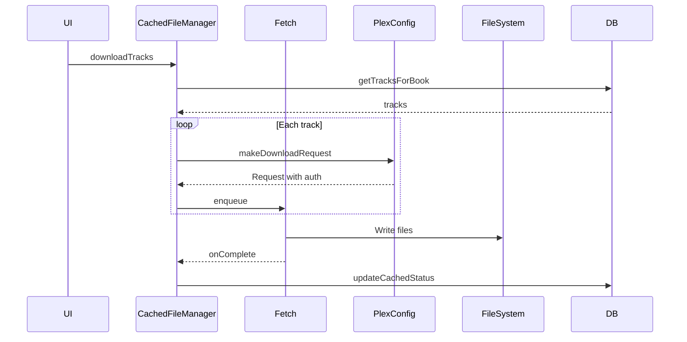
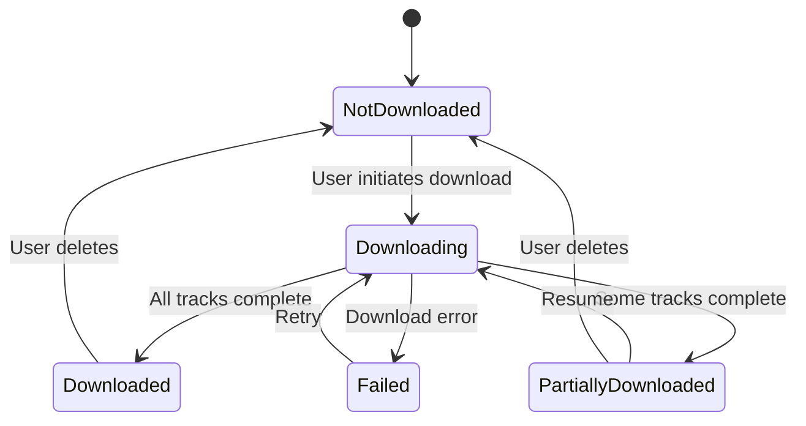

# Offline Downloads

This document covers Chronicle's download and offline playback features.

## Overview

Chronicle supports downloading audiobooks for offline playback, allowing users to listen without an internet connection.

---

## Download Flow

---

## Key Files

| File | Purpose |
|------|---------|
| [`CachedFileManager`](../../app/src/main/java/local/oss/chronicle/data/sources/plex/CachedFileManager.kt) | Download orchestration |
| [`DownloadNotificationWorker`](../../app/src/main/java/local/oss/chronicle/features/download/DownloadNotificationWorker.kt) | Progress notifications |

---

## Storage

Downloaded files are stored in app-specific external storage:

| Aspect | Details |
|--------|---------|
| **File naming** | `{trackId}_{partHash}.{extension}` |
| **Location** | App's external files directory |
| **Persistence** | Files survive app updates but are removed on uninstall |

### Storage Considerations
- Downloads use app-specific external storage (no permissions required)
- Users can configure download location in Settings
- Storage space is checked before starting large downloads

---

## Offline Mode

When offline mode is enabled:
- Only downloaded content is shown in the library
- Network requests are minimized
- Playback uses cached files exclusively

### Enabling Offline Mode
1. Go to Settings
2. Toggle "Offline Mode" on

This is useful for:
- Low connectivity situations
- Conserving mobile data
- Faster library browsing

---

## Download States

---

## Related Documentation

- [Features Index](../FEATURES.md) - Overview of all features
- [Settings](settings.md) - Configuring download location and offline mode
- [Data Layer](../DATA_LAYER.md) - Track and book data management
