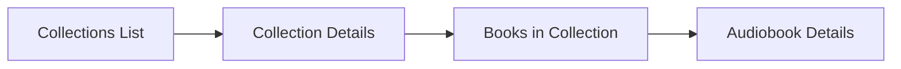
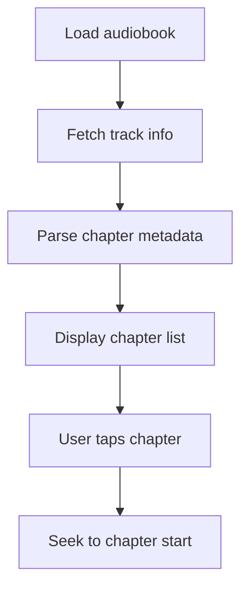

# Library & Browsing

This document covers Chronicle's library browsing features, including the home screen, library view, search, collections, and audiobook details.

## Home Screen

Displays categorized audiobook lists:
- **Recently Listened** - Books with in-progress playback
- **Recently Added** - Newest additions to library

**Implementation**: [`HomeFragment`](../../app/src/main/java/local/oss/chronicle/features/home/HomeFragment.kt), [`HomeViewModel`](../../app/src/main/java/local/oss/chronicle/features/home/HomeViewModel.kt)

---

## Library View

Full library with sorting and filtering options:

| Sort Option | Description |
|-------------|-------------|
| Title | Alphabetical by title |
| Author | Alphabetical by author |
| Date Added | Newest first |
| Date Played | Most recently listened |
| Duration | Longest/shortest |
| Year | Publication year |

**Implementation**: [`LibraryFragment`](../../app/src/main/java/local/oss/chronicle/features/library/LibraryFragment.kt), [`LibraryViewModel`](../../app/src/main/java/local/oss/chronicle/features/library/LibraryViewModel.kt)

---

## Search

Real-time search across audiobook titles and authors:

**Implementation**: [`AudiobookSearchAdapter`](../../app/src/main/java/local/oss/chronicle/features/library/AudiobookSearchAdapter.kt)

---

## Collections

Plex collections allow grouping audiobooks (e.g., by series):

**Key Files**:
- [`CollectionsFragment`](../../app/src/main/java/local/oss/chronicle/features/collections/CollectionsFragment.kt) - Collection list
- [`CollectionDetailsFragment`](../../app/src/main/java/local/oss/chronicle/features/collections/CollectionDetailsFragment.kt) - Books in collection
- [`CollectionsRepository`](../../app/src/main/java/local/oss/chronicle/data/local/CollectionsRepository.kt) - Data management

---

## Audiobook Details

Displays comprehensive audiobook information:

- Cover art
- Title, author, year
- Summary/description  
- Genre
- Duration and progress
- Chapter list (for M4B files with embedded chapters)
- Download status

**Implementation**: 
- [`AudiobookDetailsFragment`](../../app/src/main/java/local/oss/chronicle/features/bookdetails/AudiobookDetailsFragment.kt)
- [`AudiobookDetailsViewModel`](../../app/src/main/java/local/oss/chronicle/features/bookdetails/AudiobookDetailsViewModel.kt)

### Chapter Navigation

For M4B files with embedded chapters:

**Implementation**: [`ChapterListAdapter`](../../app/src/main/java/local/oss/chronicle/features/bookdetails/ChapterListAdapter.kt)

---

## Related Documentation

- [Features Index](../FEATURES.md) - Overview of all features
- [Album Info API Response](../example-query-responses/request-album-info.md) - Audiobook metadata examples
- [Collections API Response](../example-query-responses/request-collections-info.md) - Collections data examples
- [Data Layer](../DATA_LAYER.md) - Database and repository patterns
