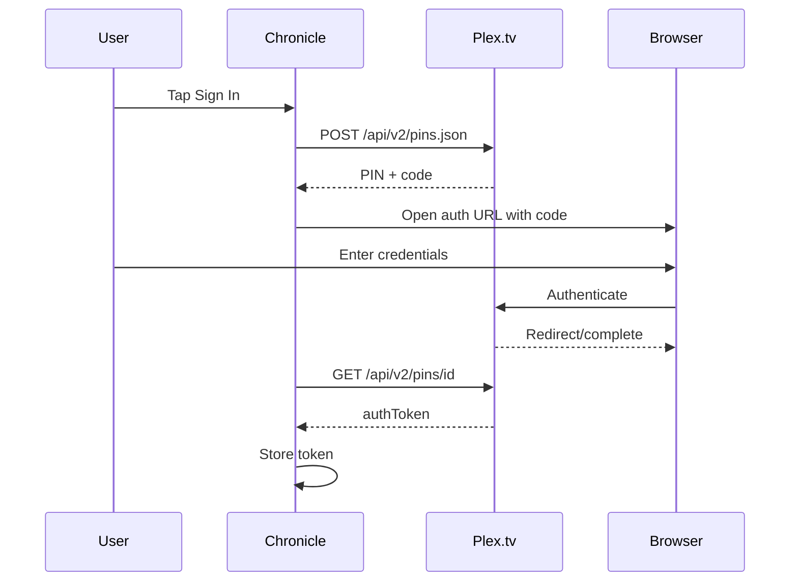
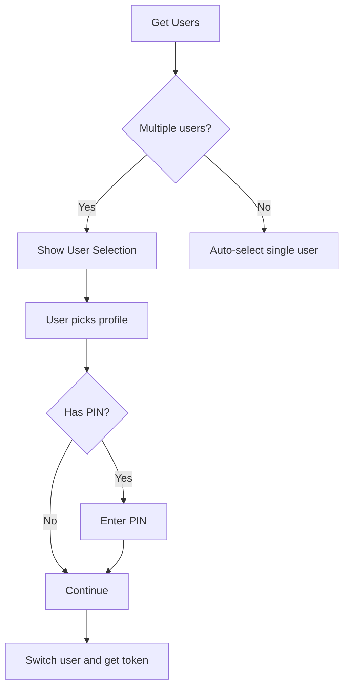
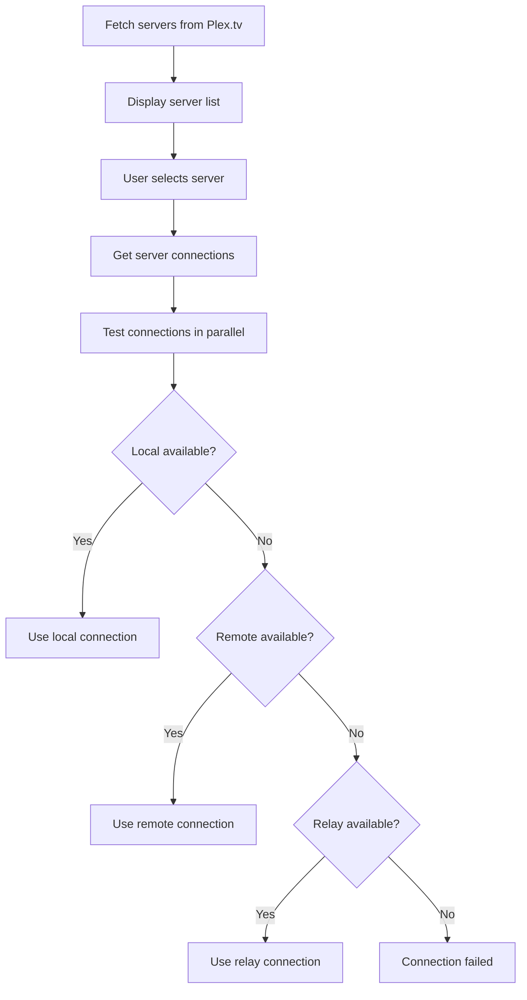

# Login & Authentication

This document covers Chronicle's authentication flow, including OAuth, user selection, server selection, and library selection.

## Plex Authentication

### OAuth Flow

Chronicle uses Plex's OAuth 2.0 PIN-based authentication flow.

**Implementation**: [`PlexLoginRepo`](../../app/src/main/java/local/oss/chronicle/data/sources/plex/PlexLoginRepo.kt)

### Key Files
- [`LoginFragment`](../../app/src/main/java/local/oss/chronicle/features/login/LoginFragment.kt) - Login UI
- [`LoginViewModel`](../../app/src/main/java/local/oss/chronicle/features/login/LoginViewModel.kt) - OAuth state management
- [`PlexLoginService`](../../app/src/main/java/local/oss/chronicle/data/sources/plex/PlexService.kt) - API endpoints

---

## Server/User Selection

### Multi-User Support

Plex accounts can have multiple users (managed users). Chronicle supports user switching:

**Implementation**: 
- [`ChooseUserFragment`](../../app/src/main/java/local/oss/chronicle/features/login/ChooseUserFragment.kt)
- [`ChooseUserViewModel`](../../app/src/main/java/local/oss/chronicle/features/login/ChooseUserViewModel.kt)

### Server Selection

Users can have multiple Plex servers. Chronicle tests connectivity and selects the best connection:

**Implementation**: 
- [`ChooseServerFragment`](../../app/src/main/java/local/oss/chronicle/features/login/ChooseServerFragment.kt)
- [`PlexConfig.setPotentialConnections()`](../../app/src/main/java/local/oss/chronicle/data/sources/plex/PlexConfig.kt)

### Library Selection

Lists Music libraries from the selected server (audiobooks are stored as music in Plex):

**Implementation**: 
- [`ChooseLibraryFragment`](../../app/src/main/java/local/oss/chronicle/features/login/ChooseLibraryFragment.kt)
- [`ChooseLibraryViewModel`](../../app/src/main/java/local/oss/chronicle/features/login/ChooseLibraryViewModel.kt)

---

## Related Documentation

- [Features Index](../FEATURES.md) - Overview of all features
- [API Flows](../API_FLOWS.md) - Detailed API documentation
- [OAuth Flow Examples](../example-query-responses/oauth-flow.md) - Real OAuth API responses
- [Managed Users](../example-query-responses/managed_users.md) - Managed user account examples
