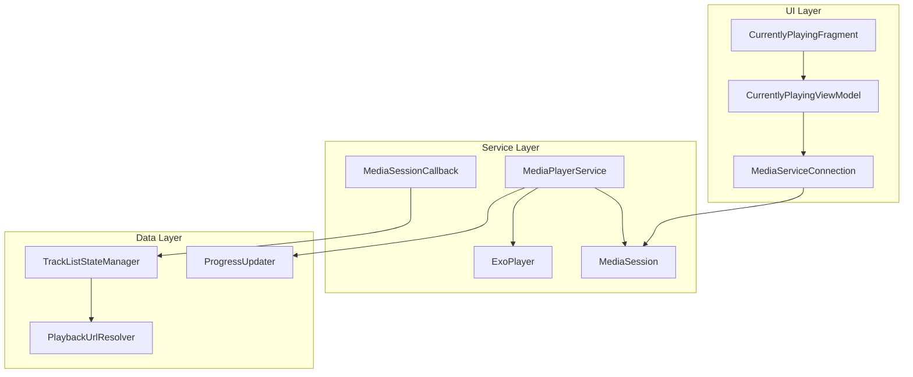
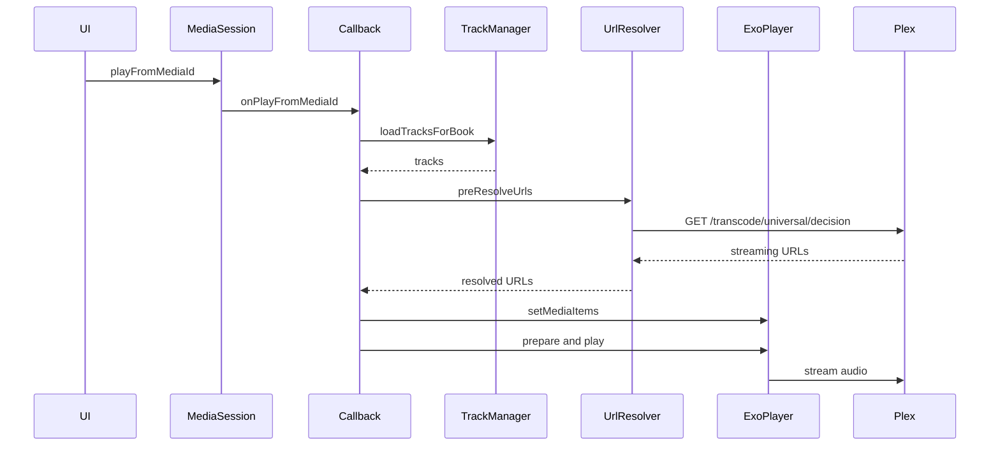
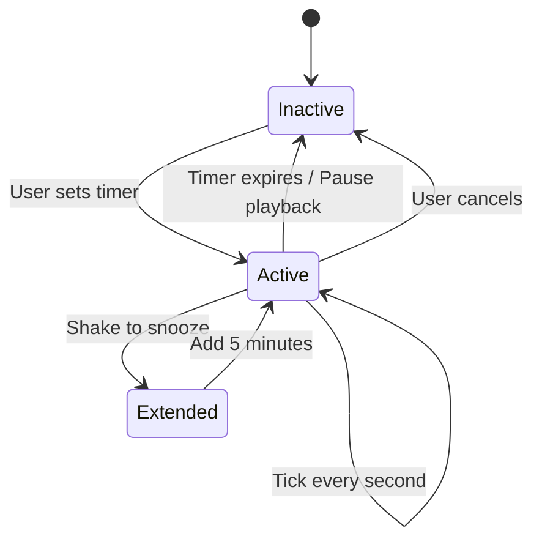
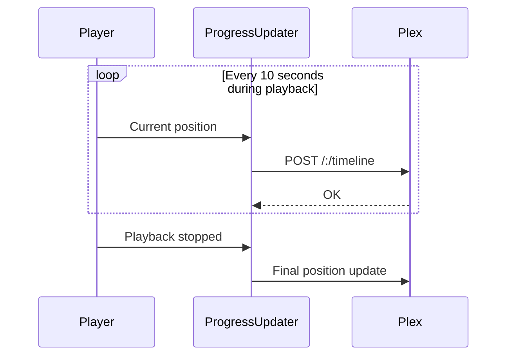

# Media Playback

This document covers Chronicle's media playback system, including player architecture, sleep timer, speed control, progress sync, and notification controls.

## Architecture

---

## Key Components

| Component | Purpose |
|-----------|---------|
| [`MediaPlayerService`](../../app/src/main/java/local/oss/chronicle/features/player/MediaPlayerService.kt) | Background service, MediaBrowserService |
| [`AudiobookMediaSessionCallback`](../../app/src/main/java/local/oss/chronicle/features/player/AudiobookMediaSessionCallback.kt) | Handles play/pause/seek commands |
| [`TrackListStateManager`](../../app/src/main/java/local/oss/chronicle/features/player/TrackListStateManager.kt) | Manages playlist state |
| [`PlaybackUrlResolver`](../../app/src/main/java/local/oss/chronicle/data/sources/plex/PlaybackUrlResolver.kt) | Resolves streaming URLs via decision endpoint |
| [`ProgressUpdater`](../../app/src/main/java/local/oss/chronicle/features/player/ProgressUpdater.kt) | Syncs progress to Plex server |

---

## Playback Flow

---

## Sleep Timer

Pauses playback after a specified duration.

### Features
- Configurable duration
- Shake-to-snooze (extends timer by 5 minutes)
- Only counts down during active playback

**Implementation**: [`SleepTimer`](../../app/src/main/java/local/oss/chronicle/features/player/SleepTimer.kt)

---

## Playback Speed Control

Supports playback speed adjustment from 0.5x to 3.0x:

| Speed | Description |
|-------|-------------|
| 0.5x | Half speed |
| 0.7x | Slower |
| 1.0x | Normal |
| 1.2x | Slightly faster |
| 1.5x | Fast |
| 1.7x | Faster |
| 2.0x | Double speed |
| 3.0x | Triple speed |

**Additional option**: Skip silence - Automatically skips silent parts of audio

**Implementation**: 
- [`ModalBottomSheetSpeedChooser`](../../app/src/main/java/local/oss/chronicle/views/ModalBottomSheetSpeedChooser.kt)
- [`PrefsRepo.playbackSpeed`](../../app/src/main/java/local/oss/chronicle/data/local/SharedPreferencesPrefsRepo.kt)

---

## Progress Scrobbling

Chronicle syncs playback progress to Plex server for:
- Cross-device progress sync
- Continue listening features
- Watch history

### Timeline Updates

**Implementation**: [`ProgressUpdater`](../../app/src/main/java/local/oss/chronicle/features/player/ProgressUpdater.kt)

---

## Notification Controls

Media notification with:
- Play/pause
- Skip forward/back (configurable duration)
- Seek bar (Android 10+)
- Album art
- Title and author

**Implementation**: [`NotificationBuilder`](../../app/src/main/java/local/oss/chronicle/features/player/NotificationBuilder.kt)

---

## Related Documentation

- [Features Index](../FEATURES.md) - Overview of all features
- [Architecture Layers](../architecture/layers.md) - Service layer details
- [Plex Integration](../architecture/plex-integration.md) - Streaming URL resolution
- [Track Info API Response](../example-query-responses/request_track_info.md) - Track metadata examples
