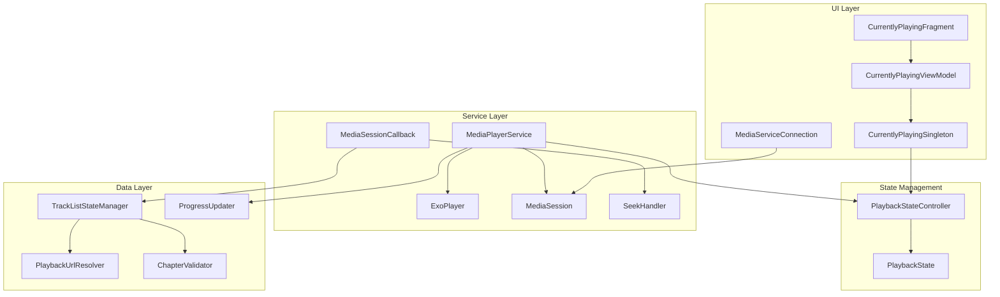
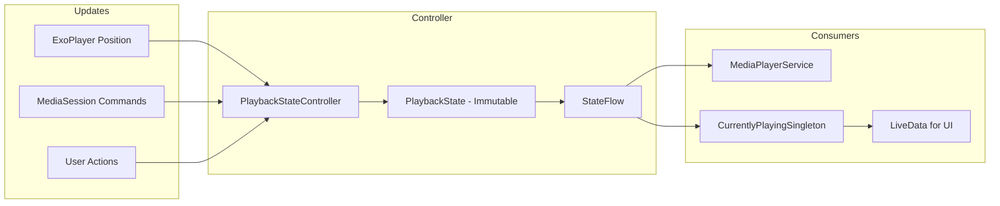
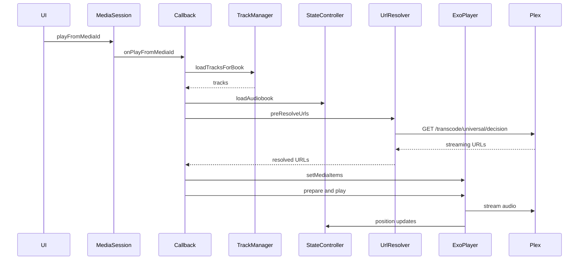
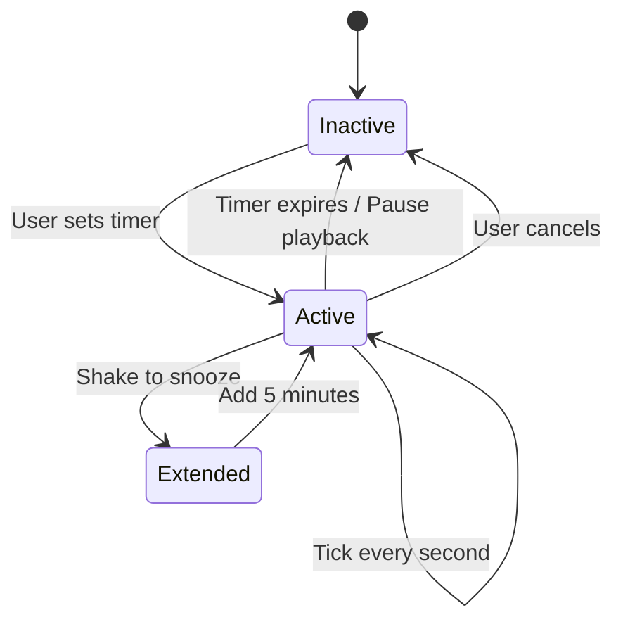
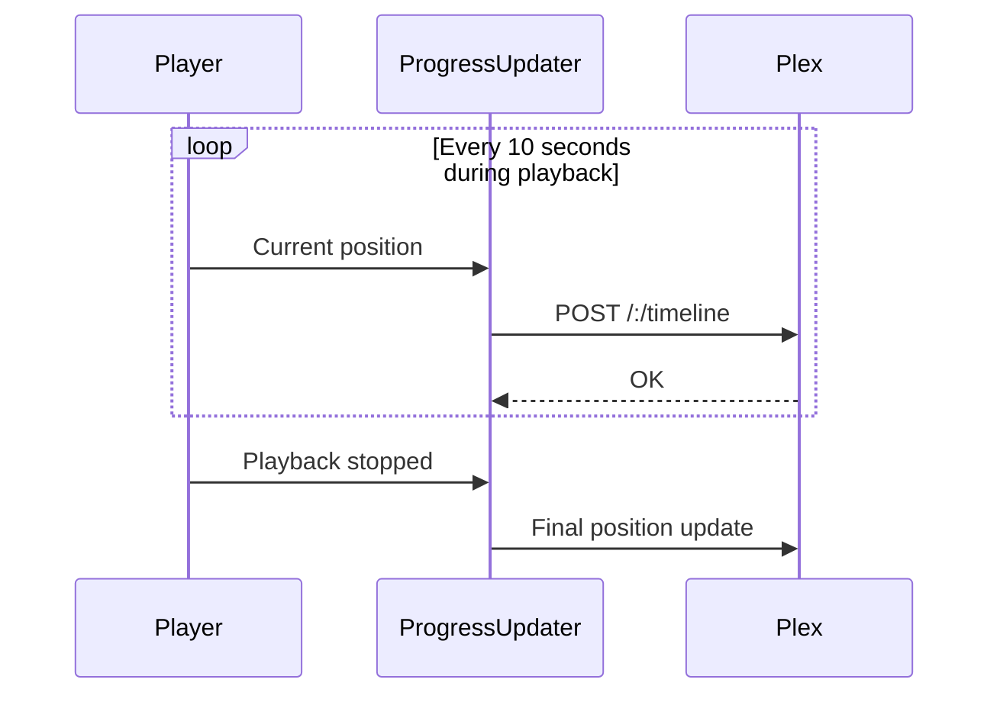

# Media Playback

This document covers Chronicle's media playback system, including player architecture, state management, thread safety, error handling, sleep timer, speed control, and progress sync.

## Architecture



---

## Key Components

| Component | Purpose |
|-----------|---------|
| [`MediaPlayerService`](../../app/src/main/java/local/oss/chronicle/features/player/MediaPlayerService.kt) | Background service, MediaBrowserService |
| [`AudiobookMediaSessionCallback`](../../app/src/main/java/local/oss/chronicle/features/player/AudiobookMediaSessionCallback.kt) | Handles play/pause/seek commands |
| [`PlaybackStateController`](../../app/src/main/java/local/oss/chronicle/features/player/PlaybackStateController.kt) | **Single source of truth** for playback state |
| [`PlaybackState`](../../app/src/main/java/local/oss/chronicle/features/player/PlaybackState.kt) | Immutable playback state data class |
| [`TrackListStateManager`](../../app/src/main/java/local/oss/chronicle/features/player/TrackListStateManager.kt) | Manages playlist state with Mutex protection |
| [`SeekHandler`](../../app/src/main/java/local/oss/chronicle/features/player/SeekHandler.kt) | Atomic seek operations with timeout |
| [`ChapterValidator`](../../app/src/main/java/local/oss/chronicle/features/player/ChapterValidator.kt) | Validates positions against chapter bounds |
| [`PlaybackUrlResolver`](../../app/src/main/java/local/oss/chronicle/data/sources/plex/PlaybackUrlResolver.kt) | Resolves streaming URLs with retry logic |
| [`ProgressUpdater`](../../app/src/main/java/local/oss/chronicle/features/player/ProgressUpdater.kt) | Syncs progress to Plex server |
| [`CurrentlyPlayingSingleton`](../../app/src/main/java/local/oss/chronicle/features/currentlyplaying/CurrentlyPlayingSingleton.kt) | Bridges StateFlow to LiveData for UI |

---

## State Management

### PlaybackStateController

The [`PlaybackStateController`](../../app/src/main/java/local/oss/chronicle/features/player/PlaybackStateController.kt) is the **single source of truth** for all playback state.



### Design Principles

| Principle | Implementation |
|-----------|----------------|
| **Immutability** | `PlaybackState` is a data class; updates create new instances via `copy()` |
| **Thread Safety** | All updates go through `Mutex.withLock {}` |
| **Reactivity** | State exposed via `StateFlow` for reactive observation |
| **Debounced Persistence** | Database writes are debounced (3 seconds) to reduce I/O |

### PlaybackState Data Class

```kotlin
data class PlaybackState(
    val audiobook: Audiobook?,
    val tracks: List<MediaItemTrack>,
    val chapters: List<Chapter>,
    val currentTrackIndex: Int,
    val currentTrackPositionMs: Long,
    val isPlaying: Boolean,
    val playbackSpeed: Float
) {
    // Computed properties
    val bookPositionMs: Long  // Total position across all tracks
    val currentChapter: Chapter?  // Chapter at current position
    val currentChapterIndex: Int
    val totalDurationMs: Long
    val hasMedia: Boolean
}
```

---

## Playback Flow



---

## Thread Safety

### Mutex Protection

All playback state updates use Kotlin's `Mutex` to prevent race conditions:

```kotlin
private val mutex = Mutex()

suspend fun updatePosition(trackIndex: Int, positionMs: Long) = mutex.withLock {
    val newState = _state.value.withPosition(trackIndex, positionMs)
    _state.value = newState
}
```

### SeekHandler

The [`SeekHandler`](../../app/src/main/java/local/oss/chronicle/features/player/SeekHandler.kt) ensures atomic seek operations:

- Prevents concurrent seek requests
- Implements timeout to avoid hanging
- Validates seek position before execution

### TrackListStateManager Thread Safety

The [`TrackListStateManager`](../../app/src/main/java/local/oss/chronicle/features/player/TrackListStateManager.kt) uses Mutex for:

- Track list updates
- Chapter detection
- Position calculations

---

## Error Handling and Retry Logic

### Network Resilience

[`PlaybackUrlResolver`](../../app/src/main/java/local/oss/chronicle/data/sources/plex/PlaybackUrlResolver.kt) uses retry with exponential backoff:

```kotlin
withRetry(
    config = RetryConfig(maxAttempts = 3, initialDelayMs = 1000L)
) { attempt ->
    resolveStreamingUrl(trackKey)
}
```

### URL Caching

Resolved URLs are cached to avoid repeated network calls:

- Thread-safe cache using `ConcurrentHashMap`
- Automatic cache invalidation on errors
- Fallback to cached URL if network fails

### ChapterValidator

The [`ChapterValidator`](../../app/src/main/java/local/oss/chronicle/features/player/ChapterValidator.kt) prevents invalid playback states:

- Validates seek positions against chapter boundaries
- Prevents seeking beyond track/chapter limits
- Returns corrected positions for edge cases

---

## Sleep Timer

Pauses playback after a specified duration.



### Features
- Configurable duration
- Shake-to-snooze (extends timer by 5 minutes)
- Only counts down during active playback

**Implementation**: [`SleepTimer`](../../app/src/main/java/local/oss/chronicle/features/player/SleepTimer.kt)

---

## Playback Speed Control

Supports playback speed adjustment from 0.5x to 3.0x:

| Speed | Description |
|-------|-------------|
| 0.5x | Half speed |
| 0.7x | Slower |
| 1.0x | Normal |
| 1.2x | Slightly faster |
| 1.5x | Fast |
| 1.7x | Faster |
| 2.0x | Double speed |
| 3.0x | Triple speed |

**Additional option**: Skip silence - Automatically skips silent parts of audio

**Implementation**: 
- [`ModalBottomSheetSpeedChooser`](../../app/src/main/java/local/oss/chronicle/views/ModalBottomSheetSpeedChooser.kt)
- [`PrefsRepo.playbackSpeed`](../../app/src/main/java/local/oss/chronicle/data/local/SharedPreferencesPrefsRepo.kt)

---

## Progress Scrobbling

Chronicle syncs playback progress to Plex server for:
- Cross-device progress sync
- Continue listening features
- Watch history

### Timeline Updates



**Implementation**: [`ProgressUpdater`](../../app/src/main/java/local/oss/chronicle/features/player/ProgressUpdater.kt)

---

## Notification Controls

Media notification with:
- Play/pause
- Skip forward/back (configurable duration)
- Seek bar (Android 10+)
- Album art
- Title and author

**Implementation**: [`NotificationBuilder`](../../app/src/main/java/local/oss/chronicle/features/player/NotificationBuilder.kt)

---

## Related Documentation

- [Features Index](../FEATURES.md) - Overview of all features
- [Architecture Layers](../architecture/layers.md) - Service layer details
- [Architectural Patterns](../architecture/patterns.md) - PlaybackStateController, Retry, Error Handling patterns
- [Plex Integration](../architecture/plex-integration.md) - Streaming URL resolution
- [Android Auto](android-auto.md) - Android Auto integration
- [Track Info API Response](../example-query-responses/request_track_info.md) - Track metadata examples
