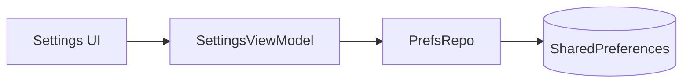
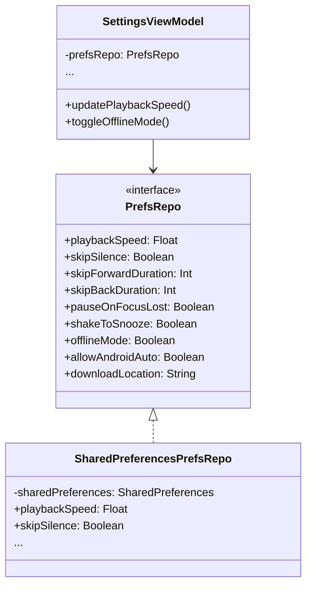

# Settings

This document covers Chronicle's configurable preferences and settings.

## Overview

Chronicle provides various settings to customize the listening experience.

---

## Available Settings

| Setting | Description | Default |
|---------|-------------|---------|
| **Playback Speed** | Default playback speed (0.5x - 3.0x) | 1.0x |
| **Skip Silence** | Automatically skip quiet parts of audio | Off |
| **Skip Forward Duration** | Jump forward duration (10-90 seconds) | 30s |
| **Skip Back Duration** | Jump back duration (10-90 seconds) | 10s |
| **Pause on Focus Lost** | Pause when other audio plays | On |
| **Shake to Snooze** | Extend sleep timer by shaking device | On |
| **Offline Mode** | Show only downloaded content | Off |
| **Allow Android Auto** | Enable Android Auto support | Off |
| **Download Location** | Choose storage location for downloads | Internal |

---

## Implementation

### Key Files

| File | Purpose |
|------|---------|
| [`SettingsFragment`](../../app/src/main/java/local/oss/chronicle/features/settings/SettingsFragment.kt) | Settings UI |
| [`SettingsViewModel`](../../app/src/main/java/local/oss/chronicle/features/settings/SettingsViewModel.kt) | Settings state management |
| [`PrefsRepo`](../../app/src/main/java/local/oss/chronicle/data/local/SharedPreferencesPrefsRepo.kt) | Preferences persistence |

### Preference Storage

Settings are stored using Android's SharedPreferences:

---

## Setting Categories

### Playback Settings

Control how audio is played:

- **Playback Speed**: Adjusts narration speed
- **Skip Silence**: Uses ExoPlayer's silence skipping feature
- **Skip Durations**: Configures forward/back jump amounts
- **Pause on Focus Lost**: Handles audio focus changes

### Offline Settings

Control offline behavior:

- **Offline Mode**: When enabled, only downloaded books appear
- **Download Location**: Internal storage or SD card (if available)

### Platform Settings

Control platform integrations:

- **Android Auto**: Toggle for in-car playback support
- **Shake to Snooze**: Accelerometer-based sleep timer extension

---

## Settings Architecture

---

## Related Documentation

- [Features Index](../FEATURES.md) - Overview of all features
- [Playback](playback.md) - How playback settings are applied
- [Downloads](downloads.md) - Download location configuration
- [Android Auto](android-auto.md) - Android Auto setting details
